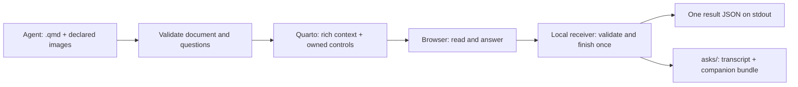

# ask-form-qmd — design

**Status: implemented experimentally.** Design approved 2026-09-24.
Implementation: [v1 tracker](progress/v1.md).

Predecessor evidence: the repo-local Quarto forms PoC (2026-09-24).
Standing references: [ask-form](../ask-form/design.md),
[rich-document](../rich-document/design.md), and the
[Lightbridge state catalog](../../plugins/lightbridge/skills/lightbridge-config/references/catalog.md).

## Direction

A new **Authored / Contract** skill at `plugins/experiment/skills/ask-form-qmd/`.
It collects human decisions through a rich document: the agent writes constrained
Quarto Markdown and declarative questions; the tool owns rendering, controls,
validation, submission, and persistence.

Confirmed for this proposal: Quarto plus native controls; copy the existing
rich-document styling and theme; keep the implementation independent with no
shared kernel extraction. It remains a sibling of ask-form, not a migration of it.

Routing: ordinary chat questions stay in chat; compact forms remain ask-form's
strength; ask-form-qmd fits document-led reviews with substantial context, or an
explicit request for a Quarto form. Experimental status does not imply explicit-only
invocation. Real use and review determine graduation out of `experiment`.



## Authoring contract

**Accepted authoring choice:** a single `.qmd` with `{ask}` blocks interleaved
with rich context, rather than a separate question-spec file with cross-references.

Example of the supported syntax:

````markdown
---
title: Choose the rendering approach
form:
  version: 1
---

## Context

The native approach keeps answer collection small. The alternatives can be
explained here with a diagram, tabs, code, or comparison columns.

```{ask}
id: renderer
type: single_select
label: Which direction should proceed?
required: true
options:
  - value: native
    label: Quarto + native controls
    recommended: true
  - value: current
    label: Keep the current renderer
recommendation: Native controls fit document-led reviews with structured answers.
```

```{ask}
id: confidence
type: scale
label: How confident is this choice?
min: 1
max: 5
step: 1
```
````

The wrapper consumes `{ask}` as declarative YAML before Quarto receives the
canonical document; it is never an executable cell. Duplicate keys, unknown
properties, duplicate question IDs, invalid recommendations, and invalid option
references produce source-located errors. Ordinary `yaml` code fences stay literal.

Copy rich-document's constrained content profile: prose, code, local declared
images, Mermaid, tabs, callouts, and columns. Headings replace `section` elements;
ordinary document content replaces `context` elements. Question blocks initially
appear in the main flow only, never inside tabs, collapsed content, or columns.
Rich context may still use those layouts. This keeps required questions visible
and the reading and focus order predictable.

Question properties follow ask-form where applicable. Preserve all nine answer
types, Other, recommendations, per-question notes, and overall comments. Option
and review-item detail strings use the same restricted rich-content parser, with
question blocks, headings, and layouts excluded inside those slots. No arbitrary
HTML, CSS, JavaScript, OJS, user filters/includes, or R/Python execution.

Compile to a normalized `form.json`: ordered content/question records, stable IDs,
field constraints, and asset references. Question IDs and option values are stable
machine identifiers; labels and rich context are for readers. Compiled structures
are generated, never a second author-edited source of truth.

## Browser and visual contract

Copy the current rich-document assets and the relevant viewer behavior into the
new skill: warm paper light theme, neutral near-black dark theme, teal accents,
article typography and reading width, table of contents, code copy/highlighting,
tabs/callouts, and the visible theme toggle. Extend its existing `--document-*`
CSS tokens for inputs, focus, validation messages, question cards, and the submit
footer. Do not carry over the PoC's Cosmo styling or ask-form's glass styling.

Preserve reader-owned theme selection and ensure theme changes retain input,
focus, and tab state. Copy the owned Mermaid lifecycle, including measurable
rendering for hidden panels, independent error handling, and enlargement; do not
fall back to Quarto's stock all-diagrams-on-load initializer.

Native controls cover text, numbers, choices, and ranges. Small owned JavaScript
handles rankings, matrices, review items, notes, and serialization. Untouched
sliders and rankings remain unanswered until explicitly changed/confirmed.
Recommendations are visible but never preselect answers. Submission reports and
focuses invalid questions without discarding input. The server remains authoritative.

Use explicit `form` ownership on controls, as verified by the PoC, rather than an
HTML form tag spanning generated Quarto section wrappers. All runtime dependencies
are shipped/embedded; no CDN requests. No OJS or Shiny runtime.

V1 uses a single scrolling article with a compact Send/Cancel footer. Split layout
and quote-to-note are deferred; the rich document and complete input catalog are
the initial experiment. Layout parity with ask-form is not a v1 claim.

## CLI and lifecycle

A skill-bundled Python CLI with Typer and pinned PEP 723 dependencies. Initially
verify against the same Quarto 1.9.38 engine as rich-document. Independent engine
upgrades require this skill's own checks.

| Command | Behavior |
|---|---|
| `example` | Emit a supported `.qmd` exercising the catalog |
| `schema` | Emit metadata, block, question, and result contracts |
| `validate SOURCE.qmd --json` | Check source/profile/assets/questions; return locations and fixes |
| `ask SOURCE.qmd` | Validate, render, open, wait, collect one submission or cancellation |
| `list --limit 10 --json` | List this producer's submitted records for the invocation project |
| `open ASK_ID` | Open a saved submission as a read-only document with recorded answers |
| `stop ASK_ID` | Stop its read-only viewer, preserving the archive |

`ask` accepts `--no-open`, `--no-save`, and an explicit optional `--timeout`.
Default: no timeout, saving on. Run it using the harness's ongoing-process support.
The URL and compiler diagnostics go to stderr; stdout is one terminal JSON result.
Keep the familiar `status`, `answers`, and `meta` fields, including `skipped`,
`other`, `notes`, `comments`, `diverged`, and `saved`. Add `ask_id` and `bundle`
metadata without changing answer shapes. Preserve 0=submitted, 1=cancelled/timeout,
2=invalid input, 3=bind failure, 4=dependency/render/archive operation failure,
and 5=read-only viewer failure. Save failure does
not erase valid answers or change submitted exit status; report it in diagnostics
and machine-readable metadata, and omit `meta.saved`.

The receiver accepts one terminal action; duplicate submissions cannot create
multiple records. The browser receives an acknowledgement before the collecting
server shuts down. Closing a tab is not cancellation. Invalid answers leave the
session open. A lost acknowledgement must be recoverable by querying terminal
session state during the acknowledgement window rather than creating a new ask.

Unlike the repeatable PoC, `ask` finishes once. Read-only `open` is a separate
viewer lifecycle, with an explicit stop and no idle timer. Opening an archive
cannot re-submit or silently create a fresh decision.

## Storage: extend the existing asks archive

**Accepted storage choice:** share `asks/` for submitted decision records and
keep each new form's supporting files under `asks/_bundles/<ask-id>/`. Do not split
the transcript into `asks/` and its payload into the rich-document `artifacts/` store.

```text
~/.lightbridge/projects/<project-key>/
  asks/
    <existing-ask-form-record>.md
    <ask-id>.md
    _bundles/
      <ask-id>/
        manifest.json
        source.qmd
        form.json
        result.json
        assets/
        rendered/
          index.html
```

An ask ID combines the familiar timestamp/slug with a collision-resistant suffix.
The top-level Markdown file remains the human-readable decision record and
`meta.saved` target. It contains context in reading order, questions, actual
answers, recommendations/divergence, notes, comments, and raw structured data.
Normalize Quarto presentation constructs into readable Markdown for this record;
retain exact rich source and rendering in the companion bundle.

Add backward-compatible frontmatter fields: `producer: ask-form-qmd`,
`record_version`, `ask_id`, and a relative `bundle` link. Existing ask-form records
remain valid without these fields. The filesystem remains the inventory:
`asks/*.md` lists decisions; `_bundles/` supplies their supporting files.

This preserves the current `lb status` count, which uses `asks/*.md`, and familiar
search over the decision archive. Scope searches to those Markdown records when
avoiding HTML/generated JSON duplicates. No new configuration section or separate
registry/index is needed. The Lightbridge CLI resolves the invocation project's
state path via `lb path --json`; do not reproduce project-key rules or hand-edit
Lightbridge state.

The bundle owns the structured source/render/result snapshot; the Markdown
transcript is its generated readable projection, not separately editable data.
Use relative links for bundled files so `lb mv` can relocate the complete project
state. Absolute receipt paths are delivery metadata, not internal link targets.

The manifest records producer/schema/profile/renderer/theme versions, source and
render hashes, declared-asset hashes, creation/submission times, and a provenance
reference for the copied rich-document assets. It also hashes `form.json` and
`result.json`. Session URLs, access tokens, ports, and PIDs never enter the bundle.

**Accepted retention choice:** archive only submitted forms, matching ask-form.
Compile and serve unanswered forms from private temporary state. Cancelled,
timed-out, or failed renders create no decision record. `--no-save` returns answers
without a durable bundle. Durable drafts/resume are deferred.

On submission, stage the complete bundle, publish it without overwriting existing
state, then atomically publish the top-level Markdown record as the completion
marker. Report `meta.saved` only after both exist and verify. A crash between those
steps can leave an unreferenced bundle, but not a falsely completed archive record;
diagnose it rather than silently deleting data. Save failures still return answers.
Where a harness requires separately authorized persistence, stage the whole package
and verify the authorized copy before reporting success; never silently bypass the
harness boundary. The multi-file handoff must be tested rather than assuming the
existing single-Markdown `--stage-save` mechanism transfers unchanged.

`open` verifies the saved bundle and presents recorded answers in read-only mode
using its archived renderer, without recompiling against a newer Quarto. Saved HTML
contains no live submission capability. The read-only server supplies the saved
result and owns review-mode initialization; it exposes no submission route.
The original inputs and actual submitted state are both retained. This is visual
reconstruction from frozen assets/data, not a claim to save browser pixel state.

## Independence and implementation shape

The skill carries its scripts, schemas, templates, CSS, filters, and browser JS.
No imports from the installed ask-form or rich-document directories; no symlinks
to sibling assets. Reuse through explicit copies with provenance and local tests.
Pin source revision/checksums when taking those copies; review later fixes for
both copies deliberately. Shared-kernel extraction remains out of scope.

Keep the implementation behind a few deep responsibilities: CLI dispatch;
source/compile; form validation/serialization; local serving and record storage.
Use modules when those boundaries need them, not one abstraction per widget.

On implementation, register the new producer and bundle layout in the Lightbridge
catalog and update the `lb status` explanatory label that currently credits only
`ask_form.py`. Its counting behavior need not change. Existing skill docs keep
their current contracts; this experiment does not amend their accepted designs.

## Acceptance before relying on it

- Every answer type round-trips; required/optional/Other/recommendation metadata
  behave correctly, including finite values, numeric steps, duplicate selections,
  and required matrix/review completeness. Do not copy validator gaps blindly.
- Light/dark changes preserve answers; keyboard submission, validation focus,
  narrow layouts, and diagram enlargement work in representative forms.
- Hidden-tab Mermaid and a broken diagram do not break the form or later diagrams.
- Browser requests stay local with caches disabled; arbitrary source code, injected
  project configuration, traversal, and unauthorized POSTs remain outside the boundary.
- One submission yields one result and one archive record; cancel and save failures
  retain their promised semantics. Concurrent asks cannot overwrite each other.
- A saved form reopens read-only with original context/answers after deleting its
  working source and after moving project state; existing ask-form archives still count.
- A copied/packaged skill works without sibling skill installations, using only its
  documented Quarto, uv/Python, and Lightbridge prerequisites.

Implementation follows the [v1 progress tracker](progress/v1.md).
