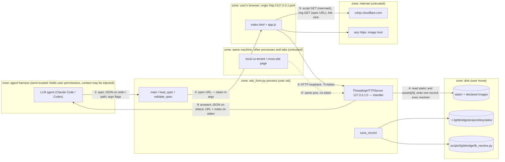

# ask-form — Security Architecture

> Source: https://github.com/Lightbridge-KS/agent-stuff · `plugins/productivity/skills/ask-form/` (branch `feat/security-architecture-skill`, HEAD `e9a2888`) · Date: 2026-09-11 · Mode: Explain · Class: Local tool + Agentic overlay · Tier: confidential (regulated excluded by policy only — see §1)
> See also: [ask-form design](design.md) §"Security posture" · [tracker v1](progress/v1.md) §"Confirmed contracts". No sibling lens docs (system / data / surface / agentic / extensibility) exist for this skill; this doc stands alone.

Paths below are relative to `plugins/productivity/skills/ask-form/` unless prefixed with `tests/`, `scripts/`, `docs/` or `.github/`, which are repo-root paths.

## 1. Overview

ask-form is a human-in-the-loop channel: an AI agent writes a JSON spec, `scripts/ask_form.py` serves it as one page on a random loopback port, the user answers in their browser, and the answers come back to the agent as one JSON document on stdout, then land on disk as a markdown record. **What is worth protecting** is the *integrity of the human decision* (that the answers really came from the user, not the agent), the *confidentiality* of what the agent chose to show and what the user typed (both are project decisions and free text that may carry anything the user pastes), and the *rest of the user's disk* (the server must serve only what the spec declared). **From whom:** the agent itself, whose context can be steered by injected text; any other process or browser tab on the same machine that can reach the loopback port; and the two remote hosts the page may contact at the agent's request (cdnjs for Mermaid, any `https:` image the spec names).

**Classification, with evidence.**

- *Local tool:* binds `("127.0.0.1", 0)` only (`ask_form.py:588`); one user, one browser, one run, then `server.shutdown()` (`ask_form.py:605`). Nothing listens after a terminal outcome.
- *Agentic overlay:* the caller is an LLM agent by design — "The agent supplies the judgment (what to ask); this tool stays deterministic" (`ask_form.py:15-16`; `SKILL.md:15-18`). Every string the page renders is agent-authored, and every string the user types flows back into the agent's context window via stdout (`ask_form.py:829`). The agent is therefore both an actor *behind* the tool and an input source *into* it.
- *Tier — confidential:* specs carry design context (diagrams, options, recommendations) and answers carry the user's judgment plus free text; the archived record also stores the absolute project path and git state (`ask_form.py:765`). *Regulated (PHI) is excluded by a policy line only:* "Do not put PHI in a spec you cannot justify showing in a browser tab" (`SKILL.md:124-125`; `docs/ask-form/design.md:142-143`). No control detects or blocks PHI in a spec or in an answer, so the tier is confidential by intent and would silently become regulated the moment a user pastes a patient detail into a `long_text` answer.

**Security substrate.** Identity provider: none — possession of the per-run URL token *is* the identity (`ask_form.py:508-509`). TLS termination: none; plain HTTP on loopback. Secret store: none; the token lives in process memory, the URL, and one stderr line (`ask_form.py:586, 593, 595`). Sandbox/container: none in-tool; the process runs under the harness's own Bash sandbox with whatever it allows (the design records that Claude Code's sandbox permits loopback bind and browser launch, Codex permits bind only: `docs/ask-form/design.md:23-26`). Audit sink: the markdown record under `~/.lightbridge/projects/<key>/asks/` (`ask_form.py:751-767`) plus whatever the harness keeps of stdout/stderr; the HTTP request log is deliberately silenced (`ask_form.py:490-491`).

## 2. Assets & Actors

| # | Asset | Tier | Where it lives (evidence) | Who may access |
|---|-------|------|---------------------------|----------------|
| A1 | **The human decision** — the submitted answers, `other`, `notes`, `comments`, and the fact that a *human* made them | confidential (crown jewel) | in flight as the `POST /submit` body (`ask_form.py:541-570`); in memory in `Run.answers` (`:480`); on stdout (`:829`); on disk in the record (`:766`) | the user (author), the agent (consumer) |
| A2 | **The spec** — what the agent chose to show: title, intro, options, recommendations, mermaid source, image paths | confidential | agent-authored via stdin or a path (`ask_form.py:773-786`); inlined into the page (`:519-520`); echoed raw into the record tail (`:746`) | the agent (author), the user (reader) |
| A3 | **The run token** — the only credential | credential | `secrets.token_urlsafe(18)` (`ask_form.py:586`); in the URL (`:593`); printed to stderr (`:595`); passed as argv to `open` (`:579`); held by the page (`static/app.js:7`) | the user's browser tab, the agent that launched the run |
| A4 | **Declared image files** — local images the spec names via `context.src` | confidential; could be anything on disk | realpath-resolved at validate time into `Compiled.assets` (`ask_form.py:130-139`); served by index at `/asset/N` (`:529-538`) | token holder |
| A5 | **Everything else on the user's disk** — must *not* be reachable through the server | up to regulated | the two file-serving routes are the only disk reads at request time (`ask_form.py:522-528`, `:529-538`) | nobody, via this tool |
| A6 | **The asks archive** — durable copy of A1 + A2 with project path and git state | confidential | `~/.lightbridge/projects/<key>/asks/<stamp>_<slug>.md` (`ask_form.py:755-766`; state dir from `scripts/lightbridge/lb_resolve.py:54-55`, overridable by `LIGHTBRIDGE_STATE_DIR`, `:47`) | the user; any agent later grepping it (`SKILL.md:96-97`) |
| A7 | **The user's browser context on the page origin** `http://127.0.0.1:<port>` — script running there holds A3 and can forge A1 | credential-adjacent | `static/index.html`, `static/app.js` | code from `self` and `https://cdnjs.cloudflare.com` only (`static/index.html:6-7`) |
| A8 | **The agent's turn** — the run blocks until Send or Cancel, by design | availability | `run.event.wait(timeout)` with `timeout=None` default (`ask_form.py:602`, `:792`) | the user (Cancel), the agent (stop the process, `SKILL.md:74-75`) |

| Actor | Trust level | Capabilities | Wants |
|-------|-------------|--------------|-------|
| the user | high — the answerer | opens the URL the tool launched; reads the page; submits or cancels | to answer once, truthfully, and have that recorded |
| **the agent** (Claude Code / Codex driving the CLI) | as its harness permissions — *but its context may carry injected text* | writes the spec (any strings, any local image path, any https image URL); runs the process; reads stderr (**so it holds A3**) and stdout; can run `curl` | follows its context — including a hostile instruction to forge an approval, show a file, or beacon data out |
| local co-tenant | none | reaches `127.0.0.1:<port>` from any process on the machine, or from any web page open in the user's browser (cross-site request); can read `ps` argv briefly | the token; the answers; to wedge or hijack the run |
| dependency author (supply chain) | executes in the page origin (A7) or in-process | `marked` 15.0.12 and DOMPurify 3.2.6 vendored in `static/vendor/`; Mermaid 11.6.0 fetched from cdnjs at runtime (`static/app.js:283`); Python stdlib; the lightbridge resolver path-loaded in-process (`ask_form.py:641-647`) | to run code where the token is |
| remote host operator | none | cdnjs serves a script into A7; any `https:` image host named in a spec sees the user's IP and the full URL the agent composed | traffic; whatever the URL encodes |
| insider | n/a | single-user local tool; there is no second human role | — |

## 3. Trust Boundaries & Attack Surface



Crossing ③′ is physically the same socket as ③ with a different actor; it is numbered separately because the control differs (③ carries the token, ③′ does not).

**Entry points, enumerated from code.**

| # | Entry point (real route / port / tool / file) | Who reaches it | Authn required? | Where (evidence) |
|---|-----------------------------------------------|----------------|-----------------|------------------|
| E1 | CLI argv: `SPEC`, `--timeout`, `--no-open`, `--no-save`, `--example`, `--schema`, `--validate` | the agent | harness Bash permission | `ask_form.py:790-798` |
| E2 | spec JSON on stdin or from *any* readable path | the agent | none in-tool | `ask_form.py:773-786` (`Path(source).read_text`, `:780`) |
| E3 | `context.src` — any local file with an image extension, or any `http(s)://` URL | the agent (inside the spec) | none; validated for existence + extension only | `ask_form.py:124-139` |
| E4 | `GET /` — page with spec inlined | browser tab; co-tenant | **token** | `ask_form.py:515-521` |
| E5 | `GET /static/*` — page code, vendored JS, CSS | anyone on loopback | **none** (public by design, `docs/ask-form/design.md:114`) | `ask_form.py:522-528`; path confined at `:525` |
| E6 | `GET /asset/N` — declared image by index | browser tab; co-tenant | **token** | `ask_form.py:529-538` |
| E7 | `POST /submit` — the answers | browser tab; co-tenant; **the agent with curl** | **token** + `Content-Type: application/json` + `≤ MAX_BODY` | `ask_form.py:544-567`, `:55` |
| E8 | `POST /cancel` | same as E7 | **token** | `ask_form.py:548-553` |
| E9 | any other path / method | anyone on loopback | — | 404 (`:539`, `:545`); no `do_OPTIONS`, so preflights get the stdlib 501 |
| E10 | `LIGHTBRIDGE_STATE_DIR` env var — redirects where the record is written | whoever sets the process env (harness) | none | `scripts/lightbridge/lb_resolve.py:47, 54-55` |
| E11 | `<agent-stuff root>/scripts/lightbridge/lb_resolve.py` — executed in-process at save time | whoever can write the checkout | none | `ask_form.py:641-647` |
| E12 | `https://cdnjs.cloudflare.com/ajax/libs/mermaid/11.6.0/mermaid.min.js` — script into the page origin, only when a mermaid pane exists | cdnjs | CSP `script-src` allowlists the host; no SRI | `static/app.js:279-289`; `static/index.html:7` |
| E13 | `git -C <root> rev-parse / branch / status` subprocess at save time | the cwd's repo | — | `ask_form.py:651-663` |

**One attack path, end to end** — the crown-jewel one: a *steered agent forges the user's answer.*

```mermaid
sequenceDiagram
    participant A as Attacker (the agent, steered by injected context)
    participant S as ask_form.py stderr (line 595)
    participant E as POST /submit (E7)
    participant G as Handler._authorized (508-509) + validate_answers (278-353)
    participant R as save_record (751-767)
    A->>S: launches the run; reads the URL, which contains ?t=<token>
    A->>E: curl POST /submit?t=<token> with a well-formed "approve" body across crossing ③
    E->>G: token matches; body is valid JSON; every id is a known option
    G-->>A: 200 {"status":"submitted"} — passes; this is the gap
    E->>R: record written as "status: submitted", indistinguishable from a human submission
    Note over A,R: No control distinguishes the user's browser from the agent's curl.<br/>The tool cannot prove a human decided; only the harness's own gates can.
```

## 4. Threats

STRIDE on the two crown-jewel crossings (③ browser/agent → server, and ④ server → disk). Others get a one-line verdict below.

| Crossing | S | T | R | I | D | E |
|----------|---|---|---|---|---|---|
| ③ `?t=token` → `/`, `/asset/N`, `/submit`, `/cancel` | **Yes — the agent.** It holds the token (stderr `:595`) and can POST a submission as if the user did (attack path above). A co-tenant cannot: 144-bit token, 403 without it (`:516, :530, :546`). | Body validated against the catalog before acceptance (`:563-565`); first writer wins under a lock (`:474-483`). In-transit tampering needs a loopback MITM, i.e. root — n/a. | **Yes.** The record says `status: submitted` with no origin, no user-agent, no signature (`:719-721`); the request log is silenced (`:490`). A forged submission and a real one leave identical evidence. | The page inlines the whole spec (`:519`); a token holder reads A2 and A4. Without the token: only `/static/*` (public code). Cross-origin reads are opaque (no CORS headers emitted in `_send`, `:494-503`). | No rate limit; daemon threads (`:591`); `Content-Length` capped at 5 MB before read (`:556-558`). A loopback flood can slow the run but not end it. Accepted for a single-user tool. | A token holder gets exactly the four routes; there is no admin plane. n/a beyond S. |
| ④ server → `static/`, `assets[N]`, `asks/`, resolver | n/a — no caller identity at this crossing. | Record writes never clobber: suffix loop (`:762-764`). `static/` is read-only served. | The record has no integrity protection (plain file the agent can also write with its own tools). | **Path confinement:** `/static/` resolves then requires `STATIC_DIR in target.parents` (`:525`); `/asset/` is index-only into a list fixed at validate time (`:533-534`), realpath-resolved with `strict=True` (`:132`) and image-extension-gated (`:136`). Absolute paths and `..` cannot escape either. Residual: **any image on disk the agent names is shown**; the extension gate is the only filter. | mkdir/write failures are caught and reported as `not saved:` (`:827-828`). | `exec_module` of `lb_resolve.py` from a path derived from the file's own location (`:641-647`) — code execution from the checkout, same trust as the tool itself. |

**Other crossings, one line each.**

- ① agent → CLI: the agent is the trusted author here; the validator is a shape check, not a content filter (`:172-275`). Any spec content the agent's context contains — including injected text — is rendered verbatim as sanitized markdown or text. *Verdict:* the crossing is where prompt injection enters this tool; the controls at ③ and ⑤ are what bound its blast radius.
- ② CLI → browser via `open URL`: the token rides in argv for the lifetime of `open` (`:579`), visible to same-uid `ps`. Same trust level as the user's own shell; accepted.
- ③′ co-tenant → port: 403 without the token; `Content-Type` must be `application/json` (`:554`), so a cross-site simple POST cannot even reach validation; no `Host` check, so a DNS-rebound page shares the origin but still lacks the token. *Verdict:* held by the token alone.
- ⑤ page → internet: **egress the agent controls.** `img-src https:` in the CSP (`static/index.html:7`) lets a `context` image with an `https:` `src` (`ask_form.py:128-129`; `static/app.js:261`) fetch any URL the agent composed; the Mermaid script is pinned by version but not by hash (`static/app.js:283`). Links open with `noopener noreferrer` (`static/app.js:41`). *Verdict:* one open beacon channel, one un-hashed script.
- ⑥ CLI → agent: stdout is user text bound for the model. The user is trusted; `long_text` has no length cap (`ask_form.py:441-442`) so a pasted document goes straight into context. *Verdict:* injection risk low (trusted author), context-bloat risk real, on the agent to handle.

**The ranked few that matter.**

| # | Threat | Asset | Actor | Crossing | Likelihood | Impact | Mitigated by (§5) |
|---|--------|-------|-------|----------|------------|--------|-------------------|
| 1 | Agent forges or replays a submission with the token it was handed, then acts as if the user approved | A1 (human decision) | the agent, steered | ③ | low today (needs a misaligned or injected agent) — but it is the exact failure the tool exists to prevent | high: a `review` pane is the user's 💡 approval gate (`SKILL.md:58`) | ❌ none in-tool; the harness's Bash gate and the user reading the transcript are the only controls |
| 2 | Agent exfiltrates context through the user's browser: encodes data in an `https:` image URL or a markdown link the user clicks | A2 and anything else in the agent's context | the agent, steered | ⑤ | low-medium | medium: silent, one request per image; the host sees IP + URL | ❌ `img-src https:` permits it by design; markdown `img` is forbidden but `context` images are not |
| 3 | Agent shows a local image it should not (a screenshot of a patient record, a diagram with credentials) — the user sees it in a tab, and its *path* lands in the record | A4, A5 | the agent, steered or careless | ③/④ | low-medium | medium-high if the file is regulated | ⚠️ extension gate only (`:136`); the record stores the resolved path via the raw spec tail (`:746`) |
| 4 | User pastes a secret or PHI into `long_text` / notes; it is written in plaintext to `asks/` forever and echoed into the agent transcript | A1, A6 | the user (accidental) | ③→④→⑥ | medium over time | high under PDPA if PHI | ❌ policy line only (`SKILL.md:124-125`); no retention, no redaction; `--no-save` is opt-out per run |
| 5 | Mermaid script substituted at cdnjs or by an on-path party; runs in the page origin with the token | A7, then A1/A3 | remote host operator / supply chain | ⑤ | low (https + version pin) | high | ⚠️ CSP allowlist + version pin; no `integrity` attribute |
| 6 | Co-tenant hits the port | A1, A3 | local co-tenant | ③′ | low | medium | ✅ token + content-type + path confinement (`test_token_scope_and_page`) |
| 7 | XSS via agent-authored strings (label, help, intro, option text, mermaid source) | A7 → A1 | the agent, steered | ①→③ | low | high (script on the origin holds the token) | ✅ textContent everywhere (`app.js:27`), DOMPurify on markdown (`:40`) and on rendered SVG (`:271`), `securityLevel: "strict"` (`:269`), `</` escaped in the inlined spec (`ask_form.py:519`), CSP (`index.html:7`) |

**Agentic overlay.**

- *Inputs that reach the model:* the stdout document — answers, `other` free text, `notes`, `comments` (`ask_form.py:608-618`); stderr lines including the exception message in `not saved: {e}` (`:828`) and the saved path (`:826`). All authored by the trusted user or the tool; no untrusted third party writes into this channel. The agent's *own* spec is the untrusted input in the other direction (see ①).
- *Write / irreversible tools:* the tool writes one file (never overwriting, `:762-764`), spawns `open` with a URL (`:579`), and runs read-only `git` (`:651-663`). It cannot delete, push, or send. The gate in front of these is the harness's tool permission, not anything in-tool; `agentic-architecture` covers that organ.
- *Tools that can send data out:* the browser, on the agent's instruction — `https:` image fetches (threat 2), the cdnjs script GET (fixed URL, no data), and links the user clicks. The CLI process itself makes no outbound network call.

## 5. Controls

| Threat (§4 #) | Control | Where it lives (evidence) | Status |
|---------------|---------|---------------------------|--------|
| 1 | proof that a human, not the agent, submitted | — | ❌ absent; residual accepted by design (§6, §8) |
| 1, 6 | per-run token, 144 bits, in the URL; checked on `/`, `/asset/N`, `/submit`, `/cancel` | `ask_form.py:586` (mint), `:508-509` (check), `:516, :530, :546` (gates) | ✅ located |
| 1, 6 | one terminal outcome, first writer wins; server exits after it | `Run.finish` `:474-483`; `serve` `:602-606` | ✅ located |
| 6 | `Content-Type: application/json` required on submit; 5 MB cap read before body | `:554-558`; `MAX_BODY` `:55` | ✅ located |
| 6 | no CORS headers; no `do_OPTIONS`; cross-origin reads opaque | `_send` `:494-503` (no `Access-Control-*`) | ✅ located (by omission) |
| 6 | `Host` header validation against DNS rebinding | — | ❌ absent; low value while the token holds |
| 3, 5(A5) | `/static/` confined to `STATIC_DIR` after resolve | `:524-526` | ✅ located; asserted by `tests/test_ask_form.py:237` |
| 3 | `/asset/` serves only the validate-time list, by integer index; realpath `strict=True`; image extensions only | `:130-139`, `:533-534` | ✅ located; asserted by `tests/test_ask_form.py:245-256` |
| 3 | a filter on *which* local images may be shown (path allowlist, PHI check) | — | ❌ absent; policy line only |
| 2 | block outbound image beacons | CSP `img-src 'self' data: https:` | ❌ absent by design — `https:` is deliberately open |
| 2 | links carry `rel="noopener noreferrer"` | `static/app.js:41` | ✅ located |
| 5 | CSP `script-src 'self' https://cdnjs.cloudflare.com`; Mermaid version pinned in the URL | `static/index.html:7`; `static/app.js:283` | ⚠️ partial — no `integrity` hash, no fallback to a vendored copy |
| 7 | agent strings as text nodes; markdown through DOMPurify with `img`, `style`, `form`, `input` forbidden; SVG through DOMPurify; `securityLevel: "strict"`; `</` escaped in the inlined spec | `static/app.js:27, :35-44, :269-271`; `ask_form.py:519` | ✅ located |
| 4 | retention / redaction of records; at-rest encryption | — | ❌ absent; `--no-save` per run (`ask_form.py:794, :822`) is the only lever |
| 4 | records never clobbered; save failure never changes exit code or stdout | `:762-764`; `:822-828` | ✅ located; asserted by `tests/test_ask_form.py:377-386` |
| — | request logging | `Handler.log_message` `:490-491` returns nothing | ❌ absent by design (stderr reserved for the URL) |

### 5.1 Identity & access

There is no identity provider and no session: the user is whoever holds the URL that `open` launched, and the token is the whole authorization model — one credential, four routes, no roles, no admin split (`ask_form.py:508-509`). Lifetime is one run: minted at `:586`, dead when `server_close()` returns at `:606`. That fits a local tool. What it cannot do is separate the two token holders — the user's tab and the agent that read stderr — which is the root of threat 1. *Agentic overlay:* the tool's own permissions are what the harness grants the process: bind loopback, spawn `open`, read the declared images, write one file under `~/.lightbridge`. There is no in-tool permission layer; `agentic-architecture` maps where the harness's HITL organ sits.

### 5.2 Secrets & supply chain

The only secret is the run token. It lives in memory (`Run.token`, `:466`), in the URL (`:593`), on stderr (`:595`, by contract: the Codex path needs it printed), in `open`'s argv (`:579`), and in the page (`static/app.js:7`). Never on disk, never in the record (`render_record` writes spec and result, not the URL; `:714-748`). No `.env`, no keys, no config section (`docs/ask-form/design.md:151-153`).

Supply chain, per component:

| Component | Version | How it arrives | Pinned / audited |
|---|---|---|---|
| Python runtime and stdlib | `>=3.11` (`ask_form.py:3`) | `uv run --script`; `dependencies = []` (`:4`) | no third-party Python at all ✅ |
| `marked` | 15.0.12 (header of `static/vendor/marked.min.js`) | vendored in the skill; travels through the registry symlink | file present ✅; no manifest, hash, or update check ❌ |
| DOMPurify | 3.2.6 (header of `static/vendor/purify.min.js`) | vendored | same ❌ |
| Mermaid | 11.6.0 | fetched from cdnjs at page load when a mermaid pane exists (`static/app.js:279-289`) | version in URL ✅; no SRI ❌; offline → code-block fallback (`:265`) |
| `lb_resolve.py` | this checkout | path-loaded from `parents[5]/scripts/lightbridge/` and executed (`:641-647`) | same repo, same trust ✅ |

*Skill/plugin provenance (overlay):* the skill is Authored, lives in this public repo, and reaches the harness through a registry symlink; a copied install loses the resolver and saves nothing (`:642-643`), which is fail-closed for persistence. CI runs the test suite and `py_compile` on every push (`.github/workflows/validate.yml:37-38, :52-60`); there is no dependency audit step for the vendored JS.

### 5.3 Data protection

*In transit:* plain HTTP on loopback; the bytes never leave the kernel. `Cache-Control: no-store` on every response (`:498`) keeps the spec and answers out of the browser cache. *At rest:* the record is a plaintext markdown file in the user's home; whatever the OS provides (FileVault) is the only encryption and this doc cannot verify it. *In logs:* the request log is off (`:490`); stdout/stderr go wherever the harness keeps tool output — in Claude Code that is a transcript under `~/.claude/projects/`, so answers are duplicated there for the transcript's lifetime. *De-identification / retention:* none; the record is "always-on" and a "plain archive" by decision (`docs/ask-form/design.md:151-153`). *What reaches the model (overlay):* everything the user typed; there is no in-tool filter, and the only guidance is the PHI policy line aimed at the *spec*, not at *answers* (`SKILL.md:124-125`).

### 5.4 Isolation & containment

Vocabulary of `extensibility-architecture` §8: the tool has **a process wall** (the CLI is its own process under the user's uid, started and stoppable by the harness) and **a browser origin wall** (the page is confined to `http://127.0.0.1:<port>`, and CSP confines what code runs there: `static/index.html:6-7`). There is **no OS sandbox, container, or network zone of its own**; whatever the harness's Bash sandbox imposes is inherited and unverifiable from here. What the walls actually confine: the page can reach only the four routes plus cdnjs and `https:` images; the process can read any file the spec names (E2, E3) and write only under the resolved state dir. The disk-serving routes are the one place the process wall is *opened* to the browser, and both are confined (`:525`, `:533-534`). The activation lock of §8 does not apply: the tool loads no plugins; the only late-bound code is Mermaid from cdnjs.

### 5.5 Logging & audit

The audit artifact is the record: frontmatter (title, created, project path, git state, status, duration), one block per question with answer, recommendation, divergence and note, comments, and the raw spec + result (`render_record` `:714-748`). It is written by the same process that could be forging the answer, has no signature, and is a file the agent can rewrite with its own tools — so it evidences *that a form ran*, not *who answered*. The HTTP request log is silenced (`:490-491`); there is no tool-call log beyond what the harness keeps. *Tamper resistance:* none. *Who reads it:* the user, and agents grepping `asks/` (`SKILL.md:96-97`). *Retention:* forever, no rotation. For a clinical decision this would not meet an event-level audit bar (`medlog-ref`); it is not meant to.

## 6. Assurance

**Tests that assert controls** — `tests/test_ask_form.py`, run by `just test` and CI (`validate.yml:37-38`), a dry gate (hermetic: real loopback server, no external service). Verified green on 2026-09-11 on this Mac: 19 run, 1 skipped (the pty test, no pty in the sandbox).

| Control | Test | Lines |
|---|---|---|
| token gates `/`, `/submit`; `/static/` open; `/static/../` confined; unknown path 404 | `test_token_scope_and_page` | `:228-243` |
| `/asset/N` token-gated, index-bounded, serves the declared bytes | `test_asset_whitelist` | `:245-256` |
| answer catalog validation (unknown id, missing required, not-an-option) → 400; `text/plain` → 415; bad JSON → 400; the run survives | `test_answer_validation_keeps_the_run_alive` | `:277-294` |
| first writer wins; second terminal POST → 409 | `test_cancel_then_submit_conflicts` | `:388-393` |
| save failure never changes exit code or stdout | `test_unwritable_state_dir_is_a_note_not_a_failure` | `:377-386` |
| cancel and `--no-save` write nothing | `test_no_save_and_cancel_write_nothing` | `:364` |

**Not asserted by any test:** that the CSP is present and unchanged; that DOMPurify actually strips a hostile label (no XSS fixture); that an `https:` image URL is fetched (threat 2); that the Mermaid URL is the pinned one. The renderer (`static/app.js`) has no automated tests at all — verification was manual passes recorded in the tracker (`docs/ask-form/progress/v1.md:42-48`).

**Scanners:** none run on this skill. `/security-review` on the next diff touching `Handler` or `app.js`, and the `claude-security` plugin over `plugins/productivity/skills/ask-form/`, are the right tools for the code-level layer; §3–4 tell them to look at the four routes, the two disk-serving branches, the markdown/SVG sanitizer calls, and the cdnjs loader. Their reports belong here when they exist. No dependency audit exists for the vendored JS.

**Residual risk, as the evidence shows it accepted:**

- Threat 1 (agent-forged submission): accepted implicitly by printing the token to stderr for the Codex path (`docs/ask-form/design.md:56-57`). Owner: KS. Until: an MCP or harness-side channel exists that keeps the token from the agent (tracker Deferred, `progress/v1.md:61`).
- Threat 2 (image-URL egress): accepted implicitly by `img-src https:`. Not recorded as a decision anywhere — see §8.
- Threat 4 (plaintext records, no retention): accepted explicitly as "always-on, plain archive" (`design.md:151-153`).
- Threat 5 (no SRI on Mermaid): not recorded as a decision — see §8.

## 7. Control Presence Matrix

| Control family | Present? | For which subsystem | Where (evidence) | Note (absence is a finding) |
|----------------|----------|---------------------|------------------|------------------------------------------|
| authentication | ✅ | HTTP routes `/`, `/asset/N`, `/submit`, `/cancel` | `ask_form.py:508-509, :586` | bearer-style URL token, one run; cannot distinguish user from agent (threat 1) |
| authorization | ⚠️ | HTTP | same | single role; token = all four routes. No finer split exists or is needed |
| input validation | ✅ | spec (agent → CLI); answers (browser → CLI) | `validate_spec :172-275`; `validate_answers :278-353` | shape and catalog checks; not a content filter — agent strings pass through to the sanitizer |
| output encoding / sanitization | ✅ | page | `static/app.js:27, :40, :271`; `ask_form.py:519` | textContent, DOMPurify, SVG profile, `</` escape |
| secrets management | ⚠️ | run token | in memory, URL, stderr, argv | no secret store needed; the stderr print is the accepted leak to the agent |
| transport encryption | ❌ | loopback HTTP | — | by design; loopback never leaves the host. Becomes a finding the day "iPad reach over the tailnet" (`progress/v1.md:62`) lands |
| at-rest encryption | ❌ | `asks/` records | — | OS-level only; unverifiable here |
| audit logging | ⚠️ | records | `render_record :714-748` | evidences the run, not the author; request log silenced (`:490`); no tamper resistance |
| rate limiting / abuse | ❌ | HTTP | — | 5 MB body cap only (`:55, :557`); accepted for loopback |
| sandboxing / isolation | ⚠️ | process; page | process wall + CSP (`index.html:7`) | no OS sandbox of its own; inherits the harness's |
| dependency pinning & audit | ⚠️ | vendored JS; cdnjs Mermaid | file headers; `app.js:283` | versions pinned; no hashes, no SRI, no audit job; Python has zero deps ✅ |
| backup & recovery | ❌ | `asks/` records | — | none; a plain archive the user may back up with their home dir |
| egress control | ❌ | page → internet | CSP `img-src https:` (`index.html:7`) | one open image-beacon channel the agent controls (threat 2) |
| agent tool gating (overlay) | ❌ in-tool | what the agent may name in a spec (local paths, URLs) | — | extension gate only (`:136`); no allowlist of directories or hosts; the harness's permission prompt is the only gate |
| PHI / regulated-data control (overlay) | ❌ | spec and answers | `SKILL.md:124-125` policy line | no detection, no redaction, no retention |

## 8. Open Questions & Notes

- **Is threat 1 an accepted risk or an unexamined one?** The design prints the token to stderr for the Codex path (`design.md:56-57`), which hands it to the agent. Nothing in `design.md` §"Security posture" or the tracker's "Confirmed contracts" states that the tool does not attest human authorship. If `review` panes are meant as the user's 💡 approval gate (`SKILL.md:58`), that should be written down as a known limitation, with the harness's transcript named as the compensating control.
- **`img-src https:` — deliberate or default?** It is required for `context.src` URLs to render, so it is probably deliberate, but no doc records the trade-off (an agent-controlled beacon through the user's browser). A `data:`-only or `self`-only policy with URL images fetched server-side would close it at the cost of a network call from the CLI.
- **Mermaid without SRI.** `docs/ask-form/design.md:136` says "mermaid lazily from cdnjs"; whether the missing `integrity` attribute is a choice (the cdnjs URL is stable and hashable) or an omission is not recorded.
- **Where does stdout live afterwards?** The harness's transcript keeps the answers; retention and location depend on the harness and are outside this repo's evidence. Users who paste sensitive text get two durable copies, one of which this tool does not control.
- **Which local images should the agent be allowed to show?** The extension gate (`:136`) is a type filter, not a scope filter. Whether a directory allowlist (project root, `_playground/`) is wanted is a product decision, not evidence.
- **The deferred "iPad reach over the tailnet" item (`progress/v1.md:62`)** changes the exposure class from Local tool to Internal service: transport encryption, `Host` validation, and token handling all move from "accepted" to "required" the day it lands. This doc should be revisited before that item leaves Deferred.
- **Harness sandbox.** What the Bash sandbox actually confines for this process (filesystem, network) is harness configuration, not repo evidence; the spikes only establish that loopback bind and `open` work.
- Not pinned to a crossing: whether an agent could exploit the `git` subprocess at save time (`:651-663`) through a hostile `.git` config in the cwd. It runs read-only commands in a repo the user already trusts; left as a note, not a threat row.
