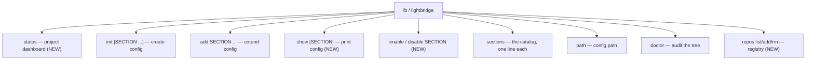
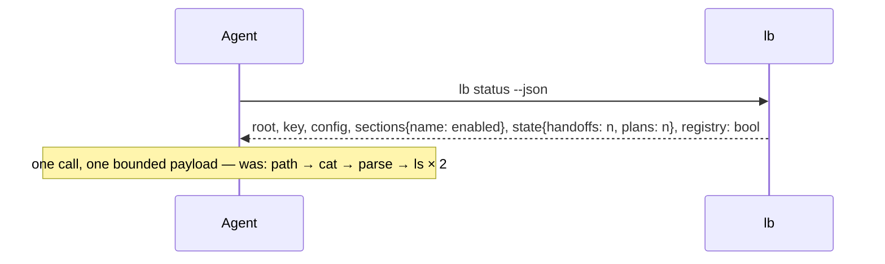

# lightbridge CLI — Surface & AX Design (v0.2 proposal)

> Source: `scripts/lightbridge/lightbridge.py` v0.1.0 + this design conversation · Date: 2026-07-16 · Mode: Design · Surface: CLI
> See also: [multi-machine sync (deferred)](./multi-machine-sync.md) · canonical spec: `plugins/lightbridge/skills/lightbridge-config/references/catalog.md`

Two users, one surface: KS at a terminal, and an AI coding agent in a non-interactive
shell. The agent is the *more* constrained user — it learns the tool only from `--help`,
pays tokens for every line returned, and must branch on exit codes — so the design is
judged from the agent's seat first (the AX lens); everything that helps the agent here
also reads fine to a human.

## Cheat Sheet (proposed surface)

```bash
lb status                 # NEW — one-shot dashboard: root, key, config, sections, state
lb init [SECTION ...]     # create this project's config (never clobbers); no args → detect
lb add SECTION ...        # append section(s); idempotent
lb show [SECTION]         # NEW — print the config (or one section) as stored; --json
lb enable|disable SECTION # NEW — flip `enabled` without hand-editing TOML
lb sections               # what can go in a config, and who reads it
lb path                   # config path only (scripting primitive; status supersedes it for humans)
lb doctor                 # audit the whole tree; exit 1 on problems
lb repos list|add|rm      # NEW — manage ~/.lightbridge/repos.toml
```

Every verb keeps `--json`; `init`/`add`/`show`/`enable`/`disable`/`path`/`status` take
`--start DIR`. Exit codes unchanged: `0` ok (incl. idempotent no-op) · `1` refused /
problems found · `2` usage.

## 1. Overview

`lightbridge` (`lb`) is the canonical resolver and lifecycle CLI for the user-level
`.lightbridge` namespace — per-project config at `~/.lightbridge/projects/<key>/config.toml`
plus the audit of that tree. v0.1 covers the **write path** well (`init`, `add`) and the
**audit path** (`doctor`), but the **read path** is a hole: to answer "what is lightbridge
doing in this repo?" a caller must chain `lb path` → `cat` → parse TOML → know which
sibling state dirs to `ls`. v0.2 closes that with read verbs and makes `lb` the
*discovery front door* to the wider ecosystem without absorbing the sibling tools.

The user is (a) KS bootstrapping or debugging a project's config, and (b) an agent
executing the `lightbridge-config` skill or answering config questions mid-session.

## 2. Surface Map

Current five verbs, plus proposed additions (marked NEW):



| Touchpoint | What the user does with it | Status |
|---|---|---|
| `lb status` | One shot: root, key, config path + exists, sections present with `enabled` state, sibling state dirs (`handoffs/`, `plans/`) with file counts and the tool that owns each, registry present? | NEW |
| `lb init [SECTION ...]` | Create the config; positional sections replace `--sections a,b` | change |
| `lb add SECTION ...` | Append sections, skip present ones | as-is |
| `lb show [SECTION]` | Print the stored config, whole or one section; `--json` = parsed TOML as JSON | NEW |
| `lb enable/disable SECTION` | Set `enabled = true/false` inside an existing section; refuses (exit 1) with "add it first" when the section is absent | NEW |
| `lb sections` | List known sections + reader | as-is |
| `lb path` | Print the config path; kept as the stable scripting primitive | as-is |
| `lb doctor` | Audit: unreadable / missing-root / stale / key-mismatch / legacy | as-is |
| `lb repos list/add/rm` | Manage `~/.lightbridge/repos.toml` — today hand-written, the last hand-edited file in the namespace | NEW |

**What `lb` deliberately does NOT absorb:** `plan_store.py`, `handoff.py`,
`repo_links.py`, `docs-index` stay standalone. Each has its own contract, README, tests,
and hook wiring; folding them in would couple release cycles and violate the repo's
one-folder-one-tool rule. Instead `lb` *points* at them: `lb --help`'s epilog and
`lb status`'s state lines name the owning tool (see §6, Principle 1/3).

## 3. Entry & Onboarding

Unchanged and already good: PATH symlink (`lightbridge` + `lb`), shebang carries `uv`
through the link, zero-setup fallback by absolute path. First contact for an agent is
`lb --help`; the proposed epilog upgrade makes that one screen the map of the whole
namespace:

```
Exit: 0 ok · 1 refused · 2 usage.
Siblings (own their state, not wrapped): plan_store.py (plans/), handoff.py (handoffs/),
repo_links.py ([repo-links] resolution), docs-index ([docs-index] rendering).
Spec: the lightbridge-config skill.
```

## 4. Key User Journeys

**J1 — agent answers "what's configured here?" (the journey v0.2 exists for):**



**J2 — bootstrap (unchanged):** `lb init` → detected sections reported with `← detected`
→ `next: add …` line teaches the remaining moves.

**J3 — toggle a feature:** today "set `enabled = false`" is a hand-edit the skill
instructs the agent to perform with a file editor. Proposed: `lb disable docs-index` —
deterministic, idempotent (already-false → `unchanged`, exit 0), reversible.

## 5. Interaction & State

- **Exit codes** — keep the v0.1 taxonomy verbatim (`0/1/2`); every new verb maps onto it.
  `status` exits 0 even when the config is absent (absence is a state, not an error;
  the output says `config: absent — create it with lb init`).
- **stdout = data, stderr = diagnostics** — already respected (legacy warning, refusal
  messages); new verbs follow.
- **`--json` everywhere** — `status --json` is the agent's primary read;
  `show --json` returns the parsed TOML (verbatim keys, **no defaults injected** — defaults
  belong to each reader and are documented in the catalog; injecting them here would
  create a second source of truth that drifts).
- **Refusals keep teaching** — pattern stays "state the fact, name the next verb":
  `enable` on a missing section → `no [research] in this config — add it: lb add research`.

## 6. Ergonomics & AX decisions (by principle)

| # | Principle | Decision |
|---|-----------|----------|
| 1 | Self-documenting affordance | `--help` epilog names sibling tools + the skill (the spec is the only onboarding). `sections` stays the in-CLI catalog digest. |
| 2 | Context economy | `status` returns a bounded dashboard, never file contents; `show` scopes to one section on request; no verb dumps sibling state bodies. |
| 3 | Right abstraction | The agent's real task is "what's active here?" → one `status` verb, not a chain. Siblings stay separate tools (task boundary = state ownership), cross-referenced not wrapped. |
| 4 | Unambiguous contract | Sections are argparse `choices` everywhere (already true for `add`; `init` moves to the same positional form — one shape for "name sections"). Unknown section → usage error naming the valid set (exists, keep). |
| 5 | Errors that teach | Keep the 0/1/2 taxonomy; every refusal names the next verb. `status` distinguishes "absent" (informational) from "unreadable" (problem, mirrors doctor's kind). |
| 6 | Predictable & safe | All new verbs idempotent; `enable/disable` edits exactly one key by targeted line-edit inside the section block (templates always emit `enabled =`), never a TOML rewrite — comments and layout survive. No `doctor --fix` (deferred, see Decisions). |
| 7 | Composable & verifiable | `init/add/enable/disable` are read-after-write verifiable via `show`/`status`. JSON shapes reuse the v0.1 `bootstrap_json` philosophy: one shape per concern, caller never branches on the verb. |

## 7. Configuration & Customization

Unchanged: `$LIGHTBRIDGE_STATE_DIR` overrides the tree (tests), `--start DIR` retargets
any project-scoped verb, `--state-dir`/`--registry` on `doctor`. `repos add/rm` writes
`~/.lightbridge/repos.toml` with the same never-clobber temperament: `add` refuses to
overwrite an existing name (exit 1, "rm it first or pick another name").

## 8. Decisions (resolved 2026-07-16, KS)

All five settled with the recommended option:

1. **`lb repos` — IN.** The registry is the last hand-written file in the namespace,
   `doctor` already reads it, and it has no owning tool — resolver-domain, unlike
   plans/handoffs. Cost: ~60 lines + tests.
2. **`init` sections go positional** (`lb init docs-index research`) to match `add`;
   `--sections a,b` is dropped in the same release — pre-1.0, sole consumer is this
   machine, no deprecation shim.
3. **`status` reports counts + owning-tool pointer only**
   (`handoffs 3 files + 1 inbox — handoff.py`). Computing *unread* would duplicate
   handoff's `.acked` logic — the one-implementation rule says no.
4. **`doctor --fix` deferred.** The only safe auto-fix is `key-mismatch` (folder rename);
   `stale` needs the multi-machine `relocate`/`not-on-this-machine` nuance from the
   [sync design](./multi-machine-sync.md), and building half of that now risks
   contradicting it.
5. **Bare `lb` stays a usage error** (exit 2, `required=True`). The usage line already
   lists every verb — adequate self-documentation; full-help-on-bare is cosmetic.

## Non-goals

- Absorbing plan-store / handoff / repo-links / docs-index into `lb` (coupling > convenience).
- Injecting per-key defaults into `show` (defaults stay with readers + catalog).
- `lb sync` / `lb relocate` — owned by the deferred [multi-machine design](./multi-machine-sync.md).
- Colors, tables, interactive prompts — two-audience rule: nothing that needs a TTY.
