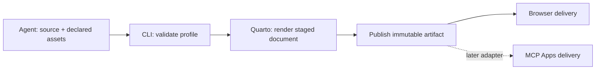

# Rich document — design

Status: **browser slice implemented; experimental** · corrected 2026-09-22.
Scope: [requirements](req/prd.md). Reference: [ask-form](../ask-form/design.md).
Implementation evidence and verification limits: [progress](progress/v1.md).

## Architecture

A thin **Authored / Contract** skill wraps a deterministic CLI and a
constrained Quarto profile. Its governed home is `plugins/experiment/skills/rich-document/`;
graduation requires actual use and review. The skill teaches when to use the surface,
its supported syntax, and how to repair diagnostics. It does not teach general
writing or require a new LLM call inside the engine.

The agent generates the explanation and chooses semantic blocks. The renderer
owns their behavior and appearance. The core should not depend on MCP.



**Accepted 2026-09-21 — engine:** constrained Quarto for v1, including its installed CLI dependency.

## Why this engine

| Candidate | Fit | Cost / reason to choose it later |
|---|---|---|
| Quarto | Best initial fit for a single, rich document | Large HTML output and a separate engine dependency; existing Markdown authoring vocabulary avoids building one |
| Astro Starlight | Better for a lasting documentation site | Site scaffolding/build configuration adds little value to a single explanation; consider when multi-page navigation becomes the product |
| Markdoc + custom viewer | Strong alternative for a strict component catalog | Own the component behavior, theme, accessibility, Mermaid integration, and export path; reconsider if MCP-first delivery dominates |
| Unrestricted generated HTML | Maximum freedom | Incompatible with the selected fixed-theme, semantic-block scope |

Quarto documents tabsets through fenced divs and supports embedded-resource HTML.
Its diagram support includes Mermaid. Starlight exposes components through MDX
or Markdoc; Markdoc provides a declarative extension mechanism. These are source
facts; the fit judgments above are design recommendations.
Sources: [Quarto HTML](https://quarto.org/docs/output-formats/html-basics.html),
[diagrams](https://quarto.org/docs/authoring/diagrams.html),
[Starlight components](https://starlight.astro.build/components/using-components/),
[Markdoc](https://markdoc.dev/docs/overview). Checked 2026-09-21.

## Agent-facing surface

The primary entrypoint is a bundled Python CLI, using Typer and pinned PEP 723 dependencies. Quarto 1.9.38 is an external
dependency; unverified versions fail with an explicit dependency diagnostic. Runtime code, schema, fixed templates, and theme travel with the skill;
no separate service installation is needed for browser v1.

```text
rich_document.py example                 # print a small supported source
rich_document.py schema                  # metadata + block/attribute contract
rich_document.py validate source.qmd     # errors with location and remedy
rich_document.py present source.qmd      # render, save, start viewer, open, return
rich_document.py open ARTIFACT_ID        # reopen saved output without rendering
rich_document.py list --limit 10         # project-scoped id/title/date inventory
rich_document.py stop ARTIFACT_ID        # stop this artifact's viewer only
rich_document.py serve ARTIFACT_ID       # foreground fallback for a background runner
```

`present` takes `--no-open`, `--no-save`, and `--json`. Normal operation emits a
short location summary. JSON mode emits one result document on stdout; engine
logs go to stderr. Result fields: `status`, `artifact_id`, `source_path`,
`html_path`, `url`, `warnings`. Runtime access tokens are not written into the
artifact manifest. A failed automatic browser launch still returns usable paths
and a URL with a warning.

Exit categories: `0` ready/valid, `2` invalid input, `3` dependency or
render failure, `4` persistence failure, `5` viewer startup failure. Errors carry
`stage`, source location where available, and a concrete repair hint.

`ready` means the output exists and the viewer answered its health probe; it
does not mean a person has read it. Source/render warnings must not be silently
converted into success. Mermaid syntax needs explicit checking because browser
rendering can fail after the HTML build succeeds.

### Authoring profile

Use Quarto's Markdown syntax without exposing its entire execution/configuration
surface. A document needs only a title and body. An optional `artifact` mapping
declares profile version and layout; omitted values mean v1 and `article`.
The versioned `.qmd` subset is an accepted authoring decision.

````markdown
---
title: Why this module boundary works
artifact:
  version: 1
  layout: article
---

## The flow

```{mermaid}
flowchart LR
  A["Request"] --> B["Domain service"] --> C["Repository"]
```

::: {.panel-tabset}
### Current

The controller owns persistence details.

### Proposed

```python
result = service.handle(request)
```

The service owns the use case.
:::

::: {.callout-note collapse="true"}
## Tradeoff
One additional boundary, with a narrow interface.
:::
````

Ordinary code fences are displayed, never run. `{mermaid}` is the single permitted
special fence initially. Div support means Pandoc fenced divs with documented
classes and attributes; it does not require accepting arbitrary HTML `<div>` tags.
Unknown profile keys, classes, attributes, executable cells, and active markup
fail validation rather than being silently ignored. Standard prose, tables,
lists, links, and code remain readable outside this viewer; enhanced blocks may
show their source in plain Markdown viewers.

## Generative UI contract

**Runs in:** own browser surface first; supporting MCP Apps hosts later.
**Model emits:** constrained Markdown and metadata. This is Declarative content
inside Controlled chrome. Host iframe delivery does not make the payload
Open-ended. It is the payload contract, rather than the file extension, that
defines the tier.

### Catalog

Values are literal source content or declared asset IDs; arbitrary data paths,
tool calls, and network-backed props are excluded. All prose is agent-authored.
Viewer control labels such as Copy, Expand, Zoom, and Reset are engine-owned.
No catalog action sends anything back to the agent in v1.

| Entry | Properties and defaults | Local action | Placement / cardinality / mobile | Representative intents |
|---|---|---|---|---|
| Document | Required title; optional subtitle; version defaults 1; layout defaults article | Navigate headings | One; responsive reading width | Explain a system; walk through a change |
| Prose | Required Markdown body | Follow a link | Repeated in main, tabs, callouts, columns; wraps | Explain the reason; list constraints |
| Code | Required text; optional language defaults plain text | Copy exact text | Repeated in content slots; horizontal scroll | Show an API call; compare implementations |
| Mermaid | Required diagram text | Enlarge, zoom, reset | Repeated in content slots; fit to width then enlarge | Map a dependency; show request flow |
| Tabset | 2–6 titled panels; first initially selected | Select panel | Repeated in main; no nested tabsets; scroll tab labels on narrow screens | Compare alternatives; separate language examples |
| Callout | Required body; kind note/tip/warning defaults note; optional title; collapse defaults false | Toggle if collapsible | Repeated in main or a tab/column; full width | Explain a caveat; tuck away supporting detail |
| Columns | Exactly two body slots; equal widths | None | Main only, at most one level; stacks on mobile | Compare responsibilities; pair explanation and example |
| Image | Required declared local asset ID and alt text | None | Repeated in content slots; bounded width | Explain a screenshot; inspect a reference diagram |

### Composition

Start with one `article` template. Header: one title plus zero or one subtitle.
Main: ordered sections containing prose, code, diagrams, images, callouts,
tabsets, or columns. TOC: derived from section headings. Footer: compact artifact
identity and renderer version, owned by the engine.

Tab panels and column slots accept prose, code, Mermaid, images, and callouts;
callout bodies accept prose, code, and images. They cannot recursively introduce
arbitrary layouts. Source order remains reading order. Comparison uses a tabset
or two columns within the article, not an additional site shell.

**Accepted 2026-09-21 — visual direction:** retain the preview's light article theme.
Add a matching dark theme with an always-available theme toggle in the viewer
chrome. Use Quarto's native light/dark theme mechanism, including adaptive code
highlighting and diagram styling; theme switching must not reset tabs or panels.
Initially follow the browser/OS color preference, then remember an explicit
choice when browser storage is available. The preference belongs to the viewer,
not to agent-authored document metadata. Both themes ship inside the HTML export.

**Dark background direction:** use nearly black, neutral backgrounds rather than
green-tinted surfaces: page `#080808`, panels `#151515`, code blocks `#101010`,
and borders `#303030`. Retain teal accents and headings.

**Accepted 2026-09-21 — dark palette:** retain the revised near-black preview
and its teal accents. Both light and dark visual treatments are accepted.

Mechanism: [Quarto light/dark theming](https://quarto.org/docs/output-formats/html-themes.html#dark-mode),
checked 2026-09-21.

### Determinism and verification

Structural determinism applies to a fixed source, profile, renderer, and theme.
It does not promise that five fresh LLM explanations will contain identical
wording, or that all browsers produce pixel-identical output.

Run one representative intent five times to inspect catalog/layout adherence,
numbers, labels, and meaning; wording can vary. Separately render one fixed fixture
five times and compare normalized structure, content, code, and assets, excluding
artifact IDs/timestamps. Pin tested engine/theme versions and record them in the
manifest. A prose sample succeeding is insufficient: test Mermaid in a hidden
tab, keyboard controls, narrow widths, and print fallback as well.

## Rendering and security boundary

Quarto is a document compiler, **not a sandbox**. `--no-execute` prevents intended
computation but is not a defense against arbitrary filters, includes, project
hooks, or raw HTML. The wrapper narrows what Quarto receives:

1. Parse frontmatter and Markdown with maintained parsers, not regex alone.
   Validate the supported metadata/block profile and Mermaid configuration.
2. Resolve only explicitly declared local assets, reject escaping paths and
   symlinks outside the declared asset root, and stage copies. Do not fetch
   remote images, scripts, fonts, or CSS during render.
3. Construct renderer-owned metadata and canonical staged source outside the
   caller's project ancestry. Do not inherit `_quarto.yml`, extensions, profiles,
   hooks, filters, includes, or execution settings from the source project.
4. Invoke a fixed Quarto command with execution disabled and bounded resources;
   allow only shipped theme/filters. Audit generated output for active content
   outside the shipped runtime. Mermaid uses a fixed strict configuration;
   source cannot override security settings or supply click handlers.
5. Serve the finished bundle on loopback with an unguessable capability URL,
   read-only routes, explicit Host checks, no directory listing, and only the
   artifact's assets. Add a tested CSP and no-referrer policy. These controls
   must be exercised against Quarto's actual runtime, not assumed compatible.

Declarative content is validated; Controlled behavior is shipped and versioned.
Open-ended HTML/CSS/JS is excluded. No PHI or secrets enter the artifact store.
Validation uses Markdown-it's fence tokens followed by Quarto's bundled Pandoc
AST. The fence scan preserves the distinction between displayed code and an
executable cell. Before canonical Markdown reaches Quarto, literal code contents
are replaced with opaque tokens; the owned Lua filter restores them after
Quarto's include/shortcode preprocessing. This prevents displayed shortcode
examples from being interpreted as includes.

Mermaid syntax validation uses Quarto's bundled Deno and Mermaid parser. The
pinned bundle receives a guarded browser-global adaptation and a syntax-only
DOMPurify stub because Deno has no browser DOM. No SVG is produced in this check;
the browser uses the unmodified Mermaid runtime and its strict sanitizer. Engine
upgrades require re-verifying both paths.

Bounds: 1 MiB source, 20 diagrams of at most 30 KiB each, 20 declared raster
assets of at most 10 MiB each / 20 MiB total, 40 MiB HTML. Compile operations have
120-second deadlines; these do not control viewer lifetime. Generated HTML is
audited for embedded resource references and forbidden active container elements.

## Artifact lifecycle and persistence

Use the existing Lightbridge resolver for project identity, including the
non-git-directory fallback. The correct namespace is `.lightbridge`.

```text
~/.lightbridge/projects/<project-key>/artifacts/<artifact-id>/
  source.qmd
  manifest.json
  assets/             # declared inputs, if any
  rendered/
    index.html
```

The manifest records schema version, title, creation time, original source and HTML hashes,
renderer/theme/viewer versions, declared assets, and render warnings. The directory
is the inventory; avoid adding a database or parallel index. Publish atomically
after successful validation/render. A revision creates a new artifact, preserving the previous explanation. Revision
lineage is not represented in v1.

The CLI owns these writes; the agent does not hand-edit Lightbridge internals.
The subtree is registered in the Lightbridge catalog, following the same
feature-owned state pattern as `asks/`. No config section is needed
until user-tunable project defaults exist.

**Accepted 2026-09-21 — retention:** save successful artifacts by default, with
`--no-save` for scratch. Saved artifacts have no automatic deletion policy.

`present` renders once and returns after viewer readiness. **Accepted lifecycle:**
no viewer countdown, idle timeout, or maximum lifetime. The reader closes the tab
when finished. The on-demand child viewer remains available until explicit
`stop` or process/OS shutdown; no activity heartbeat or visibility timer controls
its lifetime. `open` reuses a healthy viewer or starts one when needed.
The viewer lifecycle needs a detachment test
in each supported harness. If a harness reaps children, its documented background
process mechanism is the fallback. Opening again restarts delivery without
re-rendering. Saved HTML remains usable independently of the server. Browser
view state is ephemeral; closing the tab is not a submission or a reliable stop
signal. Bounded render/startup operation timeouts do not expire an already-ready
viewer. Temporary artifacts are cleaned on explicit normal viewer shutdown,
not merely when a browser tab closes.

Static HTML should embed its assets for portability. The feasibility fixture was
about 4.5 MiB with one theme and is about 7.1 MiB with both themes, so do not send
full HTML through ordinary model-visible tool output.
Image-heavy documents need size limits. Embedded-resource auditing is covered by automated checks. Direct `file://`
interaction remains unverified because the available browser policy blocks it.
Theme preference uses browser-origin storage; a new viewer port starts with the
OS default, and file exports do not persist preference across reopenings. Abrupt
process termination may leave temporary output for manual cleanup.

## MCP Apps: optional delivery, separate acceptance gate

MCP Apps is an optional host capability, not a Markdown renderer or a universal
canvas API. A server associates a tool with a `ui://` HTML resource, and the host
loads it into a sandbox. UI and host negotiate capabilities and communicate over
JSON-RPC using `postMessage`. Unsupported hosts can receive ordinary tool output.
Sources: [overview](https://modelcontextprotocol.io/extensions/apps/overview),
[2026-01-26 specification](https://github.com/modelcontextprotocol/ext-apps/blob/main/specification/2026-01-26/apps.mdx).
Checked 2026-09-21; a dated spec file on `main` can still change.

Propose one model-facing `present_document` tool calling the same validation,
render, and storage core. Its UI metadata references a stable viewer resource.
The MCP-aware viewer owns initialization, sizing, theme integration, and
artifact loading; artifact IDs/data arrive through tool results. Keep the
model-visible result compact and use a scoped app-only retrieval path for large
payloads where supported. The app never receives arbitrary filesystem access.

Do not assume the unmodified standalone Quarto HTML can simply be dropped into
that stable viewer. The adapter spike must select and prove how Quarto's rendered
body, styles, and scripts initialize inside the host-approved shell. Inserting
HTML alone does not reliably initialize its scripts; an extra iframe can be
blocked by host CSP. Share source, profile, theme, and render logic, while allowing
the delivery shell to differ.

Acceptance requires an actual chosen host: initialization, content hydration,
Quarto dependencies, Mermaid, tab switching, narrow sizing, denied clipboard or
link capabilities, and fallback. Current host support is unverified locally.
Browser support in an agent harness does not imply MCP Apps support. A remote
chat host also cannot be assumed to read a local artifact path or reach the
user's loopback URL; remote delivery requires a separate transport decision.

If this adapter needs a second renderer, reconsider Markdoc/custom-viewer before
accepting two divergent render paths. Do not build a renderer abstraction or MCP
server merely to reserve the possibility.

## Delivery slices

1. **Engine feasibility (this exploration):** representative Quarto document and
   browser inspection. This validates the candidate engine, not production readiness.
2. **Browser tracer bullet:** source → validator → isolated render → saved
   artifact → browser → reopen. Add the small catalog, theme, diagram enlargement,
   diagnostics, and lifecycle checks before exposing the skill as ready.
3. **Review and refine:** real explanations, keyboard/narrow-screen checks,
   five-run consistency exercise; revise the profile before graduation.
4. **MCP adapter:** only after a target host is chosen and the shell integration
   is demonstrated. Keep the browser path as baseline delivery.

## Implementation and verification

The bundled modules keep three responsibilities separate: `rd_core.py` owns the
source contract, compile pipeline, and artifact store; `rd_viewer.py` owns local
delivery; `rich_document.py` owns CLI output and command dispatch. The copied skill
carries all runtime assets. Persistent use requires Lightbridge on PATH; source
checkout use can resolve its canonical sibling CLI without copying resolver logic.

Viewer startup is serialized per artifact using an OS lock. Runtime records live
in private temporary state, separate from manifests. Healthy viewers are reused;
stop authenticates to the live endpoint rather than trusting a recorded PID.
No viewer activity/lifetime logic runs. A fresh viewer hash-checks the saved HTML; a healthy reused viewer retains the
already-loaded bytes.

The [owned Mermaid lifecycle](adr/0001-owned-mermaid-rendering.md) replaces Quarto's
load-time initializer. Diagram source is masked as inert code during compilation;
the final filter emits escaped placeholders. The pinned browser library and
Quarto diagram CSS are embedded without its initializer. A serial queue renders
in a measurable off-screen container, then inserts completed SVGs and controls.
Inactive panels render without being selected. Each failure retains its own
source and does not stop subsequent diagrams. `validate` checks profile/syntax;
`ready` describes compile/viewer readiness, not successful browser layout.

Owned CSS preserves Mermaid contrast when switching themes, including path and
ellipse shapes with separate fill/outline components. Diagram enlargement
moves the existing SVG into a native dialog and restores it afterward, avoiding
duplicate marker IDs. Explicit Tab wrapping, Escape, focus restoration, keyboard
zoom, and scroll/drag pan support exploration. Print CSS overrides Quarto's inactive-panel hiding rule to expose all tab panels.

[The tracker](progress/v1.md) records exact automated and browser evidence.
MCP delivery, other operating systems/harnesses, direct file viewing, exact
clipboard payload readback, and print visual acceptance remain unverified.
