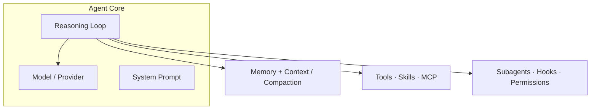
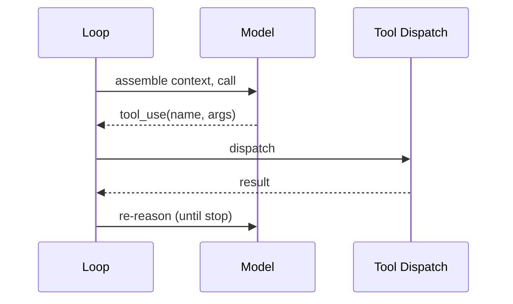

# Agentic Architecture

One lens, two directions. Produce a single document mapping an agentic system as **the core
plus its surround** — not just packages and classes.

## The core reframe (the thesis)

A conventional codebase runs deterministic control flow. An **agentic system** puts a
non-deterministic LLM at the center as the "CPU," and everything else is **agent-native
scaffolding wired around that core**:

```
                ┌──────────── THE CORE (the agent) ─────────────┐
   BRAIN        │  model/provider layer · system prompt ·       │
                │  reasoning LOOP (ReAct / plan-execute / graph)│
                └───────────────────────────────────────────────┘
   CONTEXT   context window · compaction/summarization · memory (working ↔ persistent)
   CAPABILITY  tools (registry→dispatch→exec) · skills · MCP (external tools/resources)
   ORCHESTRATION  subagents (spawn/isolate/merge) · hooks·triggers·scheduling ·
                  permissions/guardrails/HITL · session/state/event bus
```

A generic architecture pass would describe the repo as "a monorepo with packages" and never
surface the loop, memory, and MCP as first-class organs — that is the gap this skill fills.
Where a sibling skill *judges the outward surface* an agent drives (`ax-interface`),
this skill *maps the inward anatomy*.

## Mode: explain or design

Infer the mode from repo state and the prompt's verb; ask when ambiguous.

- **Explain** — reverse-engineer what exists. Evidence = the repo's real source and
  authored content: real file paths, function, class, tool, and skill names. Never invent
  an organ — the failure mode is confabulation. Unverifiable → "Open Questions".
  Output: `_docs/<system_name>_agentic_architecture.md` (snake_case project name; create
  `_docs/` if missing).
- **Design** — compile the user's inputs (PRD, rough design, this conversation) into the
  same document shape. Evidence = those inputs only. In this mode **every organ is a
  decision**: needed / not needed / undecided — don't silently settle the undecided ones;
  they go to "Decisions needed".
  Output: `docs/design/<nn>-agentic-architecture.md` (next free number) unless the user names
  a path.

## Core principles

1. **Ground every claim in the mode's evidence** (above). When unsure, say so in the
   uncertainty section rather than guessing.
2. **Significance over completeness.** Cover the architecturally significant organs; skip
   generated code, vendored deps, and delivery-surface boilerplate — *unless* they reveal
   how the agent is wired. An organ often *lives* in the surface (permission/HITL gates in
   the interactive or RPC mode, not the core loop): follow the organ, don't skip the file
   because of where it sits.
3. **Classify first, then adapt depth.** The system type drives what the document
   emphasizes and *whether an organ is code or authored content*.
4. **Absence is a finding.** A missing organ (no MCP, no persistent memory, no compaction)
   is informative — record it in the organ matrix, don't silently omit it. (Design mode:
   absence is a *decision* — record why.)
5. **One file.** Always a single Markdown file. Do not split.

## Classify the system

The type decides where each organ lives — implemented in source, or authored as content.

- **A. Capability / steering pack** (content for a BYO harness): organs appear as
  **authored files** — `SKILL.md`, `AGENTS.md`/`CLAUDE.md`, slash-command `.md`, subagent
  defs, hook scripts, MCP config. No loop / dispatch / token machinery; it installs INTO
  a harness.
- **B. Agent runtime / harness** (the engine itself, in source): organs appear as **source
  subsystems** — a real loop calling an LLM until a stop reason, tool registry + dispatch,
  provider layer, memory store, compaction, subagent orchestration. It IS the harness that
  loads packs.
- **C. Embedded / hybrid** — an application with an agent inside it, and/or a repo that
  both implements agent infra AND ships agent-native content. Cover both angles.

**Disambiguation trap:** a Runtime repo almost always *also* carries Pack-style dotfiles
(`.claude/`, `AGENTS.md`, `.mcp.json`) for its **own development**. Judge by `src/`, not
the dotfiles — if the loop/dispatch machinery lives in source, it is a Runtime (B).

State the classification and its evidence early in the doc.

**Exploration order by type** (explain mode): **Runtime → find the loop first** — it is the
heart; everything else hangs off it. **Pack → inventory the primitives first** — enumerate
skills/commands/subagents/hooks and which harness(es) they target. Then walk the organ
checklist, and trace **one representative agent turn** end to end:
`prompt → model → tool_use → dispatch → result → re-reason → …` (Runtime); or
`trigger → skill loaded → instructions steer the harness → effect` (Pack).

## The agentic anatomy (the organ checklist)

Locate (or, in design mode, decide) each organ. For each: *where it lives*, *how it's
provided*, and *present / partial / absent / n·a*. "How it's provided" has three values,
not two: **core code** (baked into the engine), **authored content** (a `SKILL.md`/prompt/
config the harness loads), or **extension-provided** (supplied through a plugin/extension
seam rather than core). Extension-provided is common in mature harnesses; mark it
`⚠️ partial` and name the seam.

| Cluster | Organ | What it is | Where to look |
|---|---|---|---|
| **Brain** | Reasoning loop | control flow driving the model until a stop reason (ReAct / plan-execute / graph) | the loop function; LangGraph assembly; `while`+`tool_use` |
| | Model / provider layer | the LLM substrate; multi-provider normalization | `providers/`, provider SDK calls, model registry |
| | System prompt / constitution | the durable instructions defining the agent | `system-prompt`, `AGENTS.md`, prompt templates |
| **Context** | Context window mgmt | how the transcript is assembled for each call | message-building at the LLM boundary |
| | Compaction / summarization | trimming when the window fills | `compact`, `summariz`, `transcript-limits` |
| | Memory | working (in-context) ↔ persistent store; budget/eviction | `memory`, `store`, `backends/`, `checkpoint` |
| **Capability** | Tools | registry → dispatch → execution backend | `tools/`, `tool-registry`, `_tools.py`, exec/VFS/shell |
| | Skills | loadable instruction capabilities | `SKILL.md`, skills loader |
| | MCP | external tools/resources/prompts protocol | `mcp/`, MCP client, `.mcp.json` |
| **Orchestration** | Subagents | spawn / isolate / merge child agents | `subagent`, `spawn`, orchestrator, `Task(` |
| | Hooks · triggers · scheduling | event-driven / autonomous runs | `hooks/`, `cron`, `scheduler` |
| | Permissions / guardrails / HITL | safety gates, human-in-the-loop, least privilege | `permission`, `approve`, confirmation gates |
| | Session / state / event bus | conversation state, streaming to surfaces | `session`, `event-bus`, `state`, checkpointer |

When you find the loop, capture its **distinctive control shape**, not just a generic turn:
single or nested (inner tool-call loop + outer follow-up loop)? Does it inject
steering/interrupt messages mid-run? Where is the one boundary that converts internal
messages to the provider wire format? These specifics are the most illuminating part of a
Runtime — the generic "call model → run tool → repeat" is table stakes.

Emphasis by type: **Runtime** → trace the code subsystems (loop first). **Pack** → most
organs are authored files; emphasize the primitive inventory, install/registry glue, target
harness(es), and multi-harness variants. **Hybrid** → cover both, and say where the agent
sits in the product.

## Write the document

**Cross-link:** check the output directory for related docs and add a "See also" line under
the title for each — match on *topic*, not just filename suffix (a hand-named
`ARCHITECTURE.md` counts as the structure doc). Canonical siblings: `system-architecture`
(generic structure), `ax-interface` output (the agent-facing surface, judged),
`surface-architecture` / `data-architecture` (the outside / the data).

Use this skeleton. Keep prose tight; let the diagrams carry the structure.

```markdown
# <Project> — Agentic Architecture

> Source: <repo origin/URL or design inputs> · Date: <date> · Mode: <Explain | Design> · Type: <Pack | Runtime | Hybrid>
> See also: [System & OOP Architecture](<sibling>) · [AX Analysis](<sibling>)  <!-- omit lines for docs not present -->

## 1. Overview
- One-paragraph purpose: what this agentic system does.
- Type classification (Pack / Runtime / Hybrid) and the evidence — cite `src/` vs dotfiles.
- Substrate: language(s), agent framework(s), provider(s), which harness it targets or is.

## 2. Agentic Anatomy        <!-- the signature diagram: the core + its surround -->

Populate every node with a real name/path from the evidence.

## 3. The Core
Model/provider layer, system prompt, and the reasoning loop. Trace one agent turn:


## 4. Context & Memory
Window assembly, compaction/summarization, and memory stores (working ↔ persistent, budget).

## 5. Capabilities
| Organ | Where it lives | Code or content |
|-------|----------------|-----------------|
| Tools | `...` | ... |
| Skills | `...` | ... |
| MCP | `...` | ... |

## 6. Orchestration & Autonomy
Subagents (spawn/isolate/merge), hooks/triggers/scheduling, permissions/guardrails/HITL,
session/state/event bus.

## 7. Extension Points
How a developer adds a tool, skill, subagent, provider, or hook.

## 8. Organ Presence Matrix
| Organ | Present? | Where | Notes (absence is a finding / a decision) |
|-------|----------|-------|-------------------------------------------|
| Reasoning loop | ✅/⚠️/❌/n·a | `...` | ... |
| ... | | | |

## 9. Glossary & Open Questions   <!-- design mode: "Decisions needed" -->
Domain terms a newcomer must know; and what the evidence cannot determine — assumptions,
choices still open. Uncertainty goes here, not into the diagrams.
```

## Mermaid (GitHub-reliable rendering)

- Every diagram in a ```` ```mermaid ```` fenced block.
- `flowchart`/`graph` with `subgraph` for the anatomy, `sequenceDiagram` for the agent
  turn, `classDiagram` only if OOP structure of a subsystem matters.
- Keep each diagram ≤ ~15 nodes; split dense views under sub-headings.
- Quote labels with spaces/special characters; identifiers match real names from the
  evidence.

## Quality checklist before finishing

- [ ] Mode and system type stated with evidence (`src/` vs dotfiles; loop-in-source ⇒ Runtime).
- [ ] The anatomy diagram is populated with real names/paths, not placeholders.
- [ ] Every organ walked; each marked present/partial/absent/n·a (or decided/undecided) with a location.
- [ ] The reasoning loop (or the pack's steering mechanism) is located and traced.
- [ ] Absences recorded in the organ matrix, not silently dropped.
- [ ] Every file/function/tool/skill named in the doc exists in the mode's evidence.
- [ ] Sibling lens docs cross-linked if present.
- [ ] Uncertainties live in "Open Questions" / "Decisions needed", not disguised as facts.
- [ ] Exactly one Markdown file.
