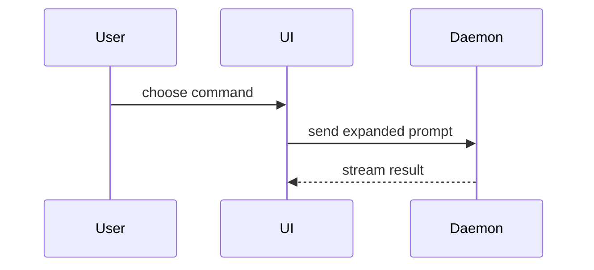

# Body shapes — the smallest visual that shows the change

Load this when a PR summary has a shape prose cannot carry: a new control flow, a
moved boundary, a re-laid file tree, a call that now happens in a different place.
Most PRs need no visual; a small one needs at most one. Pick the smallest view that
makes the key point clear, place it next to the sentence it supports, and stop.

## Shapes

**Logic or an algorithm** → pseudocode:

```text
on(save)
  if content is unchanged
    return cached result
  write new content
  return fresh result
```

**Runtime control flow** → call tree:

```text
submitForm
  createSession
    persistPrompt
    launchAgent
  navigateToSession
```

**UI structure** → component tree, with the state hooks and module boundaries that
matter:

```text
<SessionPage>            (apps/example/src/routes/session.tsx)
  useSessionEvents()
  <SessionToolbar>
    <RunSkillButton>     (packages/ui)
```

**File responsibility or a broad refactor** → shallow file tree, one comment per
entry:

```text
src/
├── commands/       # parses user actions
├── sessions/       # owns session state
└── transport/      # sends API requests
```

**Interaction, control flow, or data flow across parts** → Mermaid:



**A whole block** → show it verbatim only when most of it is new, when trimming
would hide ownership or order, or when the reader needs a copyable target shape:

```ts
function expandSkill(command: string): string {
  const skillName = command.slice(1);
  return `use the ${skillName} skill`;
}
```

## Diff of a shape

When the point is *what changed* and the surrounding shape already exists, show the
shape as a `diff`. Match the diff to the topic, not to the source files.

Component change:

```diff
 <SessionPage>
   useSessionEvents()
   <SessionToolbar>
+    <RunSkillButton />
   <SessionTimeline>
+    <SkillResultCard />
```

File-layout change:

```diff
 src/
 ├── commands/
+│   └── show-me.ts       # expands the slash command
 ├── sessions/
-└── transport.ts
+└── transport/
+    ├── client.ts
+    └── stream.ts
```

Call-tree change:

```diff
 submitForm
   createSession
     persistPrompt
+    expandSkillMention
     launchAgent
   navigateToSession
+    subscribeToEvents
```

Control-flow change:

```diff
 on(save)
-  write content
+  if content is unchanged
+    return cached result
+  write new content
+  invalidate cache
```

## Rules

- Keep only the calls, files, props, states, and boundaries the reader needs to
  see the change. Everything else is noise that hides the point.
- One visual per idea; one or two per PR is typical, the full set never.
- A visual is body text: the *Voice* floor applies. File trees and call trees are
  where home-directory paths, machine names, and site hostnames leak in — use the
  repo-relative path and a stand-in for anything site-specific.
