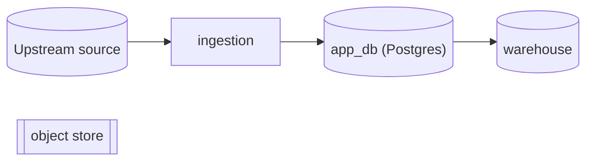
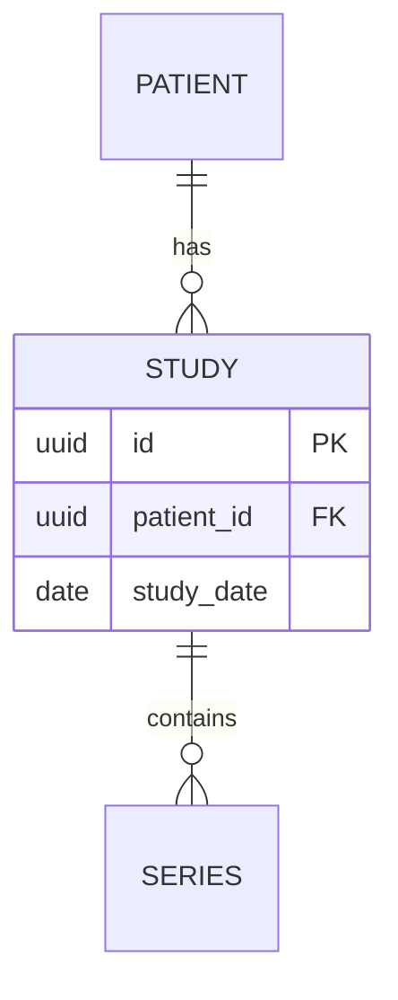
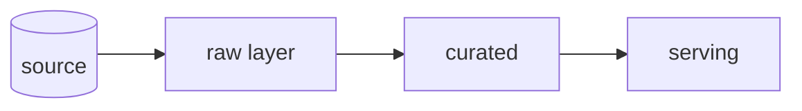
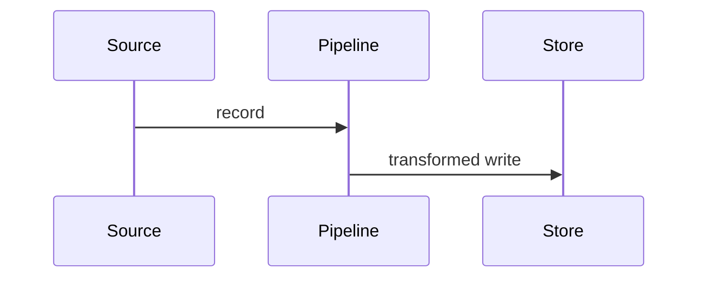

# Data Architecture

One lens, two directions: **follow the data, not the code.** Document the `studies` table —
its columns, keys, who writes it and who reads it — not the `StudyRepository` class behind
it (the class belongs to the `system-architecture` lens; here it is only evidence for who
touches the data). The spine is always **data at rest** (stores, schema) then **data in
motion** (ingestion, transformation, lineage).

## Mode: explain or design

Infer the mode from repo state and the prompt's verb; ask when ambiguous.

- **Explain** — reverse-engineer what exists. Evidence = the repo's **declarative
  artifacts**: schema/migration files, ORM/`dbt` models, IaC, compose/config, seed data —
  real tables, columns, keys, jobs. Never invent schema or flows; the failure mode is
  confabulation. Org policy or upstream systems you cannot see are *outside the evidence
  boundary* — they go to "Open Questions / External Assumptions", never into the ER diagram.
  Output: `_docs/<system_name>_data_architecture.md` (snake_case project name; create
  `_docs/` if missing).
- **Design** — compile the user's inputs (PRD, rough design, this conversation) into the
  same document shape. Evidence = those inputs only. Don't invent requirements or silently
  settle open choices (engine, retention, partitioning …) — undecided → "Decisions needed".
  Output: `docs/design/<nn>-data-architecture.md` (next free number) unless the user names
  a path.
  When the design is settled and the user is about to build, point forward to
  `codebase-blueprint` — it reconciles this doc against its sibling lenses and the chosen
  framework, and has standing to amend claims here.

## Core principles

1. **Ground every claim in the mode's evidence** (above). When unsure, say so in the
   uncertainty section rather than guessing.
2. **Significance over completeness.** Cover core entities, primary pipelines, systems of
   record; skip framework bookkeeping tables (sessions, migration logs), generated
   fixtures, and dead stores unless they reveal design intent.
3. **Adapt depth to data-system type** — classify first, then let the emphasis table drive.
4. **One file.** Always a single Markdown file. Do not split.

## Classify, then weight the sections

Data-system types, each with its natural emphasis:

- **OLTP app DB** (ORM models, migrations, normalized schema) → schema-centric
- **Analytics / warehouse / lakehouse** (`dbt`, staging→mart layers, medallion) → flow & lineage-centric
- **ML / data-science pipeline** (datasets → features → models, experiment logs) → provenance-centric
- **Event / streaming** (topics, event schemas, processors) → motion-centric
- **Document / NoSQL / graph** (schema-on-read collections) → access-pattern-centric
- **File / blob / object lake** (buckets, DICOM/PACS, parquet trees) → storage-layout-centric
- **Hybrid** = more than one present (very common) — cover each, label sections clearly.

State the classification and its evidence early in the doc. In design mode, classify from
the intended shape in the inputs.

| Section                       | OLTP DB | Warehouse | ML Pipeline | Streaming | NoSQL | Blob/Lake |
|-------------------------------|---------|-----------|-------------|-----------|-------|-----------|
| Data Landscape (inventory)    | full    | full      | full        | full      | full  | full      |
| Data Models / Schema (rest)   | full + ERD | logical + marts | dataset/feature schemas | event schemas | collections + access | manifest/layout |
| Dataflow & Lineage (motion)   | light   | full      | full        | full      | light | full      |
| System of Record & Ownership  | full    | full      | full        | full      | full  | full      |
| Storage & Access              | indexes/keys | partitioning/clustering | splits/formats | partitions/ordering | access patterns | layout/naming |
| Lifecycle & Governance        | full    | full      | full (provenance) | retention/replay | full | full (PHI/retention) |

"light" = a short paragraph; "full" = paragraph plus a diagram or table. Never drop a
section silently — if it does not apply, write one line saying why.

In explain mode, two exploration rules beyond your defaults: determine the **system of
record** for each core entity (grep writes vs reads; flag multi-source-of-truth), and trace
**one representative lineage** end to end — `ingested → stored → transformed → served →
archived/purged` — naming the real stores and jobs it passes through.

## Write the document

**Cross-link:** check the output directory for sibling lens docs (`system-architecture`,
`surface-architecture`, `agentic-architecture`) and add a "See also" line under the title for each found —
the set triangulates one system. If none, the doc stands alone.

**Modeling lens — Conceptual → Logical → Physical:** present schema at the zoom that fits.
*Conceptual* = entities and relationships only; *Logical* = attributes, keys, normalized
relationships, no engine specifics; *Physical* = real tables, column types, indexes,
partitions. Small schema → one physical ERD; large schema → lead conceptual, drill into
physical only where it matters. (This mirrors the sibling skills' C4 levels-of-zoom.)

Use this skeleton. Keep prose tight; let the diagrams and tables carry the structure.

```markdown
# <Project> — Data Architecture

> Source: <repo origin/URL or design inputs> · Date: <date> · Mode: <Explain | Design> · Data system: <OLTP | Warehouse | ML | Streaming | NoSQL | Blob | Hybrid>
> See also: [System & OOP Architecture](<sibling>) · [UX/DX Design](<sibling>)  <!-- omit lines for docs not present -->

## 1. Overview
- One-paragraph purpose: what data this system manages and why.
- Data-system type and the evidence for that classification.
- Tech: database engines, ORMs, pipeline/transform tools, storage services (or "TBD").

## 2. Data Landscape        <!-- where data lives: the inventory map -->
Every store the system reads or writes: relational DBs, NoSQL, caches, queues/topics,
blob/object stores, and external/upstream data sources.

| Store | Engine / Kind | Holds | Written by | Read by |
|-------|---------------|-------|------------|---------|
| `app_db` | Postgres | core entities | ingestion | API |

## 3. Data Models / Schema   <!-- data at rest: conceptual → logical → physical -->
The core entities, attributes, keys, and relationships.

| Table | Key columns | Notes (types, indexes, constraints) |
|-------|-------------|-------------------------------------|

## 4. Dataflow & Lineage     <!-- data in motion: DFD + one traced lifecycle -->
How data is ingested, transformed, and served. A data-flow view plus one end-to-end trace.



## 5. System of Record & Ownership
For each core entity, the authoritative store and any derived/cached/denormalized copies;
who writes vs who reads. Flag any entity with more than one apparent source of truth.

## 6. Storage & Access
Indexes, partition/sharding keys, caching layers, hot/cold tiers, and notable query or
access patterns. What makes reads/writes fast or slow.

## 7. Lifecycle & Governance
Schema evolution (migration tooling and history), retention/TTL, soft-delete and
purge/archival jobs, data classification (PII/PHI markers, anonymization steps, access
roles). Explain mode: populate ONLY from declared artifacts; unverifiable policy → §8.

## 8. Open Questions & External Assumptions   <!-- design mode: "Decisions needed" -->
What the evidence cannot determine: upstream systems, true retention policy, ownership
across teams, choices still open. Be honest here — uncertainty goes here, not into the
diagrams.
```

## Mermaid (GitHub-reliable rendering)

- Every diagram in a ```` ```mermaid ```` fenced block.
- Match diagram to view: `erDiagram` for schema (real cardinalities — `||--o{`, `}o--o{` —
  and accurate PK/FK markers), `flowchart` for landscape and DFD views (`LR` for
  layered/medallion pipelines), `sequenceDiagram` for a lineage trace.
- Keep each diagram ≤ ~15 nodes/entities; lead with a conceptual ERD and split detail
  under sub-headings rather than one giant graph.
- Quote labels containing spaces or special characters; identifiers match real table,
  column, store, and job names from the evidence.

## Quality checklist before finishing

- [ ] Mode and data-system type stated with evidence.
- [ ] Every table/column/store/job/pipeline named in the doc exists in the mode's evidence.
- [ ] The doc follows the data (rest + motion), not the code structure behind it.
- [ ] Section emphasis matches the data-system type.
- [ ] System of record identified for each core entity; multi-source-of-truth flagged.
- [ ] Governance populated only from the evidence; the rest in §8.
- [ ] Sibling lens docs cross-linked if present.
- [ ] All diagrams are valid Mermaid in fenced blocks.
- [ ] Uncertainties live in "Open Questions" / "Decisions needed", not disguised as facts.
- [ ] Exactly one Markdown file.
