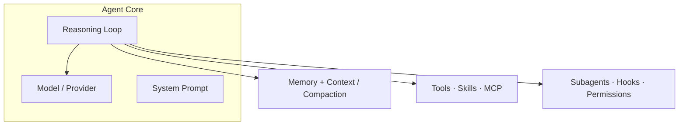
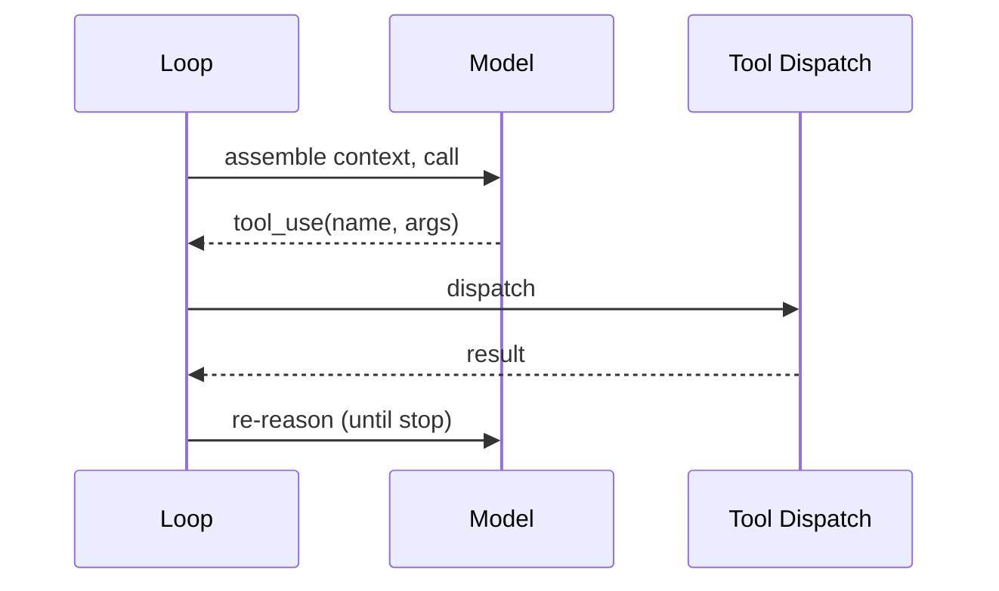

# Explain Agentic System

Produce one document that explains an **agentic system** by reading its real source and
authored content — not by guessing. The output is a single Markdown file with Mermaid
diagrams that renders on GitHub.

## The core reframe (the thesis)

A conventional codebase runs deterministic control flow. An **agentic system** puts a
non-deterministic LLM at the center as the "CPU," and everything else is **agent-native
scaffolding wired around that core**:

```
                ┌──────────── THE CORE (the agent) ─────────────┐
   BRAIN        │  model/provider layer · system prompt ·       │
                │  reasoning LOOP (ReAct / plan-execute / graph)│
                └───────────────────────────────────────────────┘
   CONTEXT   context window · compaction/summarization · memory (working ↔ persistent)
   CAPABILITY  tools (registry→dispatch→exec) · skills · MCP (external tools/resources)
   ORCHESTRATION  subagents (spawn/isolate/merge) · hooks·triggers·scheduling ·
                  permissions/guardrails/HITL · session/state/event bus
```

To explain such a system you map **the core plus its surround**, not just packages and
classes. A generic architecture pass would describe the repo as "a monorepo with packages"
and never surface the loop, memory, and MCP as first-class organs — that is the gap this
skill fills. Where a sibling skill *judges the outward surface* an agent drives
(`ax-interface-analysis`), this skill *maps the inward anatomy*.

## Core principles

1. **Ground every claim in the actual code or content.** Reference real file paths, real
   function, class, tool, and skill names. Never invent an organ. This skill's main failure
   mode is confabulation — a plausible-sounding agent diagram that does not match the repo.
   When unsure, say so in "Open Questions" rather than guessing.
2. **Significance over completeness.** Cover the architecturally significant organs. Skip
   generated code, vendored deps, and delivery-surface boilerplate (CLI/TUI/web shells)
   unless they reveal how the agent is wired — an organ often *lives* in the surface (e.g.
   permission/HITL gates in the interactive or RPC mode, not in the core loop). Follow the
   organ, don't skip the file because of where it sits.
3. **Classify first, then adapt depth.** The system type (next section) drives what the
   document emphasizes and *whether an organ is code or authored content*.
4. **Absence is a finding.** A missing organ (no MCP, no persistent memory, no compaction)
   is informative — record it in the organ matrix, don't silently omit it.
5. **One file.** Always write a single Markdown file. Do not split.

## Step 1 — Classify the system

The type decides where each organ lives — implemented in source, or authored as content.

```
A. CAPABILITY / STEERING PACK          B. AGENT RUNTIME / HARNESS
   (content for a BYO harness)            (the engine itself, in source)
-------------------------------        ----------------------------
organs appear as AUTHORED FILES:       organs appear as SOURCE SUBSYSTEMS:
  SKILL.md, AGENTS.md/CLAUDE.md,         a real loop calling an LLM until a
  slash-command .md, subagent defs,      stop reason; tool registry + dispatch;
  hook scripts, MCP config, prompt       provider layer; memory store; context
  "programs"                             compaction; subagent orchestration
NO loop / dispatch / token machinery   HAS loop / dispatch / token accounting
installed INTO a harness               IS the harness that loads packs

C. EMBEDDED / HYBRID = an application with an agent inside it, and/or a repo that both
   implements agent infra AND ships agent-native content. Cover both angles.
```

**Disambiguation trap:** a Runtime repo almost always *also* contains Pack-style dotfiles
(`.claude/`, `AGENTS.md`, `.mcp.json`) for its **own development**. Judge by `src/`, not the
dotfiles — if the loop/dispatch machinery lives in source, it is a Runtime (B), even though
it carries steering content too.

State the classification and its evidence early in the doc.

## Step 2 — Explore systematically (don't read everything)

Read in this order; stop drilling once you understand an organ's boundary.

1. **Orientation:** `README`, `docs/`, `AGENTS.md`/`CLAUDE.md`, any `_docs/*architecture*`
   (treat pre-existing analyses as claims to cross-check, not ground truth).
2. **Manifests:** `package.json`, `pyproject.toml`, `Cargo.toml`, etc. — language, agent
   frameworks (LangGraph, provider SDKs), the public surface, install/registry glue.
3. **Top-level tree** ~2–3 levels, ignoring `node_modules`, `.venv`, `dist`, vendored code.
4. **Ordering rule by type:**
   - **Runtime (B): find the loop first** — it is the heart; everything else hangs off it.
   - **Pack (A): inventory the primitives first** — enumerate skills/commands/subagents/hooks
     and which harness(es) they target.
5. **Walk the organ checklist** (Step 3), locating each and noting *code vs content* and
   *present / absent / n·a*.
6. **One representative agent turn:** trace a single cycle end to end —
   `prompt → model → tool_use → dispatch → tool result → re-reason → …` (Runtime); or
   `trigger → skill/command loaded → instructions steer the harness → effect` (Pack).

Grep signatures (adapt to language):

```
LOOP        rg "while|for" near model calls; "stopReason|stop_reason|tool_use|agentLoop"
            "create_agent|StateGraph|ReAct|plan"
CONTEXT/MEM rg "compact|summariz|token|budget|evict|checkpoint|store|memory"
CAPABILITY  fd SKILL.md ; rg "registerTool|def tool|@tool|inputSchema|mcp|Client\("
ORCHESTR.   rg "subagent|spawn|Task\(|orchestrat|hook|cron|schedul|permission|approve|HITL"
PACK GLUE   fd 'AGENTS.md|CLAUDE.md' ; rg "user-invocable|allowed-tools|npx skills add|hooksPath"
```

The goal is a faithful mental model of the agent and its wiring, not a line-by-line audit.

## Step 3 — The agentic anatomy (the organ checklist)

Locate each organ. For each: *where it lives* (real path), *how it's provided*, and
*present / partial / absent / n·a*. "How it's provided" has three values, not two:
**core code** (baked into the engine), **authored content** (a `SKILL.md`/prompt/config the
harness loads), or **extension-provided** (supplied through a plugin/extension point rather
than core — e.g. subagents shipped as an example extension, not a first-class subsystem).
Extension-provided is common in mature harnesses; mark it `⚠️ partial` and name the seam.

| Cluster | Organ | What it is | Where to look |
|---|---|---|---|
| **Brain** | Reasoning loop | control flow driving the model until a stop reason (ReAct / plan-execute / graph) | the loop function; LangGraph assembly; `while`+`tool_use` |
| | Model / provider layer | the LLM substrate; multi-provider normalization | `providers/`, provider SDK calls, model registry |
| | System prompt / constitution | the durable instructions defining the agent | `system-prompt`, `AGENTS.md`, prompt templates |
| **Context** | Context window mgmt | how the transcript is assembled for each call | message-building at the LLM boundary |
| | Compaction / summarization | trimming when the window fills | `compact`, `summariz`, `transcript-limits` |
| | Memory | working (in-context) ↔ persistent store; budget/eviction | `memory`, `store`, `backends/`, `checkpoint` |
| **Capability** | Tools | registry → dispatch → execution backend | `tools/`, `tool-registry`, `_tools.py`, exec/VFS/shell |
| | Skills | loadable instruction capabilities | `SKILL.md`, skills loader |
| | MCP | external tools/resources/prompts protocol | `mcp/`, MCP client, `.mcp.json` |
| **Orchestration** | Subagents | spawn / isolate / merge child agents | `subagent`, `spawn`, orchestrator, `Task(` |
| | Hooks · triggers · scheduling | event-driven / autonomous runs | `hooks/`, `cron`, `scheduler` |
| | Permissions / guardrails / HITL | safety gates, human-in-the-loop, least privilege | `permission`, `approve`, confirmation gates |
| | Session / state / event bus | conversation state, streaming to surfaces | `session`, `event-bus`, `state`, checkpointer |

When you find the loop, capture its **distinctive control shape**, not just a generic turn:
is it a single loop or nested (e.g. inner tool-call loop + outer follow-up loop)? Does it
inject steering/interrupt messages mid-run? Where is the one boundary that converts internal
messages to the provider wire format? These specifics are the most illuminating part of a
Runtime — the generic "call model → run tool → repeat" is table stakes.

Emphasis by type: **Runtime** → trace the code subsystems (loop first). **Pack** → most
organs are authored files; emphasize the primitive inventory, install/registry glue, target
harness(es), and multi-harness variants. **Hybrid** → cover both, and say where the agent
sits in the product.

## Step 4 — Write the document

**Filename:** `_docs/<system_name>_agentic_architecture.md`, where `<system_name>` is the
repo/project name in snake_case. Create `_docs/` if it does not exist.

**Cross-link:** list `_docs/` and add a "See also" line under the title for any related doc —
match on *topic*, not just an exact filename suffix (a hand-named `*-OOP-UML-Architecture.md`
or `ARCHITECTURE.md` counts as the structure doc even though it won't match the glob below).
The canonical sibling suffixes:
- `*_system_oop_architecture.md` (from `explain-system-architecture`) — generic structure.
- `*_ax_analysis.md` (from `ax-interface-analysis`) — the agent-facing surface, judged.
- `*_ux_design.md` / `*_data_architecture.md` — the outside / the data.

Use this skeleton. Keep prose tight; let the diagrams carry the structure.

```markdown
# <Project> — Agentic Architecture

> Source: <repo origin/URL if known> · Analyzed: <date> · Type: <Pack | Runtime | Hybrid>
> See also: [System & OOP Architecture](./<system_name>_system_oop_architecture.md) · [AX Analysis](./<system_name>_ax_analysis.md)  <!-- omit lines for docs not present -->

## 1. Overview
- One-paragraph purpose: what this agentic system does.
- Type classification (Pack / Runtime / Hybrid) and the evidence — cite `src/` vs dotfiles.
- Substrate: language(s), agent framework(s), provider(s), which harness it targets or is.

## 2. Agentic Anatomy        <!-- the signature diagram: the core + its surround -->

Populate every node with a real name/path from the repo.

## 3. The Core
Model/provider layer, system prompt, and the reasoning loop. Trace one agent turn:


## 4. Context & Memory
Window assembly, compaction/summarization, and memory stores (working ↔ persistent, budget).

## 5. Capabilities
| Organ | Where it lives | Code or content |
|-------|----------------|-----------------|
| Tools | `...` | ... |
| Skills | `...` | ... |
| MCP | `...` | ... |

## 6. Orchestration & Autonomy
Subagents (spawn/isolate/merge), hooks/triggers/scheduling, permissions/guardrails/HITL,
session/state/event bus.

## 7. Extension Points
How a developer adds a tool, skill, subagent, provider, or hook.

## 8. Organ Presence Matrix
| Organ | Present? | Where | Notes (absence is a finding) |
|-------|----------|-------|------------------------------|
| Reasoning loop | ✅/⚠️/❌/n·a | `...` | ... |
| ... | | | |

## 9. Glossary & Open Questions
Domain terms a newcomer must know; and anything undetermined from the code — assumptions and
areas worth deeper investigation. Uncertainty goes here, not into the diagrams.
```

## Mermaid guidance (for reliable GitHub rendering)

- Put every diagram in a ```` ```mermaid ```` fenced block.
- Use `flowchart`/`graph` with `subgraph` for the anatomy, `sequenceDiagram` for the agent
  turn, `classDiagram` only if OOP structure of a subsystem matters.
- Keep each diagram focused (roughly ≤ 15 nodes). Split dense views under sub-headings.
- Quote labels with spaces/special characters: `a["tool dispatch — routes calls"]`.
- Verify identifiers match real names from the code so diagram and prose agree.

## Quality checklist before finishing

- [ ] System type stated with evidence (`src/` vs dotfiles; loop-in-source ⇒ Runtime).
- [ ] The anatomy diagram is populated with real names/paths, not placeholders.
- [ ] Every organ walked; each marked present/partial/absent/n·a with a location.
- [ ] The reasoning loop (or the pack's steering mechanism) is located and traced.
- [ ] Absences recorded in the organ matrix, not silently dropped.
- [ ] Every file/function/tool/skill named in the doc exists in the repo.
- [ ] Sibling `_docs/` docs cross-linked if present.
- [ ] Uncertainties live in "Open Questions", not disguised as facts.
- [ ] Exactly one Markdown file, written to `_docs/`.
```
