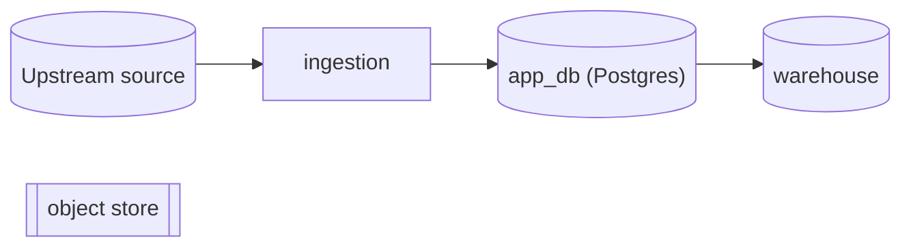
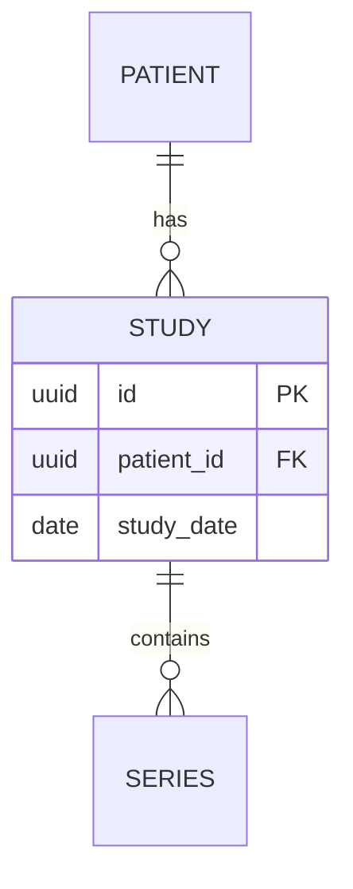
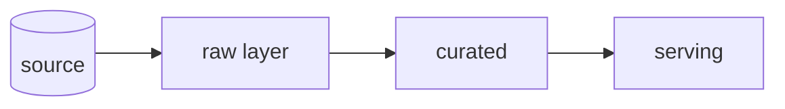
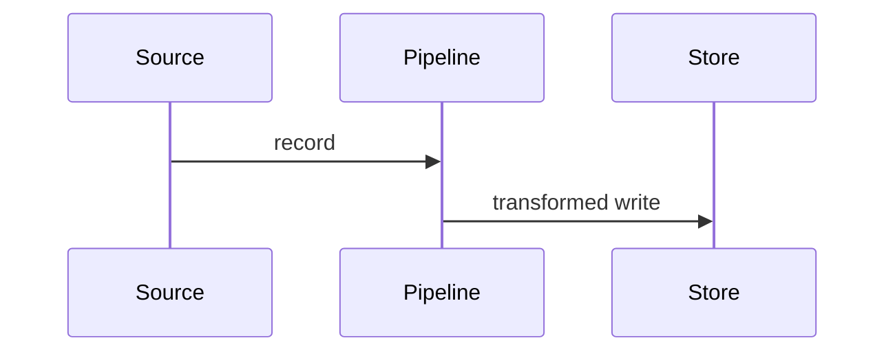

# Explain Data Architecture

Produce one document that explains the **data** of an **existing** codebase by reading its real
source — not by guessing. Where `explain-system-architecture` looks at how the *code* is
organized (the inside) and `explain-ux-dx-design` looks at what a *consumer* touches (the outside),
this skill follows the **data itself**: where it rests (stores, schema, models) and how it moves
(ingestion, transformation, lineage). The output is a single Markdown file with Mermaid diagrams
that renders on GitHub.

## Core principles

1. **Ground every claim in the repo's declared artifacts.** Reference real tables, columns,
   keys, migration files, ORM models, `dbt` models, pipeline definitions, IaC, config, and
   column comments. Never invent tables, fields, relationships, or flows. This skill's main
   failure mode is confabulation — a plausible-sounding schema or pipeline that does not match
   the repo. The evidence boundary is the **declarative artifacts in the repo** (schema/migration
   files, ORM/`dbt` models, IaC, compose/config, seed data) — not org policy or upstream systems
   you cannot see. Anything inferred or external goes to "Open Questions / External assumptions",
   never into the ER diagram.
2. **Follow the data, not the code.** Document the `studies` table, its columns, keys, who writes
   it and who reads it, its partitioning and retention — not the `StudyRepository` class behind
   it. The class belongs to the sibling architecture skill; here it is just evidence for who
   touches the data.
3. **Significance over completeness.** A large system has many tables, files, and jobs; the doc
   covers the architecturally significant ones — the core entities, the primary pipelines, the
   systems of record. Skip framework bookkeeping tables (sessions, migrations log), generated
   fixtures, and dead stores unless they reveal design intent.
4. **Adapt depth to data-system type.** Classify the system first (next section), then emphasize
   the sections that matter for that type and trim the rest.
5. **One file.** Always write a single Markdown file. Do not split into multiple docs.

## Step 1 — Classify the data system

"Data architecture" means different things depending on what the repo manages. The data-system
type drives what the document emphasizes — schema, flow, or layout. Use these signals:

```
OLTP APP DB                          ANALYTICS / WAREHOUSE / LAKEHOUSE
-----------                          --------------------------------
relational store backing an app:     ELT/ETL into columnar analytics:
  ORM models (SQLAlchemy/Prisma/       dbt models, SQL transforms, staging→
  ActiveRecord/Ent), migrations          mart layers, BigQuery/Snowflake/DuckDB
  normalized schema, FKs, constraints  medallion (raw→curated→serving), lineage
→ SCHEMA-CENTRIC                      → FLOW & LINEAGE-CENTRIC

ML / DATA-SCIENCE PIPELINE           EVENT / STREAMING
--------------------------           -----------------
datasets → features → models:        data-in-motion over a bus:
  dataset manifests, feature code,     Kafka/PubSub topics, event/Avro/Proto
  train/val/test splits, model           schemas, stream processors, consumers
  registry/artifacts, experiment logs  ordering, partitioning, replay
→ PROVENANCE-CENTRIC                  → MOTION-CENTRIC

DOCUMENT / NoSQL / GRAPH             FILE / BLOB / OBJECT LAKE
-----------------------             -------------------------
schema-on-read collections:          data as files in a store:
  Mongo/Dynamo/Redis/Neo4j,            S3/GCS buckets, DICOM/PACS, parquet/
  embedded vs referenced docs,           image trees, naming & folder layout
  access patterns drive the model      manifests/catalogs, partition layout
→ ACCESS-PATTERN-CENTRIC             → STORAGE-LAYOUT-CENTRIC

HYBRID = more than one present (very common: an app DB + an analytics pipeline,
or an app DB + an ML pipeline + a blob store). Cover each and label sections clearly.
```

State the classification and the evidence for it early in the doc. If hybrid, cover each
data system and label sections clearly.

## Step 2 — Explore systematically (don't read everything)

Read in this order; stop drilling once you understand the boundary of a part. The spine is
**data at rest** (stores + schema) then **data in motion** (flow + lineage).

1. **Orientation:** `README`, `docs/`, `ARCHITECTURE.md`, any `data/` or `db/` docs, ER
   diagrams or data dictionaries already in the repo. Verify them against the artifacts — docs
   drift.
2. **Stores & connections:** find where data lives and how it is reached — `docker-compose`
   services (postgres, redis, mongo, kafka, minio), IaC (Terraform buckets/DBs), connection
   strings and `DATABASE_URL`/DSNs in config and `.env.example`, client/driver initialization.
   This is the **data landscape**.
3. **Schema (data at rest):** migration files (`migrations/`, `alembic/`, `prisma/schema.prisma`,
   `*.sql`), ORM model classes, `dbt` model + `schema.yml`, table DDL, JSON/Avro/Proto schemas.
   Extract entities, attributes, primary/foreign keys, constraints, indexes, and partitioning.
4. **Dataflow (data in motion):** ingestion scripts, ETL/ELT jobs, `dbt` lineage (`ref()`/
   `source()`), pipeline/DAG definitions (Airflow/Dagster/Prefect), stream producers/consumers,
   anonymization/preprocessing steps. Map source → transform → sink.
5. **System of record & ownership:** for each core entity, determine which store is authoritative
   and which copies are derived/cached/denormalized; grep writes vs reads.
6. **Storage & access characteristics:** indexes, partition/sharding keys, caching layers, hot/cold
   tiers, notable query patterns, batch vs stream.
7. **Lifecycle & governance (declared only):** schema-evolution tooling (migration history),
   retention/TTL settings, soft-delete columns (`deleted_at`), purge/archival jobs, PII/PHI
   markers (column comments, `pii`/`phi` tags, anonymization code), access roles/grants.
8. **One representative lineage trace:** follow a single datum end to end — `ingested → stored →
   transformed → served → archived/purged` — naming the real stores and jobs it passes through.

Useful commands (when a shell is available): `tree -L 3 db migrations`, `rg "CREATE TABLE|ALTER
TABLE|FOREIGN KEY"`, `rg "class .*Base|__tablename__|@Entity|model "`, `rg "ref\(|source\(|COPY|
INSERT INTO|to_parquet|boto3|s3://|kafka"`, `rg -i "retention|ttl|deleted_at|anonymi|pii|phi"`.
Adapt to the stack. The goal is a faithful map of where data lives and how it moves, not a
row-by-row audit.

## Step 3 — Choose section emphasis

The data-system type (Step 1) drives which half of the doc carries the weight — *rest* (schema)
or *motion* (flow). Never drop a section silently; if it does not apply, write one line saying why.

| Section                       | OLTP DB | Warehouse | ML Pipeline | Streaming | NoSQL | Blob/Lake |
|-------------------------------|---------|-----------|-------------|-----------|-------|-----------|
| Data Landscape (inventory)    | full    | full      | full        | full      | full  | full      |
| Data Models / Schema (rest)   | full + ERD | logical + marts | dataset/feature schemas | event schemas | collections + access | manifest/layout |
| Dataflow & Lineage (motion)   | light   | full      | full        | full      | light | full      |
| System of Record & Ownership  | full    | full      | full        | full      | full  | full      |
| Storage & Access              | indexes/keys | partitioning/clustering | splits/formats | partitions/ordering | access patterns | layout/naming |
| Lifecycle & Governance        | full    | full      | full (provenance) | retention/replay | full | full (PHI/retention) |

"light" = a short paragraph; "full" = paragraph plus a diagram or table.

## Step 4 — Write the document

**Filename:** `_docs/<system_name>_data_architecture.md`, where `<system_name>` is the repo or
project name in snake_case. Create the `_docs/` directory if it does not exist.

**Cross-link:** check `_docs/` for sibling docs and add a "See also" line under the title for each
found, so the set forms a triangulated view of one system:
- `*_system_oop_architecture.md` (from `explain-system-architecture`) — the inside.
- `*_ux_design.md` (from `explain-ux-dx-design`) — the outside.
If neither is present, the doc stands alone.

**Modeling lens — Conceptual → Logical → Physical:** present the schema at the zoom level that
fits. *Conceptual* = entities and relationships only (business view). *Logical* = attributes,
keys, normalized relationships, no engine specifics. *Physical* = real tables, column types,
indexes, partitions, the actual engine. For a small schema, one physical ERD is enough; for a
large one, lead with a conceptual ERD of the core entities and drill into physical detail only
where it matters. This mirrors the C4 levels-of-zoom the sibling skills use.

Use this skeleton. Keep prose tight; let the diagrams and tables carry the structure.

```markdown
# <Project> — Data Architecture

> Source: <repo origin/URL if known> · Analyzed: <date> · Data system: <OLTP | Warehouse | ML | Streaming | NoSQL | Blob | Hybrid>
> See also: [System & OOP Architecture](./<system_name>_system_oop_architecture.md) · [User-Facing API & UX/DX](./<system_name>_ux_design.md)  <!-- omit lines for docs not present -->

## 1. Overview
- One-paragraph purpose: what data this system manages and why.
- Data-system type and the evidence for that classification.
- Tech: database engines, ORMs, pipeline/transform tools, storage services.

## 2. Data Landscape        <!-- where data lives: the inventory map -->
Every store the system reads or writes: relational DBs, NoSQL, caches, queues/topics,
blob/object stores, and external/upstream data sources.

| Store | Engine / Kind | Holds | Written by | Read by |
|-------|---------------|-------|------------|---------|
| `app_db` | Postgres | core entities | ingestion | API |

## 3. Data Models / Schema   <!-- data at rest: conceptual → logical → physical -->
The core entities, attributes, keys, and relationships.

| Table | Key columns | Notes (types, indexes, constraints) |
|-------|-------------|-------------------------------------|

## 4. Dataflow & Lineage     <!-- data in motion: DFD + one traced lifecycle -->
How data is ingested, transformed, and served. A data-flow view plus one end-to-end trace.



## 5. System of Record & Ownership
For each core entity, the authoritative store and any derived/cached/denormalized copies;
who writes vs who reads. Flag any entity with more than one apparent source of truth.

## 6. Storage & Access
Indexes, partition/sharding keys, caching layers, hot/cold tiers, and notable query or
access patterns. What makes reads/writes fast or slow.

## 7. Lifecycle & Governance
Schema evolution (migration tooling and history), retention/TTL, soft-delete and purge/archival
jobs, and data classification (PII/PHI markers, anonymization steps, access roles). Populate
ONLY from declared artifacts; send real-world policy you cannot verify to §8.

## 8. Open Questions & External Assumptions
Anything not determinable from the repo's artifacts: upstream systems, true retention policy,
ownership across teams, assumptions made. Be honest here — uncertainty goes here, not into the
diagrams.
```

## Mermaid guidance (for reliable GitHub rendering)

- Put every diagram in a ```` ```mermaid ```` fenced block.
- Match the diagram to the view: `erDiagram` for schema (entities, keys, relationships),
  `flowchart` for the data landscape and data-flow/DFD views, `sequenceDiagram` for a lineage
  trace. Use `flowchart LR` for layered/medallion pipelines (raw → curated → serving).
- Use real cardinalities in `erDiagram` (`||--o{`, `}o--o{`) and keep PK/FK markers accurate.
- Keep each diagram focused (roughly ≤ 15 nodes/entities). If a schema is large, lead with a
  conceptual ERD of core entities and split detail into smaller diagrams under sub-headings
  rather than one giant graph.
- Quote labels containing spaces or special characters: `db[("app_db (Postgres)")]`.
- Verify identifiers match real table, column, store, and job names from the repo so the diagram
  and prose agree.

## Quality checklist before finishing

- [ ] Data-system type stated with evidence.
- [ ] Every table/column/store/job/pipeline named in the doc exists in the repo's artifacts.
- [ ] The doc follows the data (rest + motion), not the code structure behind it.
- [ ] Section emphasis matches the data-system type (Step 3).
- [ ] System of record identified for each core entity; multi-source-of-truth flagged.
- [ ] Governance section populated only from declared artifacts; unverifiable policy in §8.
- [ ] Sibling architecture / UX docs cross-linked if present in `_docs/`.
- [ ] All diagrams are valid Mermaid in fenced blocks and render mentally.
- [ ] Uncertainties live in "Open Questions", not disguised as facts.
- [ ] Exactly one Markdown file, written to `_docs/`.
