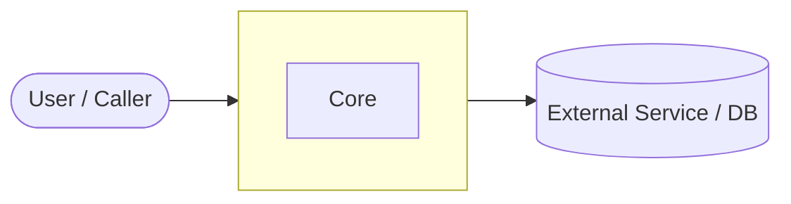
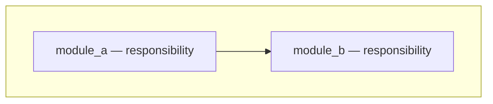
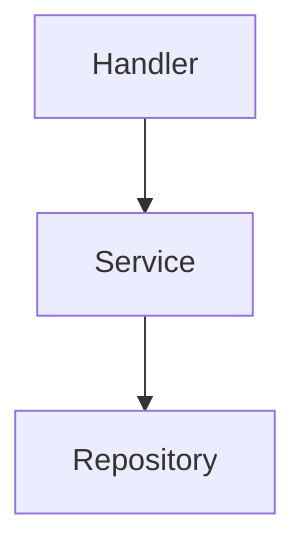
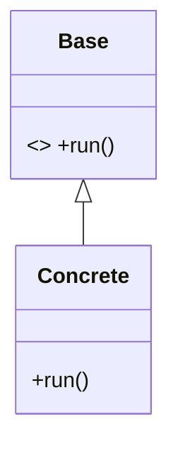
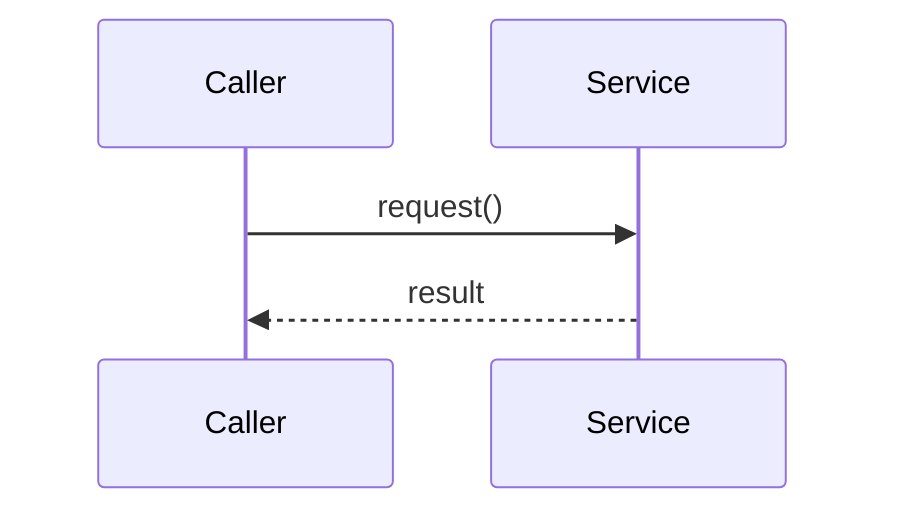

# Explain System Architecture

Produce one architecture document that explains an **existing** codebase by reading its
real source — not by guessing. The output is a single Markdown file with Mermaid diagrams that renders on GitHub.

## Core principles

1. **Ground every claim in the actual code.** Reference real file paths, real class and
   function names. Never invent components, classes, or relationships. This skill's main
   failure mode is confabulation — a plausible-sounding diagram that does not match the
   repo. When unsure, say so explicitly in the "Open questions" section rather than
   guessing.
2. **Significance over completeness.** A large repo has hundreds of files; the doc covers
   the architecturally significant ones. Skip generated code, vendored dependencies, build
   artifacts, and test fixtures unless they reveal design intent.
3. **Adapt depth to repo type.** Classify the repo first (next section), then emphasize
   the sections that matter for that type and trim the rest.
4. **One file.** Always write a single Markdown file. Do not split into multiple docs.

## Step 1 — Classify the repo

The repo type drives what the document emphasizes. Use these signals:

```
APPLICATION                          LIBRARY / PACKAGE
-----------                          -----------------
has an entry point that RUNS:        has a public API surface meant to be IMPORTED:
  main / __main__ / cmd/ / bin/        exported package(s), __init__.py exports,
  server bootstrap, CLI root           package.json "exports"/"main", Cargo [lib]
deployment config:                   distribution metadata:
  Dockerfile, compose, k8s, .env       pyproject/setup.py packages, semver, registry
wires concrete dependencies          defines abstractions/interfaces for callers
runtime flows (request lifecycle)    usage flows (how a caller calls the API)

HYBRID = both present (e.g. a framework, or a library shipping a CLI/demo app)
```

State the classification and the evidence for it early in the doc. If hybrid, cover both
angles and label sections clearly.

## Step 2 — Explore systematically (don't read everything)

Read in this order; stop drilling once you understand the boundary of a part.

1. **Orientation:** `README`, `docs/`, `ARCHITECTURE.md`, `CONTRIBUTING.md` if present.
2. **Manifests / dependency graph:** `pyproject.toml` / `setup.py`, `package.json`,
   `Cargo.toml`, `go.mod`, `pom.xml`, etc. These reveal language, frameworks, the public
   surface, and external dependencies.
3. **Top-level tree:** list the directory structure ~2–3 levels deep, ignoring
   `node_modules`, `.venv`, `dist`, `build`, `target`, `.git`, vendored code.
4. **Entry points:** find where execution or import begins — `main`, `__main__`, CLI
   definitions, server/app factories, package re-exports.
5. **Core modules:** for each significant package/module, read its *public interface*
   (class and function signatures, docstrings) rather than full bodies. Note its single
   responsibility.
6. **Key abstractions & patterns:** grep for base classes / interfaces / protocols
   (`ABC`, `Protocol`, `interface`, `trait`), registries/factories (`register`, `factory`,
   `create_`), dependency-injection wiring, plugin hooks, and notable decorators.
7. **One representative flow:** trace a single path end to end — request → handler →
   services → output for an app; or `Caller → public API → core class → result` for a
   library.

Useful commands (when a shell is available): `find`, `tree -L 2`, `rg "class |def "`,
`rg "import|require"`. Adapt to the language. The goal is a faithful mental model, not a
line-by-line audit.

## Step 3 — Choose section emphasis

| Section                         | App  | Library | Hybrid |
|---------------------------------|------|---------|--------|
| System Context (C4 L1)          | full | light   | full   |
| Containers / High-level (C4 L2) | full | as modules | full |
| Components (C4 L3)              | full | full    | full   |
| OOP & Class architecture        | key classes | full + patterns | full |
| Key flows (sequence)            | runtime flow | usage flow | both |
| Extension points               | light | full    | full   |

"light" = a short paragraph; "full" = paragraph plus a diagram. Never drop a section
silently — if it does not apply, write one line saying why.

## Step 4 — Write the document

**Filename:** `_docs/<system_name>_system_oop_architecture.md`, where `<system_name>` is
the repo or project name in snake_case. Create the `_docs/` directory if it does not exist.

**Cross-link:** check `_docs/` for sibling docs and add a "See also" line under the title for
each found, so the set forms a triangulated view of one system:
- `*_ux_design.md` (from `explain-ux-dx-design`) — the outside.
- `*_data_architecture.md` (from `explain-data-architecture`) — the data.
If neither is present, the doc stands alone.

Use this skeleton. Keep prose tight; let the diagrams carry the structure.

```markdown
# <Project> — System & OOP Architecture

> Source: <repo origin/URL if known> · Analyzed: <date> · Type: <App | Library | Hybrid>
> See also: [User-Facing API & UX/DX](./<system_name>_ux_design.md) · [Data Architecture](./<system_name>_data_architecture.md)  <!-- omit lines for docs not present -->

## 1. Overview
- One-paragraph purpose: what this project is and what problem it solves.
- Repo type and the evidence for that classification.
- Tech stack: language(s), key frameworks, notable dependencies.

## 2. System Context        <!-- C4 Level 1 -->
Who/what uses the system and what it depends on.


## 3. High-Level Structure   <!-- C4 Level 2: containers (app) or top-level packages (lib) -->

| Path | Responsibility |
|------|----------------|
| `src/...` | ... |

## 4. Components           <!-- C4 Level 3: inside the most important container/package -->


## 5. OOP & Class Architecture
Key classes, interfaces, inheritance, composition, and the design patterns in use
(name the pattern, point to where it lives, and say why it's used).


## 6. Key Flows
A representative end-to-end path.


## 7. Extension Points
How a developer extends or customizes the system (subclassing, plugins, config, hooks).

## 8. Key Abstractions / Glossary
Short definitions of the domain terms and core types a newcomer must know.

## 9. Open Questions & Notes
Anything that could not be determined from the code, assumptions made, and areas worth
deeper investigation. Be honest here — this is where uncertainty goes instead of into the
diagrams.
```

## Mermaid guidance (for reliable GitHub rendering)

- Put every diagram in a ```` ```mermaid ```` fenced block.
- For C4 levels (Context / Containers / Components), use `flowchart`/`graph` with
  `subgraph` blocks rather than the native `C4Context` syntax — plain flowcharts render
  far more reliably on GitHub. (The native C4 syntax exists but is flaky; only use it if
  the user asks.)
- Use `classDiagram` for OOP structure and `sequenceDiagram` for flows.
- Keep each diagram focused (roughly ≤ 15 nodes). If a view is too dense, split it into a
  couple of smaller diagrams under sub-headings rather than one giant graph.
- Quote labels containing spaces or special characters: `a["module_a — does X"]`.
- Verify identifiers match real names from the code so the diagram and prose agree.

## Quality checklist before finishing

- [ ] Repo type stated with evidence.
- [ ] Every class/module/path named in the doc exists in the repo.
- [ ] Section emphasis matches the repo type (Step 3).
- [ ] Sibling UX/DX and data docs cross-linked if present in `_docs/`.
- [ ] All diagrams are valid Mermaid in fenced blocks and render mentally.
- [ ] Uncertainties live in "Open Questions", not disguised as facts.
- [ ] Exactly one Markdown file, written to `_docs/`.
