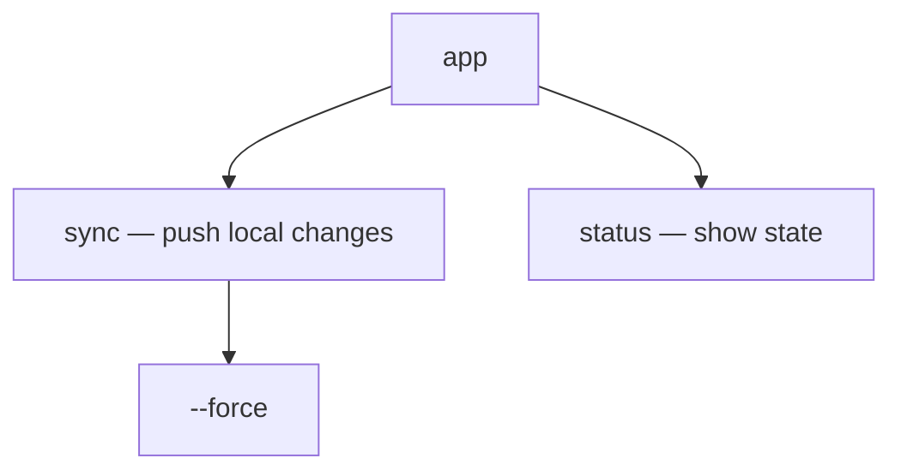
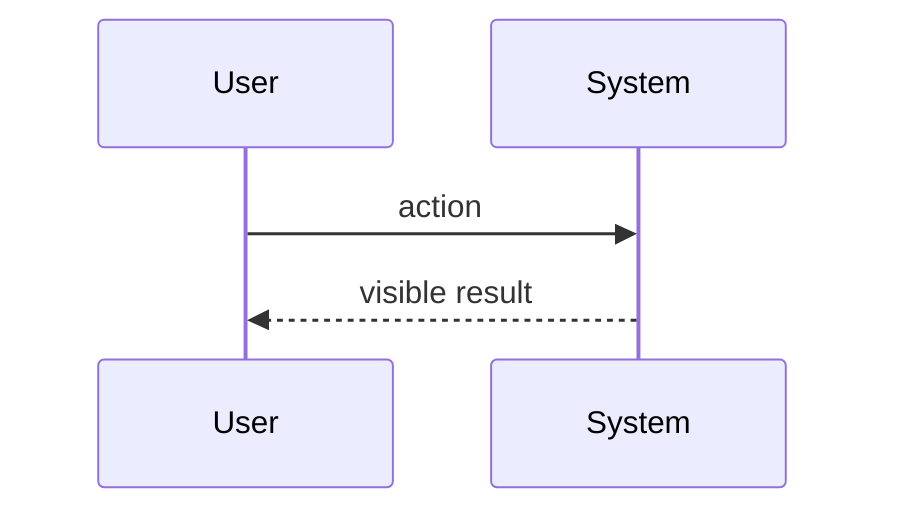
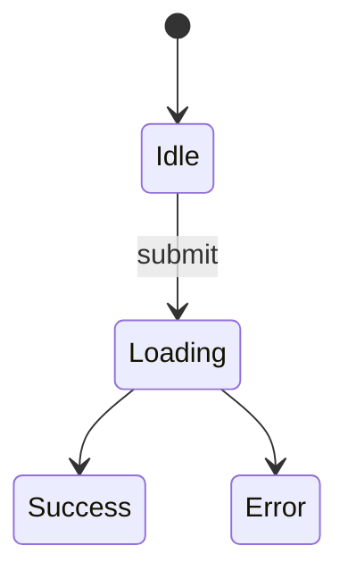

# Explain UX & DX Design

Produce one document that explains the **user-facing surface** of an **existing** codebase by
reading its real source — not by guessing. Where `explain-system-architecture` looks *inside*
the boundary (classes, modules, internal flows), this skill looks *outside* it: everything a
consumer touches without needing to know the internals. The output is a single Markdown file
with Mermaid diagrams that renders on GitHub.

## Core principles

1. **Ground every claim in the actual code.** Reference real routes, commands, exported
   symbols, endpoint paths, and component files. Never invent screens, commands, or
   parameters. This skill's main failure mode is confabulation — a plausible-sounding API or
   screen flow that does not match the repo. When unsure, say so explicitly in the "Open
   questions" section rather than guessing.
2. **Describe the surface as the user sees it, not as the code implements it.** Document the
   command `app sync --force`, the route `/settings/billing`, or the call `client.upload(file)`
   — not the `SyncCommand` class or `BillingController` behind them. The internals belong to
   the sibling architecture skill.
3. **Significance over completeness.** A large surface has many touchpoints; the doc covers the
   architecturally significant ones — the primary user journeys and the most-used API. Skip
   internal-only endpoints, debug commands, and dead routes unless they reveal design intent.
4. **Adapt depth to surface type.** Classify the surface first (next section), then emphasize
   the sections that matter for that type and trim the rest.
5. **One file.** Always write a single Markdown file. Do not split into multiple docs.

## Step 1 — Classify the surface

"User" and "UX" mean completely different things depending on what the repo exposes. The
surface type drives what the document emphasizes — and what "user-facing API" even means. Use
these signals:

```
GUI APP (web / desktop / mobile)     CLI / TUI
--------------------------------     ---------
user = end user                      user = operator at a terminal
router/route configs, page/screen    arg parser (argparse/click/clap/
  components, navigation, layouts       cobra/yargs), subcommand registry,
design-system components, forms        --help text, output formatters
i18n / string catalogs               exit codes, stdin/stdout/stderr contract
"API" = screens & components         "API" = command & flag tree

LIBRARY / SDK                        WEB API (REST / GraphQL / RPC)
-------------                        ------------------------------
user = developer who imports it      user = client developer over the wire
public exports (__init__, index.ts,  route/controller definitions, OpenAPI /
  lib.rs, package "exports")           GraphQL schema, request/response DTOs
README quickstart, examples/         auth middleware, error handlers
docstrings/signatures of the         versioning, status-code & error contract
  public surface                     "API" = endpoints & schema
"API" = exported symbols / DX

HYBRID = more than one present (e.g. a library that ships a CLI, or an app with
a public REST API). Cover each surface and label sections clearly.
```

State the classification and the evidence for it early in the doc. If hybrid, cover each
surface and label sections clearly.

**When the user is (or could be) an AI agent.** For CLI, Web API, SDK, or MCP surfaces, a likely
consumer is an autonomous agent, not only a human. If so, add one short note to §6 (IA / API
Ergonomics) on its *agent experience* ("AX") — does the surface read like it was built for a
forgetful, text-only reasoner with a finite context window? A few quick signals: self-documenting
spec/`--help`, token-economical output (no raw-JSON dumps), errors that teach rather than just
fail, and stable exit/status codes to branch on. Keep it descriptive here; for a full evaluative
audit with prioritized fixes, defer to the sibling `ax-interface-analysis` skill.

## Step 2 — Explore systematically (don't read everything)

Read in this order; stop drilling once you understand the boundary of a surface.

1. **Orientation:** `README`, `docs/`, usage guides, `--help` output, API docs, screenshots in
   the repo. These describe the surface in the authors' own words — verify them against code.
2. **Manifests / metadata:** `package.json` (`bin`, `exports`, `scripts`), `pyproject.toml`
   (`[project.scripts]`, entry points), `Cargo.toml` (`[[bin]]`, `[lib]`), `openapi.yaml`,
   GraphQL `.graphql` schema. These reveal the declared surface and entry points.
3. **Entry points:** find where a user first makes contact — the route table, the CLI root and
   subcommand registration, the package's top-level re-exports, the API server's route mounts.
4. **Surface inventory:** enumerate the touchpoints for the surface type (per Step 1) —
   the screen/route list, the command tree, the exported public symbols, the endpoint catalog.
   This inventory is the backbone of the doc.
5. **Conventions & naming:** how the surface is organized and named — URL/route patterns, flag
   naming (`--kebab-case`), resource pluralization, function naming idioms, error/status
   conventions. Consistency (or its absence) is itself a UX finding.
6. **States, feedback & errors:** what the user sees when things vary — loading/empty/error
   states, validation messages, exit codes, HTTP status and error-body shapes, auth challenges.
7. **One representative user journey:** trace a single path the way a user experiences it —
   `land on page → navigate → submit form → see result` for a GUI; `invoke command → flags →
   output` for a CLI; `import → construct → call → handle result` for a library; `authenticate
   → request → response → error handling` for a web API.

Useful commands (when a shell is available): `tree -L 2`, `rg "@app.route|@router|addCommand|
@click.command|export (function|const|class)"`, `rg "fastapi|express|argparse|clap"`. Adapt to
the language and framework. The goal is a faithful map of the surface, not a line-by-line audit.

## Step 3 — Choose section emphasis

| Section                       | GUI App | CLI/TUI | Library/SDK | Web API |
|-------------------------------|---------|---------|-------------|---------|
| Cheat sheet (top of doc)      | task → screen/shortcut table (or skip) | top commands + flags | top ~10 calls + lookup table | top endpoints as curl/httpie |
| Overview & user persona       | full    | full    | full        | full    |
| Surface map (inventory)       | sitemap / nav | command tree | API surface table | endpoint catalog |
| Entry & onboarding            | full (first screen) | full (install + first run) | full (quickstart) | full (auth + first call) |
| Key user journeys             | full    | full    | usage flows | call flows |
| Interaction & state           | full    | output + exit codes | error/return contract | status & error contract |
| IA / API ergonomics           | full    | flag conventions | naming & DX | resource design |
| Configuration & customization | full    | full    | options/config | headers/params/versioning |

"light" = a short paragraph; "full" = paragraph plus a diagram or table. Never drop a section
silently — if it does not apply, write one line saying why.

## Step 4 — Write the document

**Filename:** `_docs/<system_name>_ux_design.md`, where `<system_name>` is the repo or project
name in snake_case. Create the `_docs/` directory if it does not exist.

**Cross-link:** check `_docs/` for sibling docs and add a "See also" line under the title for
each found, so the set forms a triangulated view of one system:
- `*_system_oop_architecture.md` (from `explain-system-architecture`) — the inside.
- `*_data_architecture.md` (from `explain-data-architecture`) — the data.
If neither is present, the doc stands alone.

**Cheat sheet:** open the doc with a `## Cheat Sheet` preamble (unnumbered, between the "See also"
line and `## 1. Overview`) — a one-screen TL;DR of the 5–10 most-used touchpoints that a reader
can copy and run immediately. Its *form follows the surface type* (see Step 3): runnable code
snippets plus an "I want to… → call" table for a Library/SDK; the most-common invocations with
real flags for a CLI; the top endpoints as `curl`/httpie calls with the auth header for a Web API;
a "common task → screen/shortcut" table for a GUI app — and if even that adds nothing for a pure
GUI, skip it with one line saying why. Two rules keep it trustworthy: (1) **it is a curated subset
of the Surface Map, ordered by frequency of use — never introduce a symbol, command, or endpoint
here that you have not already verified and listed in §2;** (2) keep it to roughly one screen, so
it stays a quick reference and not a second inventory.

Use this skeleton. Keep prose tight; let the diagrams and tables carry the structure.

```markdown
# <Project> — User-Facing API & UX/DX

> Source: <repo origin/URL if known> · Analyzed: <date> · Surface: <GUI | CLI | Library | Web API | Hybrid>
> See also: [System & OOP Architecture](./<system_name>_system_oop_architecture.md) · [Data Architecture](./<system_name>_data_architecture.md)  <!-- omit lines for docs not present -->

## Cheat Sheet
<!-- One-screen TL;DR: the 5–10 most-used touchpoints, copy-paste-runnable, ordered by frequency.
     Form follows surface type (Step 3): Library → code snippets + "I want to… → call" table;
     CLI → top invocations with real flags; Web API → top endpoints as curl/httpie + auth header;
     GUI → "task → screen/shortcut" table (or one line saying why it is skipped).
     Every entry MUST already appear (verified) in §2 Surface Map — never introduce a new symbol here. -->

## 1. Overview
- One-paragraph purpose: what this project does for its user.
- Surface type and the evidence for that classification.
- Who the user is (end user / operator / developer / client dev) and how they reach the system.

## 2. Surface Map
The full inventory of user touchpoints. Pick the form that fits the surface type:
- GUI → sitemap / navigation map
- CLI → command & flag tree
- Library → public API surface table
- Web API → endpoint catalog


| Touchpoint | What the user does with it |
|------------|----------------------------|
| `app sync` | ... |

## 3. Entry & Onboarding
How a user first encounters and starts using the system: install / first run / auth /
the smallest "hello world". Quote the real first command, route, or call.

## 4. Key User Journeys
2–3 representative end-to-end paths, as the user experiences them.


## 5. Interaction & State
What the user sees as conditions vary: loading/empty/error states, validation messages,
exit codes, HTTP status codes and error-body shapes, auth challenges.


## 6. Information Architecture / API Ergonomics
How the surface is organized and named, and whether it is consistent: route/URL patterns,
flag conventions, resource naming, function-call idioms, predictability of the surface.

## 7. Configuration & Customization
What the user can tune: settings screens, CLI flags & config files, library options,
API headers/params/versioning.

## 8. Open Questions & Notes
Anything that could not be determined from the code, assumptions made, and areas worth
deeper investigation. Be honest here — this is where uncertainty goes instead of into the
diagrams.
```

## Mermaid guidance (for reliable GitHub rendering)

- Put every diagram in a ```` ```mermaid ```` fenced block.
- Match the diagram to the view: `flowchart` for navigation maps and command trees,
  `sequenceDiagram` for user journeys and API call flows, `stateDiagram-v2` for interaction
  states, `journey` for high-level UX/satisfaction maps (use sparingly — it renders less
  predictably on GitHub than flowcharts).
- Keep each diagram focused (roughly ≤ 15 nodes). If a view is too dense, split it into a
  couple of smaller diagrams under sub-headings rather than one giant graph.
- Quote labels containing spaces or special characters: `a["sync — push local changes"]`.
- Verify identifiers match real routes, commands, symbols, or endpoints from the code so the
  diagram and prose agree.

## Quality checklist before finishing

- [ ] Surface type stated with evidence.
- [ ] Cheat sheet present at the top (form matches surface type), every entry a verified subset of the Surface Map — or skipped with a one-line reason for a pure GUI.
- [ ] Every route/command/symbol/endpoint named in the doc exists in the repo.
- [ ] The doc describes the surface as the user sees it, not the internals behind it.
- [ ] Section emphasis matches the surface type (Step 3).
- [ ] Sibling architecture and data docs cross-linked if present in `_docs/`.
- [ ] All diagrams are valid Mermaid in fenced blocks and render mentally.
- [ ] Uncertainties live in "Open Questions", not disguised as facts.
- [ ] Exactly one Markdown file, written to `_docs/`.
