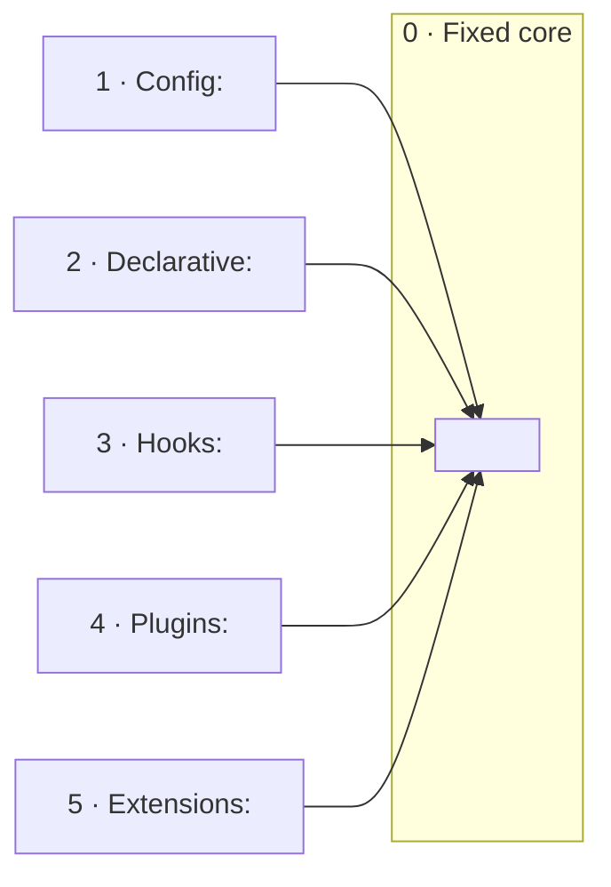
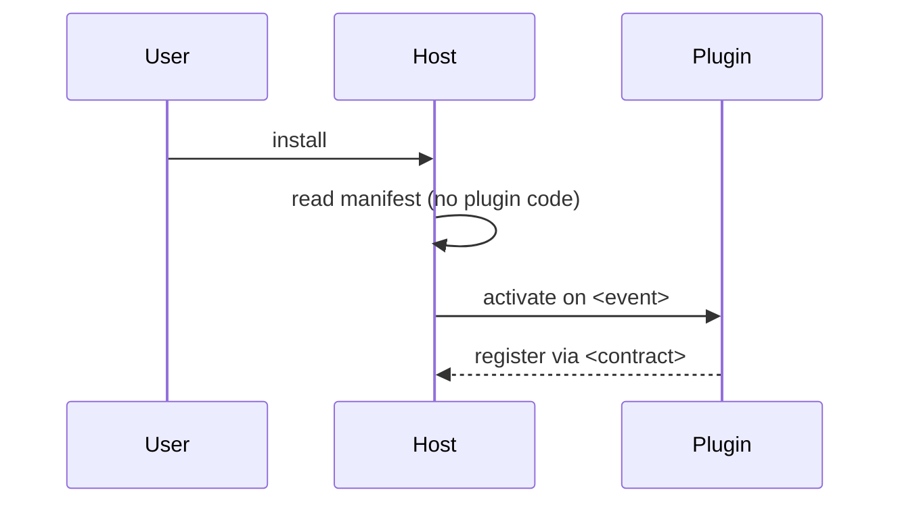

# Extensibility Architecture

One lens, two directions: **follow the line of change, not the code.** Every shipped
program draws a line through itself — what is fixed, what bends at runtime, what a user may
bolt on, what a trusted operator (or the AI agent inside it) may rewrite. The sibling
lenses map structure, data, surface, and the agent's organs; this lens maps **how the
system changes after it ships, and who holds the pen**. `system-architecture` §7 lists
extension points in a paragraph; here that paragraph is the whole document.

## The core reframe: the mutability ladder

```
 FIXED ─────────────────────────────────────────────────────────────────────► OPEN

 0 compiled   1 runtime      2 declarative   3 hooks /     4 plugins            5 extensions      6 fork
   core         config         composition     scripting     (merged /            (in-process
                (values)       (data-as-        (code at      registered /         rewrite)
                               behavior)        named seams)  hosted)

 who:  vendor   operator       operator /      power user    third party          trusted operator  anyone
                               power user                                         or the AI agent
 power:  —      CHOOSE         COMPOSE         INJECT        ADD                  REWRITE           OWN
```

Rungs are **pace layers** (Brand): slow layers carry fast ones, and a system is healthy when
each concern lives on the rung that matches its rate of change and its author's trust. The
plugin rung is the Iron Man Mark 42: autonomous pieces fly in and attach to a fixed pilot
through the suit's mount points — the contract — and the pilot never changes to receive them.

Each rung up **costs** a contract, versioning, docs, and trust, and **buys** openness.
Hence the governing rule of this lens, in both modes:

> **Lowest sufficient rung.** A concern gets the least powerful mechanism that satisfies
> *who changes it · how often · how much trust · must it be hot*. Building a plugin system
> where a config table would do is the failure mode this lens exists to catch — say so.

## Mode: explain or design

Infer the mode from repo state and the prompt's verb; ask when ambiguous.

- **Explain** — reverse-engineer what exists. Evidence = the repo's real source and
  declared artifacts: settings schemas, manifest files, registries, loaders, hook
  dispatchers, real class and function names. Never invent a rung or a seam — the failure
  mode is confabulation. Unverifiable → "Open Questions".
  Output: `_docs/<system_name>_extensibility_architecture.md` (snake_case project name;
  create `_docs/` if missing).
- **Design** — compile the user's inputs (PRD, rough design, this conversation) into the
  same document shape. Evidence = those inputs only. Entry point is mandatory: the
  **variability inventory** (§2 of the skeleton) — without it, refuse to pick an archetype.
  Assign each concern its lowest sufficient rung; design a plugin mechanism *only* if a
  concern truly lands on rung 4+. Every rung and, on rung 4, every one of the nine
  decisions is decided / undecided — never silently defaulted; undecided → "Decisions
  needed", each also 💡-marked inline where the choice bites.
  For the shape of what you are proposing, read
  [`references/shapes.md`](references/shapes.md) — one runnable sketch per archetype and
  one for in-process extensions; cite the matching shape in the doc rather than inventing
  a new one.
  Output: `docs/design/<nn>-extensibility-architecture.md` (next free number) unless the
  user names a path. When settled, point forward to `codebase-blueprint`, which reconciles
  this doc against its sibling lenses and has standing to amend claims here.

## Core principles

1. **Ground every claim in the mode's evidence.** When unsure, say so in the uncertainty
   section rather than guessing.
2. **Lowest sufficient rung** (above). In explain mode this is a judgment you record: a
   concern sitting higher than it needs to is a finding.
3. **Who holds the pen — including the agent.** Every rung names its author. If the seam
   is file-based and reload is in-process, an agent with file tools can author at that rung:
   a self-modification loop. Name it, and name the asymmetric lock that guards *activation*
   (owner-only install, command-only reload, fail-closed gates) — admission control is the
   security model; an in-process seam is never a sandbox.
4. **Absence is a finding.** No config schema, no hooks, no plugin seam — record it in the
   rung matrix, don't omit it. (Design mode: absence is a *decision* — record why.)
5. **The seam has a falsifiable test.** *Add a config entry / hook / plugin / extension
   without editing the core. If you must edit the core, the seam leaks — fix the seam, not
   the symptom.* Apply it in explain mode; require it in design mode.
6. **One file.** Always a single Markdown file. Do not split.

## Classify, then weight the sections

Classify by the **highest rung offered** and its **primary audience**:

- **Closed** (≤ rung 2): configurable, not extensible — many internal tools, most CLIs.
- **Scriptable** (rung 3): hooks or embedded scripting for power users — git, game engines,
  agent harnesses with hook configs.
- **Plugin host** (rung 4): a packaged-capability seam for third parties; sub-classify the
  archetype below — Slicer, VS Code, OpenClaw, browsers, MONAI Deploy.
- **Platform** (rung 5): the host is rewritable in-process by trusted code — Emacs, pi,
  Excel/VBA.
- **Hybrid** — almost every mature system offers several rungs (VS Code: settings + hooks +
  extensions). Cover each; say which rung carries the *product's* extensibility story.

State the classification and its evidence early in the doc. In design mode, classify from
the variability inventory.

| Section                         | Closed | Scriptable | Plugin host | Platform |
|---------------------------------|--------|------------|-------------|----------|
| Variability inventory / map     | full   | full       | full        | full     |
| Runtime configuration (rung 1)  | full   | full       | light       | light    |
| Declarative composition (rung 2)| full if present | light | light     | light    |
| Hooks / scripting (rung 3)      | n·a    | full       | light       | full     |
| Plugin mechanism (rung 4)       | n·a    | n·a        | full        | light    |
| In-process extensions (rung 5)  | n·a    | n·a        | light       | full     |
| Trust & the agent               | light  | full       | full        | full     |
| Developer loop                  | light  | light      | full        | full     |

"light" = a short paragraph; "full" = paragraph plus a diagram or table. Never drop a
section silently — if it does not apply, write one line saying why.

## The ladder walk (what to locate on each rung)

| Rung | Locate | Where to look |
|---|---|---|
| **1 Config** | the settings surface and its **schema**; the **precedence chain** (defaults → file → env → CLI → per-workspace); validation; hot reload vs restart; feature flags | `config.*`, `settings.json` schema, `pydantic`/`zod` settings, env parsing, `--flag` definitions |
| **2 Declarative** | data that *describes behaviour* the core interprets: pipeline YAML, rule/expression DSLs, templates, layout XML, hanging protocols | `*.yaml` pipelines, rule engines, template dirs, `dicom_support_rule`-style expressions |
| **3 Hooks** | named seams where user code runs; the **event taxonomy by power** (observe · transform · chain · veto · replace); error semantics per class | `hooks/`, `on_*`/`before_*`/`after_*`, dispatcher loops, Lua/JS embedding |
| **4 Plugins** | the archetype; the nine decisions below | manifests, loaders, registries, extension-host processes, marketplaces |
| **5 Extensions** | files that import the whole host API and may *replace* built-ins; the reload path; what survives reload | `extensions/` dirs loaded by `jiti`/`importlib`, `registerTool` overrides, `/reload` |
| **6 Fork** | one line: is source the intended last resort? | licence, contributor docs |

Trace **one representative change end to end** per mode: explain — `user intent → which
rung → artifact written → how the host picks it up → effect`; design — the same path for
the highest-rung concern in the inventory.

### Rung 4 — archetype, then the nine decisions

```
 TIGHT ◄──────────────── plugin ↔ host coupling ────────────────► LOOSE
   MERGED                    REGISTERED                    HOSTED
   plugin becomes core       in-process via a registry     separate process,
   (same factory, same       and a typed contract; core    async RPC only; static
   hooks, same process)      reads only the registry       half declared as data
   power max · safety none   power = contract · safety     power = API · process wall
   change = restart          by tests/convention           change = live delta
   e.g. 3D Slicer            e.g. OpenClaw, MONAI Deploy   e.g. VS Code
```

| # | Decision | The question | Poles |
|---|---|---|---|
| 1 | **Contract** | what does a plugin implement? | none (reuse internals) · one narrow interface · wide bag of optional adapters · data schema + API |
| 2 | **Manifest split** | what is knowable *without running plugin code*? | nothing · distribution metadata only · full declared surface (contributions, activation, placement) |
| 3 | **Placement** | where does plugin code run? | same thread · same process · separate process/worker/remote (async-only, type-enforced) |
| 4 | **Activation** | when does it load? | all at startup · per registration mode · lazy on derived events, idempotent, timed |
| 5 | **Change landing** | how does install/update/remove take effect? | restart, mutations scheduled for next boot · process restart · live delta-based registries |
| 6 | **Compatibility** | how does the host evolve without breaking plugins? | rebuild the world per host revision · versioned additive API + gated proposals · fenced SDK imports + API check |
| 7 | **Core/plugin line** | what stays in core? | policy (security, routing, uniform envelopes) in core; transport in plugins; capability flags over id-switching |
| 8 | **Distribution** | who builds and ships the binary? | pointer index + build farm + catalog · marketplace + signing · workspace packages · copy a file |
| 9 | **Enforcement** | what keeps plugins honest? | type system · per-plugin identity · contract test suites · import guards · build farm · **dogfooding** (built-ins use the same seam) |

Decisions are one choice seen from nine angles: a rich manifest split enables lazy
activation and live change; out-of-process placement forces an async contract; merged
placement forces restart-driven change and rebuild-driven compatibility. Long form and the
four worked systems: the book chapter *Anatomy of a Plugin Mechanism*
(`software-design-explore`).

### Rung 5 — extensions rewrite

The distinguishing property is **replace, not add**: an extension imports the host, not an
SDK, and may swap built-ins, prompts, providers, UI. Document the hook classes and their
error posture — **observers fail open, vetoes fail closed** (a crashed permission gate must
block, not pass) — and the reload contract (explicit act, not a watcher; what state
survives). If the host contains an agent, this is where the self-modification loop closes.

## Write the document

**Cross-link:** check the output directory for sibling lens docs (`system-architecture`,
`data-architecture`, `surface-architecture`, `agentic-architecture`) and add a "See also"
line under the title for each found — the set triangulates one system. If none, the doc
stands alone.

Use this skeleton. Keep prose tight; let the diagrams and tables carry the structure.

```markdown
# <Project> — Extensibility Architecture

> Source: <repo origin/URL or design inputs> · Date: <date> · Mode: <Explain | Design> · Class: <Closed | Scriptable | Plugin host (merged|registered|hosted) | Platform | Hybrid>
> See also: [System & OOP Architecture](<sibling>) · [Agentic Architecture](<sibling>)  <!-- omit lines for docs not present -->

## 1. Overview
- One paragraph: what changes after this ships, and for whom.
- Classification (highest rung, archetype if rung 4) and the evidence.
- Substrate: language(s), loader tech, config format, package/marketplace (or "TBD").

## 2. Variability Inventory & Mutability Map     <!-- the signature view -->
| Concern | Who changes it | How often | Trust | Hot? | Rung | Where (evidence) |
|---------|----------------|-----------|-------|------|------|------------------|
| ...     | operator       | per deploy| high  | no   | 1    | `config/...`     |
Design mode: fill this FIRST; rung assignment follows. Explain mode: derive it from the code.

Populate every node with a real name/path; drop rungs that are absent (and say so in §9).

## 3. Runtime Configuration (rung 1)
Settings surface, schema, precedence chain, validation, hot reload vs restart, feature flags.

## 4. Declarative Composition (rung 2)
Data the core interprets as behaviour; who authors it; how it is validated.

## 5. Hooks & Scripting (rung 3)
Named seams; event taxonomy by power; error semantics per class.

## 6. Plugin Mechanism (rung 4)
Archetype and evidence. Then the nine decisions as a table: | # | Decision | This system | Evidence |.
One traced lifecycle:


## 7. In-Process Extensions (rung 5)
What may be replaced; hook classes and fail-open/fail-closed posture; the reload contract.

## 8. Trust, Admission & the Agent
Who may author at each rung; admission controls (manifest gates, signing, allow-lists,
trust prompts) vs containment (process wall, none); whether the agent can author, and the
asymmetric lock on activation.

## 9. Developer Loop
Escape hatches that skip the production path (dev paths, drag-and-drop, `--enable-*`).
If the only way to test a plugin is to ship it, nobody will write one.

## 10. Rung Presence Matrix
| Rung | Present? | For whom | Where | Notes (absence is a finding / a decision) |
|------|----------|----------|-------|-------------------------------------------|
| 1 Config | ✅/⚠️/❌ | operator | `...` | ... |
| ... | | | | |

## 11. Open Questions & Notes   <!-- design mode: "Decisions needed" -->
What the evidence cannot determine; seam-test results; choices still open.
<!-- Design mode: this section indexes the 💡 markers placed inline at each decision
     site (💡 + one line stating the choice). Budget them — the archetype, in- vs
     out-of-process, "build a plugin system at all", contract shape; `rg 💡` = the
     review checklist. -->
```

## Mermaid (GitHub-reliable rendering)

- Every diagram in a ```` ```mermaid ```` fenced block.
- `flowchart` with `subgraph` for the mutability map; `sequenceDiagram` for the traced
  change and the plugin lifecycle; `stateDiagram-v2` for install/activation states if they
  matter; `classDiagram` only for a contract worth seeing as types.
- Keep each diagram ≤ ~15 nodes; split dense views under sub-headings.
- Quote labels with spaces/special characters; identifiers match real names from the
  evidence.

## Quality checklist before finishing

- [ ] Mode and class stated with evidence (highest rung, archetype if rung 4).
- [ ] Variability inventory present; every concern has a rung and (explain) a location.
- [ ] Lowest-sufficient-rung judgment recorded: over-provisioned concerns flagged.
- [ ] Every rung walked; each marked present/partial/absent (or decided/undecided).
- [ ] Rung 4 present or chosen ⇒ archetype named and all nine decisions filled, none defaulted.
- [ ] Rung 3/5 present ⇒ hook classes and fail-open/fail-closed posture stated.
- [ ] Who holds the pen named per rung; agent-authoring and its activation lock addressed.
- [ ] Seam test applied (explain) or required (design) and its result recorded.
- [ ] Every file/class/manifest/registry named in the doc exists in the mode's evidence.
- [ ] Sibling lens docs cross-linked if present.
- [ ] Uncertainties live in "Open Questions" / "Decisions needed", not disguised as facts.
- [ ] Design mode: 💡 markers inline at each decision site, indexed in "Decisions
      needed" — budgeted; the proposed shape cites `references/shapes.md`.
- [ ] Exactly one Markdown file.
