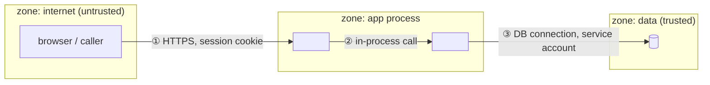

# Security Architecture (Threat Model)

One lens, two directions: **follow the trust, not the code.** Every system draws lines
where trust changes hands — the network edge, the process wall, the user/admin split, the
agent/tool boundary, the model's context window. The sibling lenses map structure, data,
surface, the agent's organs, and the line of change; this lens maps **what is worth
protecting, where trust changes, and what crosses each line uninvited.**
`system-architecture` §2 shows the external actors, `surface-architecture` §3 shows auth
as the user meets it, `data-architecture` §7 marks the PHI, `extensibility-architecture`
§8 covers admission and containment for extension seams; here those paragraphs are the
whole document.

Shostack's four questions organize it: *what are we building* (§2–3) · *what can go
wrong* (§4) · *what are we doing about it* (§5) · *did we do a good job* (§6).

```
 assets ──── who wants them ──── which crossing they come through ──── what stops them
 (§2)        (§2 actors)          (§3 boundaries, entry points)         (§5 controls, located)
                                          │
                                   §4 threats attach HERE — never to "the system"
```

**Not a vulnerability hunt.** `/security-review` (a diff) and the `claude-security`
plugin (a whole repo) *find* bugs and rank them; this document *models* what must be
defended and where. The model tells the scanners where to look; their reports come back
into §6. A threat-model doc that lists CVE-style findings has drifted into the scanners'
job — stop and point there instead. The rule while reading: a **missing control family**
goes in §7; a **bug in a present control** goes to the scanner and is not written here
(if it must survive, one line in §6 under *for the scanner to check*).

## Mode: explain or design

Infer the mode from repo state and the prompt's verb; ask when ambiguous.

- **Explain** — reverse-engineer what exists. Evidence = the repo's real auth middleware,
  permission gates, session handling, config and IaC, network/compose files, secrets
  handling, dependency manifests and lockfiles, CI. Never invent a control or a boundary —
  the failure mode is confabulation, a diagram of defenses the repo does not have.
  Unverifiable → "Open Questions".
- **Design** — compile the user's inputs (PRD, rough design, sibling lens docs, this
  conversation) into the same document shape. Evidence = those inputs only. Entry point
  is mandatory: the **asset & actor inventory** (§2 of the skeleton) — without it, refuse
  to enumerate threats. Every control family in §7 is decided / undecided — never silently
  defaulted; undecided → "Decisions needed", each also 💡-marked inline where the choice
  bites. Identity follows the user's standing convention (hospital-internal → the hospital
  IdP via SSO; outside → Google OAuth; never hand-rolled credential storage) — a deviation
  is a 💡, not a default.
  When settled, point forward to `codebase-blueprint`, which reconciles this
  doc against its sibling lenses and has standing to amend claims here.

**Output home — decided by ownership, not mode.** Would you open a PR in this repo? Yes →
inside its `docs/` tree, in the shape it already has:
`docs/design/<nn>-security-architecture.md` (layer-first, next free number) or
`docs/<slice>/security-architecture.md` (slice-first). No →
`_docs/<system_name>_security_architecture.md` (snake_case project name; untracked; never
touches the project's own `docs/`). A path the user names wins over both.

## Core principles

1. **Threats attach to a crossing and an asset.** A threat with no boundary and no asset
   is noise — cut it. "Someone could hack the server" is not a threat; "an anonymous
   caller on crossing 2 reads `studies` without a session" is.
2. **Attacker before controls.** List no control until §2 names who the attacker is, what
   they can do, and what they want. Skipping this collapses the document into a generic
   checklist ("we use HTTPS, we validate input") with no map of *what* it protects against
   *whom* — the failure mode this lens exists to catch. Say so when you see it.
3. **A control exists only if located.** Explain mode names the real file, middleware,
   config key, or gate that enforces each control. A claimed control with no location is
   ❌ absent, and **absence is a finding** — record it in the presence matrix, don't omit
   it. (Design mode: absence is a *decision* — record why.)
4. **Significance over completeness.** Model the crossings that touch the crown-jewel and
   regulated assets in full; the rest get one line each. Skip theoretical threats against
   nothing valuable, test fixtures, vendored code, and generated artifacts — unless they
   reveal how trust is wired (a fixture holding a real credential is the exception that
   proves the rule).
5. **The agent is an actor.** If the system contains or is driven by an LLM with tools,
   the context window is a trust boundary: everything that reaches it is input from a
   potentially hostile source (prompt injection), and every tool the agent holds is an
   entry point the attacker reaches *through* the agent. Give it a row in the actor table
   and the agentic overlay in §4. **If the agent can read a credential** (stderr, env, a
   config file, a URL it was told to open), **it is a caller at every crossing that
   credential opens** — list it in the entry-point table beside the human, or the
   crown-jewel threat (the agent acting as the human) stays invisible.
   `agentic-architecture` maps the permission/HITL organ and `extensibility-architecture`
   §8 the activation lock — cite them, don't restate them.
6. **Never quote a secret.** The document names *where* a secret lives and how it is
   injected — never its value, never a line that contains one.
7. **One file.** Always a single Markdown file. Do not split.

## Classify, then weight the sections

Classify by **exposure** (who can reach the system), and state the **sensitivity tier**
of the most sensitive asset beside it — the tier raises the bar in every row without
changing the shape:

- **Local tool** — one user, their own machine: a CLI, a notebook, a desktop app. Threats
  worth the ink: supply chain, secrets on disk, files the tool will overwrite, misuse by an
  agent driving it.
- **Internal service** — authenticated staff on a trusted network: a hospital LAN app, an
  intranet API. Threats: authorization gaps, insider access, lateral movement from a
  compromised peer, missing audit.
- **Internet-facing** — anonymous or self-registered users: full weight on
  authentication, injection, session handling, abuse and denial of service.
- **Agentic overlay** — the system *contains* an LLM with tools, **or is driven by one**
  that can read its credentials or steer its inputs (a CLI an agent runs and whose output
  the agent reads qualifies). Not a class: written `<class> + Agentic`. Adds prompt
  injection, excessive agency, exfiltration through tools, and the self-modification
  loop. The Local-tool bullet's "misuse by an agent" is the lightweight case with no such
  access.
- **Hybrid** — more than one *exposure class* present (a local CLI that also talks to a
  hosted API): cover each, label sections clearly.

Sensitivity tier: **public** · **internal** · **confidential** (credentials, business
data) · **regulated** (PHI, PII, financial — named regime, e.g. PDPA/HIPAA). State the
tier **the controls actually guarantee**; when a higher tier is excluded only by a policy
sentence ("no PHI in this tool"), say so and name the line — policy is not a control.
State the classification and its evidence early in the doc. In design mode, classify from
the asset inventory.

| Section                              | Local tool | Internal service | Internet-facing | +Agentic overlay |
|--------------------------------------|------------|------------------|-----------------|------------------|
| Assets & actors                      | full       | full             | full            | + agent as actor |
| Trust boundaries & attack surface    | light      | full             | full            | + context window as boundary |
| Threats (STRIDE per crossing)        | crown-jewel crossings only | full | full         | + agentic rows   |
| Identity & access                    | light      | full             | full            | + tool permissions |
| Secrets & supply chain               | full       | full             | full            | + skill/plugin provenance |
| Data protection                      | light (regulated: full) | full | full         | + what reaches the model |
| Isolation & containment              | light      | light            | full            | full             |
| Logging & audit                      | light      | full             | full            | + what the harness logs about this tool |
| Assurance                            | light      | full             | full            | full             |

"light" = a short paragraph; "full" = paragraph plus a diagram or table. An overlay cell
of `full` **replaces** the base cell; a `+` cell **adds** to it. Never drop a section
silently — if it does not apply, write one line saying why.

In explain mode, two exploration rules beyond your defaults: enumerate the **entry
points** from code *before* writing — routes and listeners, ports, CLI arguments, file
and directory watchers, webhooks, the tool registry, MCP endpoints, plugin/skill loaders —
and trace **one attack path end to end** against the crown-jewel asset: `actor → entry
point → crossing → the control that stops it, or the gap`. Design mode traces the same
path for the highest-value asset in the inventory.

## STRIDE, per crossing

For each numbered crossing in §3, ask the six questions against the asset that crosses
it; write one line or `n/a` with a reason. Apply the full grid to crossings that touch a
crown-jewel or regulated asset; the rest get a one-line verdict.

| Letter | Threat | The question at this crossing |
|---|---|---|
| **S** | Spoofing | Can the caller pretend to be someone else? (identity, tokens, origin) |
| **T** | Tampering | Can data be altered in transit or at rest across this line? |
| **R** | Repudiation | Can an action here be denied later? (is it logged, is the log trustworthy) |
| **I** | Information disclosure | Does anything leak that the caller's trust level should not see? |
| **D** | Denial of service | Can this crossing be exhausted or wedged? |
| **E** | Elevation of privilege | Can the caller do more on the far side than the near side allows? |

**Agentic overlay** — three more rows, only when the class carries the overlay:
*which inputs reach the model* (every path from an untrusted source into the context
window: user text, fetched pages, tool results, file contents, sibling-agent output);
*which tools are write or irreversible* (the excessive-agency surface, and the gate in
front of each); *which tools can send data out* (the exfiltration surface: network,
email, clipboard, a repo push).

## Write the document

**Cross-link:** check the output directory — and `docs/tests/`, where the testability doc
lives — for sibling lens docs (`system-architecture`, `data-architecture`,
`surface-architecture`, `agentic-architecture`, `extensibility-architecture`,
`testability-architecture`) and add a "See also" line under the title for each found —
match on *topic*, not filename (a hand-named `ARCHITECTURE.md` or a `*_ux_design.md` in a
`_docs/` annex counts) — the set triangulates one system. Also link the repo's own design
doc when it carries a security or trust section, and reuse its route and store names. If
none, the doc stands alone. The data-architecture doc, when present, is the map you draw
the trust lines on: reuse its store and flow names verbatim.

Use this skeleton.

```markdown
# <Project> — Security Architecture

> Source: <repo origin/URL or design inputs> · Date: <date> · Mode: <Explain | Design> · Class: <Local tool | Internal service | Internet-facing | Hybrid> <+ Agentic> · Tier: <public | internal | confidential | regulated (<regime>)>
> See also: [System & OOP Architecture](<sibling>) · [Data Architecture](<sibling>)  <!-- omit lines for docs not present -->

## 1. Overview
- One paragraph: what is worth protecting here, from whom.
- Classification (exposure class, overlay, tier) and the evidence.
- Security substrate: identity provider, TLS termination, secret store, sandbox/container
  tech, audit sink (or "TBD" in design mode).

## 2. Assets & Actors           <!-- design mode: fill this FIRST -->
| Asset | Tier | Where it lives (evidence) | Who may access |
|-------|------|---------------------------|----------------|
| ...   | regulated (PHI) | `db.studies` (see Data Architecture §3) | radiologist role |

| Actor | Trust level | Capabilities | Wants |
|-------|-------------|--------------|-------|
| anonymous caller | none | reach public entry points | ... |
| authenticated user | low | ... | ... |
| admin / operator | high | ... | ... |
| insider | high, misused | ... | ... |
| dependency author (supply chain) | executes in-process | ... | ... |
| the agent (if present) | as its permissions | every tool it holds | follows its context — including injected text |

## 3. Trust Boundaries & Attack Surface     <!-- the signature view -->

Every zone and node carries a real name; every crossing is numbered and says what carries
it (protocol, credential). Number by **(edge, credential)**, not by socket: the same port
reached with the token and without it is two crossings (③ and ③′). Then the entry-point
table — "who reaches it" includes the agent wherever it can read the credential:
| # | Entry point (real route / port / tool / file) | Who reaches it | Authn required? | Where (evidence) |
|---|-----------------------------------------------|----------------|-----------------|------------------|
Then trace ONE attack path end to end:
```mermaid
sequenceDiagram
    participant A as Attacker (<actor>)
    participant E as <entry point>
    participant G as <control that stops it>
    A->>E: <request across crossing ①>
    E->>G: <check>
    G-->>A: <denied — or: passes; this is the gap>
```

## 4. Threats
STRIDE per crown-jewel crossing:
| Crossing | S | T | R | I | D | E |
|----------|---|---|---|---|---|---|
| ① ...    | one line or n/a (why) | ... | ... | ... | ... | ... |
Other crossings: one-line verdict each.
Then the ranked few that matter — each pinned to asset × actor × crossing:
| # | Threat | Asset | Actor | Crossing | Likelihood | Impact | Mitigated by (§5) |
|---|--------|-------|-------|----------|------------|--------|-------------------|
Agentic overlay (when present): inputs that reach the model · write/irreversible tools and
their gates · tools that can send data out.

## 5. Controls
| Threat (§4 #) | Control | Where it lives (evidence) | Status |
|---------------|---------|---------------------------|--------|
| 1 | ... | `src/auth/middleware.py::require_session` | ✅ located / ⚠️ partial / ❌ absent |
### 5.1 Identity & access — authn provider and flow; session lifetime and storage; authz model (RBAC / ABAC / ownership) and where it is enforced; the admin split.
### 5.2 Secrets & supply chain — where each secret lives and how it is injected (never its value); lockfiles and pinning; signing and provenance; dependency audit in CI. Mixed substrate (vendored + CDN + stdlib)? Use a table: component · version · how it arrives · pinned / integrity-checked / audited.
### 5.3 Data protection — in transit, at rest, in logs; de-identification and retention (cite Data Architecture §7); for the agentic overlay, what may reach the model and what must not.
### 5.4 Isolation & containment — process wall · OS sandbox · container · network zone · none (name which, and what it actually confines — the vocabulary of Extensibility Architecture §8).
### 5.5 Logging & audit — what is logged, where, tamper resistance, who reads it, retention; for clinical AI, the event-level audit trail (`medlog-ref`).

## 6. Assurance                <!-- did we do a good job -->
Tests that assert controls (name them; which gate suite runs them) — **and the controls
no test asserts**, which is the actionable list. Scanners run — `/security-review`,
`claude-security`, dependency audit, SAST/DAST — and where their reports land ("none
run" is an honest answer for a local tool; say it). Residual risk: what is accepted, by
whom, until when. An absence with **no recorded acceptance** is an Open Question (§8),
not a residual risk.

## 7. Control Presence Matrix
| Control family | Present? | For which subsystem | Where (evidence) | Note (absence is a finding / a decision) |
|----------------|----------|---------------------|------------------|------------------------------------------|
| authentication | ✅/⚠️/❌ | ... | ... | ... |
| authorization | | | | |
| input validation | | | | |
| output encoding / sanitization | | | | |
| secrets management | | | | |
| transport encryption | | | | |
| at-rest encryption | | | | |
| audit logging | | | | |
| rate limiting / abuse | | | | |
| sandboxing / isolation | | | | |
| dependency pinning & audit | | | | |
| backup & recovery | | | | |
| egress / outbound allowlist | | | | |
| agent tool gating (overlay) | | | | |

## 8. Open Questions & Notes   <!-- design mode: "Decisions needed" -->
What the evidence cannot determine; threats you could not pin to a crossing; choices
still open. Be honest here — uncertainty goes here, not into the diagrams.
<!-- Design mode: this section indexes the 💡 markers placed inline at each decision
     site (💡 + one line stating the choice). Budget them — the identity provider, the
     authz model, what reaches the model, the containment mechanism, accepted residual
     risk; `rg 💡` = the review checklist. -->
```

## Mermaid (GitHub-reliable rendering)

- `flowchart` with `subgraph` blocks as trust zones for the boundary view — every
  subgraph label starts with `zone:`; number the crossing edges (①②③) so §3–5 can cite
  them. `sequenceDiagram` for the attack path; `stateDiagram-v2` for a session or token
  lifecycle if it matters.
- Keep each diagram ≤ ~15 nodes; identifiers match real modules, stores, routes, and
  tools from the evidence.
- Quote labels containing spaces or special characters.

## Quality checklist before finishing

- [ ] Mode, exposure class (with overlay), and tier stated with evidence.
- [ ] Asset and actor tables present before any control is named; the agent has a row
      when the overlay applies, and appears as a caller at every crossing whose
      credential it can read.
- [ ] Boundary diagram populated with real names; every crossing numbered and cited by
      §3–5; entry points enumerated from code (explain) or the inputs (design).
- [ ] One attack path traced end to end against the crown-jewel asset, ending at a
      located control or a named gap; crossings numbered by (edge, credential).
- [ ] Every threat pinned to asset × actor × crossing; STRIDE grid on crown-jewel
      crossings; agentic overlay rows present when the class carries it.
- [ ] Every control ✅ carries a real location; ⚠️/❌ recorded in the presence matrix,
      per subsystem — absences not omitted.
- [ ] No vulnerability findings masquerading as the model — missing control families in
      §7, bugs in present controls left to the scanners (at most one line in §6).
- [ ] §6 names the controls no test asserts; unaccepted absences moved to §8.
- [ ] No secret value, and no line containing one, quoted anywhere.
- [ ] Every file/route/module/tool named in the doc exists in the mode's evidence;
      **line numbers re-verified after the final edit** (they drift while you write —
      script it: extract every `file:NNN`, print those lines, read them).
- [ ] Sibling lens docs cross-linked if present; store and flow names match the data doc.
- [ ] Uncertainties live in "Open Questions" / "Decisions needed", not disguised as facts.
- [ ] Design mode: identity follows the standing convention or carries a 💡; 💡 markers
      inline at each decision site, indexed in "Decisions needed" — budgeted.
- [ ] Exactly one Markdown file.
