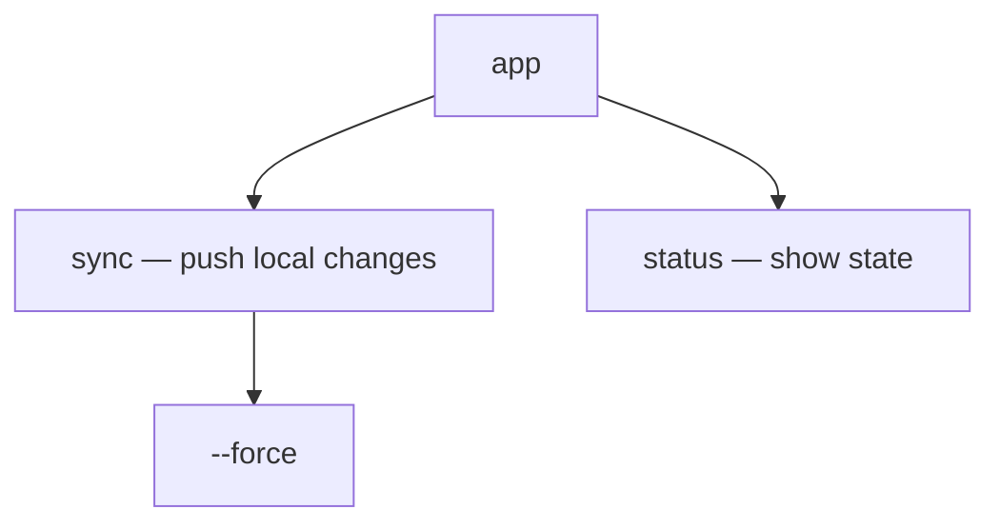
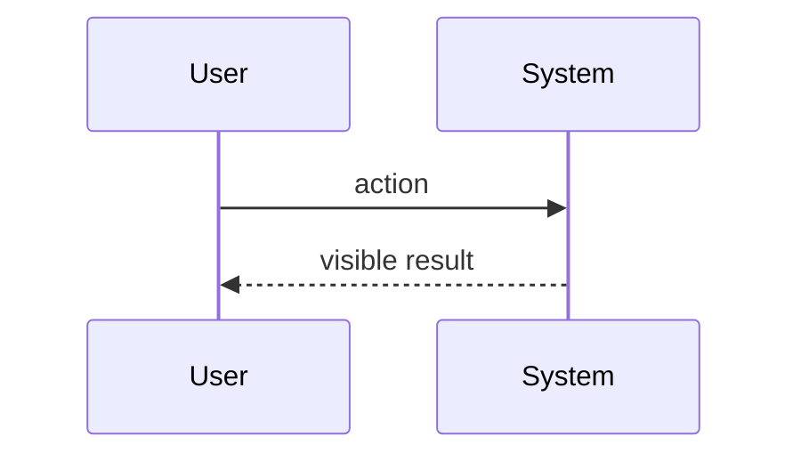
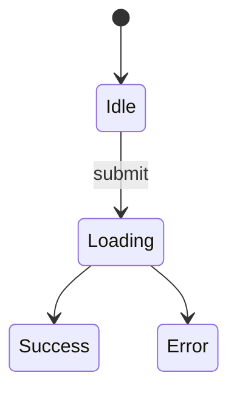

# Surface Architecture (UX / DX / API)

One lens, two directions: **describe the surface as the user sees it, not as the code
implements it.** Document the command `app sync --force`, the route `/settings/billing`,
the call `client.upload(file)` — not the `SyncCommand` class or `BillingController` behind
them (internals belong to the `system-architecture` lens). Everything a consumer touches
without knowing the internals.

## Mode: explain or design

Infer the mode from repo state and the prompt's verb; ask when ambiguous.

- **Explain** — reverse-engineer what exists. Evidence = the repo's real routes, commands,
  exported symbols, endpoint paths, component files. Never invent screens, commands, or
  parameters — the failure mode is confabulation. Unverifiable → "Open Questions".
  Output: `_docs/<system_name>_ux_design.md` (snake_case project name; create `_docs/`
  if missing).
- **Design** — compile the user's inputs (PRD, rough design, this conversation) into the
  same document shape. Evidence = those inputs only. Don't invent requirements or silently
  settle open choices (navigation model, auth flow, error contract …) — undecided →
  "Decisions needed".
  Output: `docs/design/<nn>-surface-architecture.md` (next free number) unless the user names
  a path.
  When the design is settled and the user is about to build, point forward to
  `codebase-blueprint` — it reconciles this doc against its sibling lenses and the chosen
  framework, and has standing to amend claims here. Every verb promised in this doc must
  land on a use case and a data field there, or it is a promise with no schema.

## Core principles

1. **Ground every claim in the mode's evidence** (above). When unsure, say so in the
   uncertainty section rather than guessing.
2. **Surface, not internals** (the lens above).
3. **Significance over completeness.** Cover the primary user journeys and the most-used
   API; skip internal-only endpoints, debug commands, and dead routes unless they reveal
   design intent.
4. **Adapt depth to surface type** — classify first, then let the emphasis table drive.
5. **One file.** Always a single Markdown file. Do not split.

## Classify, then weight the sections

"User" means different things per surface — classify first, since it decides what
"user-facing API" even means:

- **GUI app** (web/desktop/mobile) — user = end user; "API" = screens & components
  (routes, navigation, design-system components, i18n).
- **CLI / TUI** — user = operator at a terminal; "API" = command & flag tree
  (arg parser, `--help`, exit codes, stdin/stdout contract).
- **Library / SDK** — user = developer who imports it; "API" = exported symbols / DX
  (public exports, quickstart, signatures).
- **Web API** (REST/GraphQL/RPC) — user = client developer over the wire; "API" =
  endpoints & schema (routes, OpenAPI/GraphQL schema, auth, status & error contract).
- **Hybrid** = more than one present (a library shipping a CLI, an app with a public REST
  API) — cover each surface, label sections clearly.

State the classification and its evidence early in the doc. In design mode, classify from
the intended shape in the inputs.

**When the user is (or could be) an AI agent.** For CLI, Web API, SDK, or MCP surfaces, a
likely consumer is an autonomous agent. If so, add one short note to §6 on its *agent
experience* ("AX"): self-documenting spec/`--help`, token-economical output, errors that
teach, stable exit/status codes to branch on. Keep it descriptive; for a full evaluative
audit, defer to the `ax-interface` skill.

| Section                       | GUI App | CLI/TUI | Library/SDK | Web API |
|-------------------------------|---------|---------|-------------|---------|
| Cheat sheet (top of doc)      | task → screen/shortcut table (or skip) | top commands + flags | top ~10 calls + lookup table | top endpoints as curl/httpie |
| Overview & user persona       | full    | full    | full        | full    |
| Surface map (inventory)       | sitemap / nav | command tree | API surface table | endpoint catalog |
| Entry & onboarding            | full (first screen) | full (install + first run) | full (quickstart) | full (auth + first call) |
| Key user journeys             | full    | full    | usage flows | call flows |
| Interaction & state           | full    | output + exit codes | error/return contract | status & error contract |
| IA / API ergonomics           | full    | flag conventions | naming & DX | resource design |
| Configuration & customization | full    | full    | options/config | headers/params/versioning |

Never drop a section silently — if it does not apply, write one line saying why.

In explain mode, two exploration rules beyond your defaults: the **surface inventory**
(screen/route list, command tree, exported symbols, endpoint catalog) is the backbone of
the doc — enumerate it before writing; and trace **one representative user journey** the
way the user experiences it (`land → navigate → submit → result` for a GUI; `invoke →
flags → output` for a CLI; `import → construct → call → handle` for a library;
`authenticate → request → response → error` for a web API).

## Write the document

**Cross-link:** check the output directory for sibling lens docs (`system-architecture`,
`data-architecture`, `agentic-architecture`) and add a "See also" line under the title for
each found — the set triangulates one system. If none, the doc stands alone.

**Cheat sheet:** open the doc with a `## Cheat Sheet` preamble (unnumbered, before
`## 1. Overview`) — a one-screen TL;DR of the 5–10 most-used touchpoints a reader can copy
and run immediately. Form follows surface type (see the table). Two rules keep it
trustworthy: (1) **it is a curated subset of the Surface Map, ordered by frequency of
use — never introduce a symbol, command, or endpoint here that is not already verified and
listed in §2;** (2) keep it to roughly one screen. For a pure GUI where it adds nothing,
skip it with one line saying why.

Use this skeleton. Keep prose tight; let the diagrams and tables carry the structure.

```markdown
# <Project> — User-Facing API & UX/DX

> Source: <repo origin/URL or design inputs> · Date: <date> · Mode: <Explain | Design> · Surface: <GUI | CLI | Library | Web API | Hybrid>
> See also: [System & OOP Architecture](<sibling>) · [Data Architecture](<sibling>)  <!-- omit lines for docs not present -->

## Cheat Sheet
<!-- One-screen TL;DR: 5–10 most-used touchpoints, copy-paste-runnable, ordered by frequency.
     Every entry MUST already appear (verified) in §2 Surface Map — never introduce a new symbol here. -->

## 1. Overview
- One-paragraph purpose: what this project does for its user.
- Surface type and the evidence for that classification.
- Who the user is (end user / operator / developer / client dev) and how they reach the system.

## 2. Surface Map
The full inventory of user touchpoints, in the form that fits the surface type
(sitemap / command tree / API surface table / endpoint catalog).

| Touchpoint | What the user does with it |
|------------|----------------------------|
| `app sync` | ... |

## 3. Entry & Onboarding
How a user first encounters and starts using the system: install / first run / auth /
the smallest "hello world". Quote the real first command, route, or call.

## 4. Key User Journeys
2–3 representative end-to-end paths, as the user experiences them.


## 5. Interaction & State
What the user sees as conditions vary: loading/empty/error states, validation messages,
exit codes, HTTP status codes and error-body shapes, auth challenges.


## 6. Information Architecture / API Ergonomics
How the surface is organized and named, and whether it is consistent: route/URL patterns,
flag conventions, resource naming, function-call idioms, predictability. AX note here when
the consumer may be an agent.

## 7. Configuration & Customization
What the user can tune: settings screens, CLI flags & config files, library options,
API headers/params/versioning.

## 8. Open Questions & Notes   <!-- design mode: "Decisions needed" -->
What the evidence cannot determine, assumptions made, choices still open. Be honest here —
this is where uncertainty goes instead of into the diagrams.
```

## Mermaid (GitHub-reliable rendering)

- Every diagram in a ```` ```mermaid ```` fenced block.
- Match diagram to view: `flowchart` for navigation maps and command trees,
  `sequenceDiagram` for journeys and call flows, `stateDiagram-v2` for interaction states.
  Avoid `journey` — it renders less predictably on GitHub.
- Keep each diagram ≤ ~15 nodes; split dense views under sub-headings.
- Quote labels containing spaces or special characters; identifiers match real routes,
  commands, symbols, or endpoints from the evidence.

## Quality checklist before finishing

- [ ] Mode and surface type stated with evidence.
- [ ] Cheat sheet present (form matches surface type), every entry a verified subset of the Surface Map — or skipped with a one-line reason.
- [ ] Every route/command/symbol/endpoint named in the doc exists in the mode's evidence.
- [ ] The doc describes the surface as the user sees it, not the internals behind it.
- [ ] Section emphasis matches the surface type.
- [ ] Sibling lens docs cross-linked if present.
- [ ] All diagrams are valid Mermaid in fenced blocks.
- [ ] Uncertainties live in "Open Questions" / "Decisions needed", not disguised as facts.
- [ ] Exactly one Markdown file.
