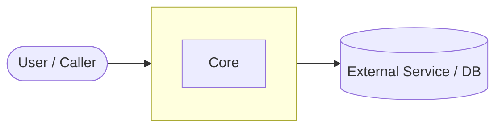
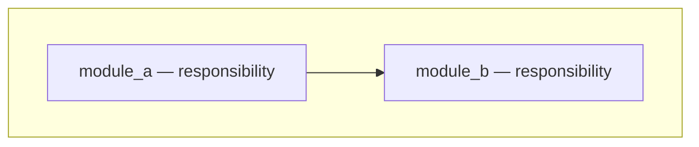
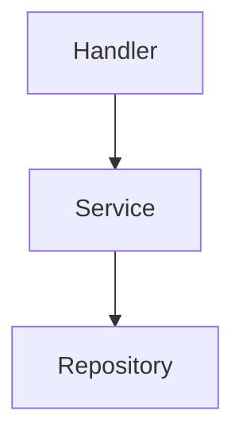
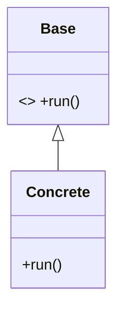
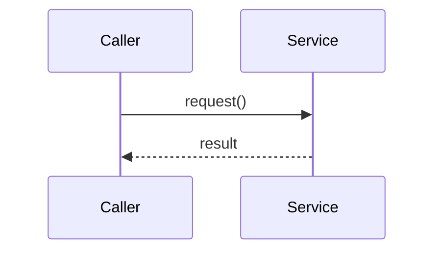

# System Architecture

One lens, two directions. Produce a single architecture document — C4-style structure
(Context → High-level → Components), OOP/class view, key flows — grounded in the mode's
evidence. You already know how to explore a codebase and what C4 is; this skill pins the
lens, the evidence rules, and the artifact.

## Mode: explain or design

Infer the mode from repo state and the prompt's verb; ask when ambiguous.

- **Explain** — reverse-engineer what exists (code-rich repo; "learn / explain / document
  this codebase"). Evidence = the repo's real source: real file paths, real class and
  function names. Never invent components or relationships — the failure mode is
  confabulation, a plausible diagram that doesn't match the repo. Unverifiable →
  "Open Questions".
  Output: `_docs/<system_name>_system_oop_architecture.md` (snake_case project name;
  create `_docs/` if missing).
- **Design** — compile the user's inputs (PRD, rough design, this conversation) into the
  same document shape (greenfield or empty repo; "design the architecture"). Evidence =
  those inputs only. Don't invent requirements or silently settle open choices —
  undecided → "Decisions needed" (this mode's "Open Questions").
  Output: `docs/design/<nn>-system-architecture.md` (next free number) unless the user
  names a path.
  If requirements are too fuzzy to compile, hand off to `c4-architect` — its phase-gated
  dialogue elicits them first.

## Core principles

1. **Ground every claim in the mode's evidence** (above). When unsure, say so in the
   uncertainty section rather than guessing.
2. **Significance over completeness.** Cover the architecturally significant parts; skip
   generated code, vendored dependencies, build artifacts, and test fixtures unless they
   reveal design intent.
3. **Adapt depth to system type** — classify first, then let the emphasis table drive.
4. **One file.** Always a single Markdown file. Do not split.

## Classify, then weight the sections

Classify as **Application** (an entry point that runs: `main`, server bootstrap, CLI root,
deploy config), **Library** (a public API meant to be imported: package exports,
distribution metadata), or **Hybrid** (both — frameworks, libraries shipping a CLI). In
design mode, classify from the intended shape in the inputs. State the classification and
its evidence early in the doc.

| Section                         | App  | Library | Hybrid |
|---------------------------------|------|---------|--------|
| System Context (C4 L1)          | full | light   | full   |
| Containers / High-level (C4 L2) | full | as modules | full |
| Components (C4 L3)              | full | full    | full   |
| OOP & Class architecture        | key classes | full + patterns | full |
| Key flows (sequence)            | runtime flow | usage flow | both |
| Extension points                | light | full   | full   |

"light" = a short paragraph; "full" = paragraph plus a diagram. Never drop a section
silently — if it does not apply, write one line saying why.

In explain mode, one exploration rule beyond your defaults: read public interfaces
(signatures, docstrings) rather than full bodies, and trace **one representative flow**
end to end (request → handler → services → output for an app; caller → public API → core →
result for a library).

## Write the document

**Cross-link:** check the output directory for sibling lens docs (`ux-dx-design`,
`data-architecture`, `agentic-system`) and add a "See also" line under the title for each
found — the set triangulates one system. If none, the doc stands alone.

Use this skeleton. Keep prose tight; let the diagrams carry the structure.

```markdown
# <Project> — System & OOP Architecture

> Source: <repo origin/URL or design inputs> · Date: <date> · Mode: <Explain | Design> · Type: <App | Library | Hybrid>
> See also: [UX/DX Design](<sibling>) · [Data Architecture](<sibling>)  <!-- omit lines for docs not present -->

## 1. Overview
- One-paragraph purpose: what this project is and what problem it solves.
- Type classification and the evidence for it.
- Tech stack: language(s), key frameworks, notable dependencies (or "TBD" in design mode).

## 2. System Context        <!-- C4 Level 1 -->
Who/what uses the system and what it depends on.


## 3. High-Level Structure   <!-- C4 Level 2: containers (app) or top-level packages (lib) -->

| Path | Responsibility |
|------|----------------|
| `src/...` | ... |

## 4. Components           <!-- C4 Level 3: inside the most important container/package -->


## 5. OOP & Class Architecture
Key classes, interfaces, inheritance, composition, and the design patterns in use
(name the pattern, point to where it lives, and say why it's used).


## 6. Key Flows
A representative end-to-end path.


## 7. Extension Points
How a developer extends or customizes the system (subclassing, plugins, config, hooks).

## 8. Key Abstractions / Glossary
Short definitions of the domain terms and core types a newcomer must know.

## 9. Open Questions & Notes   <!-- design mode: "Decisions needed" -->
What could not be determined from the evidence, assumptions made, choices still open.
Be honest here — this is where uncertainty goes instead of into the diagrams.
```

## Mermaid (GitHub-reliable rendering)

- Every diagram in a ```` ```mermaid ```` fenced block.
- C4 levels: plain `flowchart`/`graph` with `subgraph` blocks — NOT the native `C4Context`
  dialect, which renders unreliably on GitHub. `classDiagram` for OOP, `sequenceDiagram`
  for flows.
- Keep each diagram ≤ ~15 nodes; split dense views under sub-headings.
- Quote labels containing spaces or special characters; identifiers match real names from
  the evidence.

## Quality checklist before finishing

- [ ] Mode and system type stated with evidence.
- [ ] Every class/module/path named in the doc exists in the mode's evidence.
- [ ] Section emphasis matches the type.
- [ ] Sibling lens docs cross-linked if present.
- [ ] All diagrams are valid Mermaid in fenced blocks.
- [ ] Uncertainties live in "Open Questions" / "Decisions needed", not disguised as facts.
- [ ] Exactly one Markdown file.
