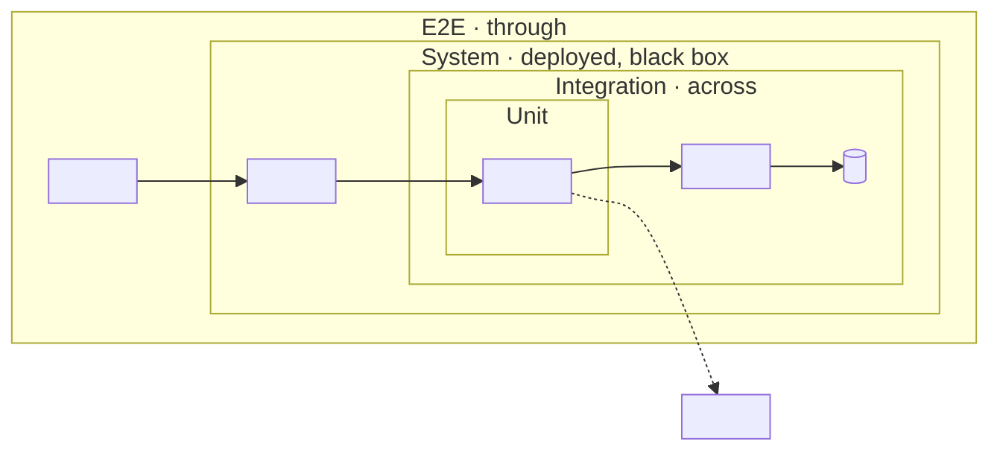
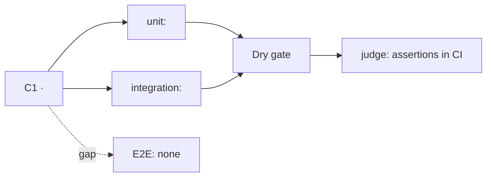
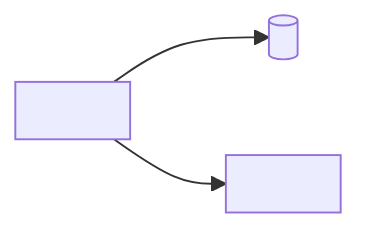

# Testability Architecture

One lens, two directions: **follow the proof, not the code.** Every system makes claims —
it never double-books, it recovers when the database restarts, it rejects the
unauthenticated caller. The sibling lenses map structure, data, surface, the agent's
organs, the line of change, and the trust; this lens maps **which box proves each claim,
what is real inside that box, which gate runs it, and who judges the result.** Two halves,
one document: *testability* is a property of the code (seams a test can control and
observe through), and the *test portfolio* is an architecture of its own (levels, gates,
environments, testers).

```
 claim ──── cheapest box that proves it ──── real vs doubled ──── gate that runs it ──── who judges
 (§2)       (§3 level map)                   (§4 seams)           (§5 gates, envs)       (§6 testers)
```

**Not a runbook.** How to bring up the live topology, which command, which flag, the
gotchas — that is how-to, and it lives in the runbooks beside this doc. This doc is the map
they hang from: a gate appears here by its entry point (`just dry`) and what it proves,
never as numbered steps or troubleshooting. A draft growing steps or gotchas has drifted
into the runbook's job — stop, link the runbook in the header, keep only the claim it
verifies. Not a coverage report either: a percentage is evidence in §9, never the thesis.

## Mode: explain or design

Infer the mode from repo state and the prompt's verb; ask when ambiguous.

- **Explain** — reverse-engineer what exists. Evidence = test directories and runner config,
  CI workflows, task-runner recipes (`justfile`, `package.json` scripts, `Makefile`),
  fixtures and seed data, compose files for test services, the composition root / DI
  wiring, the double libraries in use, and the repo's own runbooks. Never invent a test, a
  gate, or a seam — the failure mode is confabulation, a tidy pyramid the repo does not
  have. **Count, don't estimate**: tests per level come from the files — cases as the runner
  collects them (parametrised cases expanded; say so when that differs from functions);
  agent-driven levels count journeys, UAT counts scenarios. Unverifiable → "Open Questions".
- **Design** — compile the user's inputs (PRD, requirements, sibling lens docs, this
  conversation) into the same document shape. Evidence = those inputs only. Entry point is
  mandatory: the **claim & risk inventory** (§2 of the skeleton) — without it, refuse to
  choose levels. Every level, gate, tester, and the doubles school is decided / undecided —
  never silently defaulted; undecided → "Decisions needed", each also 💡-marked inline
  where the choice bites. When settled, point forward to `codebase-blueprint`, whose
  *wiring & substitution* check decides whether the seams here are seams in fact.

**Output home — decided by ownership, not mode.** Would you open a PR in this repo? Yes →
`docs/tests/testability-architecture.md`, the head of the repo's tests folder in either
layout shape: runbooks, scenario catalogues, and experiment logs sit beside it and link up
to it. A slice-first repo documenting one slice nests the same role:
`docs/<slice>/tests/testability-architecture.md`. If the repo keeps its test docs under
another name (`docs/test/`), still write `docs/tests/`, link the runbooks where they are,
and record in §10 the rename that reunites map and runbooks — never move files you did not
write. Open with the repo's doc frontmatter when its docs carry one (`summary:` +
`read_when:`). No →
`_docs/<system_name>_testability_architecture.md` (snake_case project name; untracked;
never touches the project's own `docs/`). A path the user names wins over both.

## Core principles

1. **Cheapest sufficient level.** Prove each claim at the lowest level that can prove it;
   escalate only what only a bigger box can see (integration for the SQL, E2E for the
   journey). A portfolio heavy with E2E and manual checks (the ice-cream cone) is a finding;
   a claim proven nowhere is a bigger one; a claim proven only by a manual step in a runbook
   is a finding of its own — *proven by hand*.
2. **No seam, no test.** A dependency is testable only when a test can **control** what it
   answers (indirect input) and **observe** what the code sends it (indirect output) without
   editing the code under test. Locate the seam where the concrete is chosen — composition
   root, constructor parameter, factory, env switch — and check that a test can choose
   differently. A `new PostgresRepo()` inside the method is a seam in principle only:
   absent. A dependency that is hard to double is design feedback, not a testing problem —
   record it and cite `codebase-design`.
3. **Pin every source of nondeterminism at a seam.** Clock, randomness and generated IDs,
   time zone and locale, network, concurrency and ordering, external data, model output.
   One left unpinned makes every level that contains it flaky; a flaky test is a missing
   seam, not bad luck.
4. **Name the double by its role, never its library class** (table below). Two more rules
   hold in either school: **don't mock what you don't own** — wrap a third-party API in your
   own port, double the port, and integration-test the adapter; and a double that is hard to
   build is feedback about the design (principle 2).
5. **Verification is not validation; the agent never accepts.** Unit through E2E ask *did we
   build it right*; UAT asks *did we build the right thing*, and only a person who does the
   work can answer. An agent may rehearse a UAT scenario to burn down cheap failures before
   users' time is spent; it never signs.
6. **Absence is a finding** (explain) or **a decision** (design), recorded per subsystem —
   one verdict per level for the whole system hides the subsystem nobody tests.
7. **One file.** Always a single Markdown file. Do not split.

## Pinned vocabulary

Teams use these words differently; the document pins them and maps the repo's own words
onto them (a suite the repo calls "integration" that hits staging is a *system* test here —
record both names).

| Level | Question | Box — what is real | Doubled | Typical owner |
|---|---|---|---|---|
| **Unit** | Does this logic work? | one module, through its interface | every awkward dependency | developer |
| **Integration** | Do these pieces fit at the seam? | 2+ real components across one seam (code ↔ store, filesystem, config, queue) | what lies outside that seam | developer |
| **Contract** | Do two parties still agree? | one side, against the other side's recorded expectations | the other party | both teams |
| **System** | Does the whole system meet its spec? | the deployed system in a production-like environment, black box — **including non-functional**: performance, security, resilience | third parties, at most (sandboxes) | QA, CI |
| **E2E** | Does one user journey work start to finish? | full stack, driven through the surface its user actually touches | nothing | developer, QA, agent |
| **UAT** | Is this what we needed? | the product in real use | nothing | end users, business owner |

System is traced to the spec and covers non-functional requirements; E2E follows one
journey through the user's surface. Many E2E tests are also system tests. "User" follows
the audience: a person's UI, an agent's CLI, or — for a headless pipeline — the peer
systems it serves; a system with several audiences has one E2E per audience surface.
Static checks (lint, types, architecture rules) and evals are not levels, but both belong
in §9.

| Double | Role | Real logic? | Who judges |
|---|---|---|---|
| **Dummy** | fills a parameter, never used | no | nobody |
| **Stub** | **controls** indirect input with canned answers | no | the test, on the output |
| **Spy** | **records** indirect output for the test to inspect after | no | the test, on the recording |
| **Mock** | **verifies** indirect output live against expectations | no | the mock itself |
| **Fake** | a working shortcut: in-memory store, emulator, local sandbox | **yes** | the test, on output or fake state |

Stub and fake support *state* verification; spy and mock, *behaviour* (interaction)
verification. Library classes blur the roles — `unittest.mock.Mock`, Moq, and mockito are
general-purpose — so record the role the object plays, not its type. The substitution
matrix adds three values: **real**, **sandbox** (a vendor's test environment), and **off**
(disabled by a production switch such as `--no-open` — the switch is the seam). A real
product run as a stand-in (a test PACS, an emulator) plays **fake**: name the role, note
the product. Callers are not dependencies — the test plays the caller.

**The school is recorded, not prescribed.** *Classicist* suites use real objects wherever
fast and deterministic, double only the awkward, and verify state — they survive refactors
but failures can cascade. *Mockist* suites isolate every class and verify interactions —
they pinpoint failures and drive interface design but couple tests to implementation.
Explain mode records which one the suite practises, per subsystem (mixed is common). Design
mode makes it a 💡 decision every time, with this tradeoff beside it.

## Testers, and the agent among them

The roster is **developer · CI · AI agent · QA · end user**. The agent is a first-class
tester in every system that has a surface it can drive, and it wears up to three hats:

| Hat | Does | Risk | What the system owes it |
|---|---|---|---|
| **Author** | writes tests | tautological tests that mirror the code, over-doubling | mutation testing or review as the check on its tests |
| **Runner** | runs the gates, reads the result | a red it misreads, a hang it waits on | stable exit codes, token-economical output, test affordances |
| **Driver** | drives the real UI / CLI / API like a user | an unrecorded judgment call | an oracle it can check and evidence it must leave |

| | Scripted E2E | Agent-driven E2E |
|---|---|---|
| Oracle | coded assertions | the agent's judgment, backed by evidence |
| Determinism | high | low |
| When the surface changes | breaks | adapts |
| Cost | CI minutes | tokens and wall time |
| Fits | regression on critical journeys | new features, exploration, pre-release, UAT rehearsal, one-off verification |

**The ratchet — the agent explores, the script regresses.** Once an agent-driven journey
is stable, the agent writes the scripted test from its own run; the doc records each
journey's ratchet status.

**Test affordances are architecture.** A system testable by an agent exposes: **reset**
(known state), **seed** (fixtures), **verify** (one command that reports the observable
state), **clock control**, **health / readiness**, **stable selectors** (accessibility roles
and labels — the same tree scripted drivers and browser agents read), **test accounts**, and
a log line per stage. The doc lists them; runbooks say how to use them; `ax-interface` judges
the commands' agent-facing quality.

**Evidence bundle.** A judgment the reader cannot re-check is an assertion, not a proof.
Every agent-driven run, and every gate on a remote runner, leaves what a reader who was not
there needs: the commit, the entry point, the exit status, and the oracle's observations —
queries and their results, screenshots, log lines.

## Classify, then weight the sections

Classify by **where the risk lives**; the class predicts the shape the portfolio should
have, and a mismatch between that and the actual shape is a finding.

- **Logic-heavy** — rules, parsers, algorithms, most libraries and CLIs. Shape: **pyramid**.
- **Integration-heavy** — glue over stores and APIs, CRUD services. Shape: **trophy**
  (integration widest).
- **Distributed** — several services or repos talking. Shape: **honeycomb** — integration
  and contract tests between services.
- **UI-heavy** — the user journey is the product. Shape: **trophy + E2E** on critical
  journeys.
- **Model-inside overlay** — an LLM or ML model's output is a feature *and this system owns
  the model or its prompt*. Not a class: written `<class> + Model inside`. Adds the model
  seam and an evals level. A system that only relays a remote model's output treats the
  model as a true-external dependency (§4) and locates its validation in one §8 line.
- **Hybrid** — more than one class in one system: cover each, label sections clearly.

State the **assurance** level beside the class (distinct from the security doc's
sensitivity tier): **casual** (personal tools, spikes) · **production** (other people depend
on it, including anything published) · **regulated** (a named regime — ISO 29110, a
medical-device standard, an audit — requires traceability and retained evidence). It sets
the weight of §7 and the evidence §5–6 must keep; a regulated system with no requirement
IDs is itself a finding, and §7 traces to the §2 claims meanwhile. State class, assurance,
and shape — actual with counts (explain) or intended (design) — early in the doc.

| Section | Logic-heavy | Integration-heavy | Distributed | UI-heavy | +Model inside |
|---|---|---|---|---|---|
| Claim & risk inventory | full | full | full | full | + model-quality claims |
| Level map | full | full | full | full | + an evals box |
| Seams & substitution | full | full | full | full | + the model seam |
| Gates & environments | light | full | full | full | + eval cadence |
| Testers & the agent | light | full | full | full | + the judge |
| Traceability | by assurance | by assurance | by assurance | by assurance | by assurance |
| Evals | n·a | n·a | n·a | n·a | full |
| Level presence matrix | full | full | full | full | + evals row |

"light" = a short paragraph; "full" = paragraph plus a diagram or table; "by assurance" = full
when assurance is regulated or an SRS exists, light otherwise. A Hybrid takes the heavier
cell. An overlay `+` cell **adds** to the base; `full` **replaces** it. Never drop a
section silently — if it does not apply, write one line saying why.

In explain mode, three exploration rules beyond your defaults: **inventory the tests per
level from the files** and map the repo's folder and marker names onto the pinned levels;
**find the composition root(s)** before judging any seam; and **trace one crown-jewel claim**
— the highest-risk one, not the best-covered — through every level that proves it —
`claim → unit → integration → system / E2E → gate → judge` — ending at a named gap where a
level is missing; a trace that ends in a gap is the point. Design mode traces the same path
for the highest-risk claim in the inventory.

## Write the document

**Cross-link:** look for sibling lens docs where they live — `docs/design/`, the slice
folder, `_docs/` — and in `docs/tests/` (`system-architecture`, `data-architecture`,
`surface-architecture`, `agentic-architecture`, `extensibility-architecture`,
`security-architecture`); add a "See also" line under the title for each found — match on
*topic*, not filename (a hand-named `ARCHITECTURE.md` counts). Reuse the system doc's
component names in the level map and the data doc's store names in the substitution matrix.
Each control the security doc's §6 lists as unasserted becomes a claim in §2 (source:
Security §6) — don't restate the threat model. A sibling older than the code it describes
is linked and flagged in §10; don't reuse its stale claims. Then a `Runbooks:` line linking
every how-to doc for testing — or `none`; a manual lane with no runbook is a finding.

Use this skeleton.

````markdown
---                                   <!-- owned repo whose docs carry frontmatter -->
summary: <what this system must prove, and where its risk lives — one line>
read_when:
  - adding or changing a test, a fixture, or a gate
  - deciding at which level a new claim is proven
---

# <Project> — Testability Architecture

> Source: <repo origin/URL or design inputs> · Date: <date> · Mode: <Explain | Design> · Class: <Logic-heavy | Integration-heavy | Distributed | UI-heavy | Hybrid> <+ Model inside> · Assurance: <casual | production | regulated (<regime>)> · Shape: <actual → intended>
> See also: [System & OOP Architecture](<sibling>) · [Data Architecture](<sibling>)  <!-- omit lines for docs not present -->
> Runbooks: [<how-to>](<path>) · [<how-to>](<path>)  <!-- the how-to lives there; this doc is the map -->

## 1. Overview
- One paragraph: what this system must prove, and where its risk lives.
- Classification (class, overlay, assurance) and shape — actual with counts per level, or
  intended — with the evidence.
- Test substrate: frameworks, runners, double libraries, fixture tooling, CI, remote
  runners (or "TBD" in design mode).

## 2. Claim & Risk Inventory        <!-- design mode: fill this FIRST -->
| # | Claim (what must not break) | Source | Risk if broken | Cheapest sufficient level | Proven at (evidence) | Status |
|---|-----------------------------|--------|----------------|---------------------------|----------------------|--------|
| C1 | ... | R-03 · PRD P0 · Data Architecture §8 · incident | high | unit + integration | `tests/...::test_...` | ✅ proven / ⚠️ partial / ✋ by hand / ❌ unproven |
Sources: requirement IDs and P0 capabilities; invariants claimed by sibling lens docs (a
retention rule, a contract) and every control Security §6 lists as unasserted; confirmed
contracts in the progress tracker; agent-facing docs that promise behaviour (SKILL.md,
`--help`, a schema — an instruction an agent obeys is a contract the code must keep); past
incidents.

## 3. Level Map                      <!-- the signature view -->

Each level is a bigger box over the real components; dashed = doubled at the inner levels.
| Level | This repo calls it | Where (dir / marker) | Count | Box — what is real | Gate | Runs / judges |
|-------|--------------------|----------------------|-------|--------------------|------|---------------|

## 4. Seams & Substitution
### 4.1 Dependency inventory
| Dependency | Category | Seam — where the concrete is chosen (evidence) | Control input? | Observe output? |
|------------|----------|-------------------------------------------------|----------------|-----------------|
Category = in-process · local-substitutable · remote-owned · true-external (the
dependency categories of `codebase-design`).
### 4.2 Substitution matrix
| Dependency | Unit | Integration | System | E2E |
|------------|------|-------------|--------|-----|
| `<store>`  | fake | real        | real   | real |
Cells name the role — dummy · stub · spy · mock · fake · sandbox · real — never the library
class. School practised: classicist · mockist · mixed, per subsystem (design mode: 💡).
### 4.3 Nondeterminism
| Source | Pinned at (seam / fixture) | Levels affected | Status |
|--------|----------------------------|-----------------|--------|
clock · randomness and IDs · time zone and locale · network · concurrency · external data · model output
### 4.4 Claim trace — ONE crown-jewel claim (the highest-risk), through every level


## 5. Gates & Environments
Dry = hermetic: the test starts and owns everything it touches (in-process, a subprocess,
loopback, temp dirs) and needs nothing pre-running, remote, or shared · Live = needs a
service the test does not own · Full = Dry ∪ Live. Record the repo's own gate names beside
these, and say where the local and CI versions of one gate differ.
| Gate | Levels & checks | Trigger | Runs where | Entry point | Blocking? | Evidence left |
|------|-----------------|---------|------------|-------------|-----------|---------------|
Entry point = a recipe, or a runbook link where none exists (a finding: the lane is manual).
Blocking? = `Unknown` when enforcement lives in settings the evidence cannot see.
Live topology — only the services a live gate needs:

Test data: where fixtures come from (synthetic · anonymized · recorded), how state is reset
between runs, and the guarantee that no real personal data enters a fixture. Checks that can
turn red with no code change (a live advisory database, a third-party sandbox) are named.

## 6. Testers & the Agent
| Level / gate | Runs it | Judges it (oracle) | Evidence |
|--------------|---------|--------------------|----------|
The agent's hats worn here (author · runner · driver). Agent-driven journeys:
| Journey | Surface | Oracle — what it checks | Evidence bundle | Ratchet (exploratory / scripted as `<test>`) |
|---------|---------|-------------------------|-----------------|----------------------------------------------|
Test affordances: | Affordance | Entry point | Gives the tester |. UAT: who signs, against which
scenarios, where the sign-off lives.

## 7. Traceability                   <!-- by assurance: full when regulated or an SRS exists -->
| Requirement | Level | Test / evidence | Verify-by (test · inspection · demo · analysis) |
|-------------|-------|-----------------|-------------------------------------------------|
Light: one paragraph — do tests carry requirement IDs, and how.

## 8. Evals                          <!-- Model-inside overlay; otherwise one line: n/a, why -->
The model seam (where the call is isolated; the fake or recorded model the software tests
use) · eval sets (source, size, where versioned) · judge (metric, rubric, pinned judge
model) · thresholds and their owner · cadence (per model or prompt change, not every PR).
Clinical or scientific validation of the model is **located** here — which study, which
dataset, which report — not designed; a relayed remote model gets that one line even when
the overlay does not apply. A system an agent drives (a skill, CLI, MCP server): whether the
agent routes to it and uses it correctly is an eval of that surface — one line here;
`harness-design` owns it.

## 9. Level Presence Matrix
| Level / practice | Present? | For which subsystem | Where (evidence) | Note (absence is a finding / a decision) |
|------------------|----------|---------------------|------------------|------------------------------------------|
| unit | ✅/⚠️/✋/❌ | ... | ... | ... |
| integration — store | | | | |
| integration — external API | | | | |
| contract | | | | |
| system — functional | | | | |
| system — performance / security / resilience | | | | |
| E2E — scripted | | | | |
| E2E — agent-driven | | | | |
| UAT | | | | |
| evals (overlay) | | | | |
| static checks — lint / types / architecture rules | | | | |
| mutation / property-based | | | | |
| coverage measurement | | | | |

## 10. Open Questions & Notes        <!-- design mode: "Decisions needed" -->
What the evidence cannot determine; claims no level proves; choices still open.
<!-- Design mode: this section indexes the 💡 markers placed inline at each decision
     site (💡 + one line stating the choice). Budget them — the doubles school, the
     intended shape, which journeys stay agent-driven, where live gates run, who signs
     UAT; `rg 💡` = the review checklist. -->
````

## Mermaid (GitHub-reliable rendering)

- `flowchart` with **nested** `subgraph` blocks for the level map — each level a bigger box
  over the real components; dashed edges for what is doubled inside the inner boxes.
  `flowchart` for the claim trace and the live topology; `sequenceDiagram` only when an
  agent-driven journey's order matters.
- Keep each diagram ≤ ~15 nodes; identifiers match real modules, stores, and tests from the
  evidence.
- Quote labels containing spaces or special characters.

## Quality checklist before finishing

- [ ] Mode, class (with overlay), assurance, and shape stated with evidence; test counts per
      level counted from the files, not estimated.
- [ ] Claim inventory present before any level is chosen (design) or derived from
      requirements, sibling docs, and trackers (explain); every claim carries its cheapest
      sufficient level and a status (✅ ⚠️ ✋ ❌); claims proven only by hand flagged ✋;
      Security §6's unasserted controls and agent-facing doc promises included.
- [ ] Level map populated with real names; the repo's own level names mapped onto the
      pinned ones.
- [ ] Every dependency has a category, a located seam, and a control / observe verdict;
      the substitution matrix names roles, not library classes; the school is recorded
      (explain) or 💡 (design).
- [ ] Nondeterminism sources listed with where each is pinned.
- [ ] One crown-jewel claim — the highest-risk — traced through every level that proves it,
      ending at a judge or a named gap.
- [ ] Gates: hermetic or not, entry point, where they run, evidence left — and no step
      sequences, flags, or gotchas (the runbooks' job; linked in the header).
- [ ] Tester roster present; the agent's hats named; each agent-driven journey has an
      oracle, an evidence bundle, and a ratchet status; UAT is signed by a person.
- [ ] Traceability and evals weighted by assurance and overlay; a section that does not apply
      says why in one line.
- [ ] Presence matrix per subsystem; absences recorded, not omitted.
- [ ] Fixture provenance stated; no real personal data in anything the doc names.
- [ ] Every file, test, and command named in the doc exists in the mode's evidence;
      **line numbers re-verified after the final edit**.
- [ ] Sibling lens docs cross-linked if present; component and store names match them.
- [ ] Uncertainties live in "Open Questions" / "Decisions needed", not disguised as facts.
- [ ] Design mode: 💡 markers inline at each decision site, indexed in "Decisions
      needed" — budgeted.
- [ ] Exactly one Markdown file.
